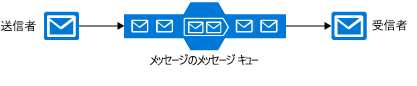
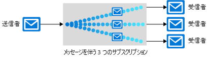

Azure 内でさまざまな分散アプリケーションの信頼性を向上させるのに役立つ多くの通信プラットフォームがあります。There are many communications platforms that can help improve the reliability of a distributed application, including several within Azure. これらのツールはそれぞれ別の目的で動作します。適切なものを選択できるように Azure 内の各ツールを確認しましょう。Each of these tools serves a different purpose; let's review each tool in Azure to help choose the right one.

ピザの順序付けと管理アプリケーションのアーキテクチャには、いくつかのコンポーネントが必要です。 web サイト、データ ストレージ、バックエンド サービスなどです。アプリケーションのコンポーネントはさまざまな方法でまとめてバインドでき、1 つのアプリケーションで複数の手法を利用できます。The architecture of our pizza ordering and tracking application requires several components: a website, data storage, back-end service, etc. We can bind the components of our application together in many different ways, and a single application can take advantage of multiple techniques. 

Contoso Slices アプリケーションでは、どの手法を使用するかを決定する必要があります。We need to decide which techniques to use in the Contoso Slices application. 最初の手順は、複数のパート間に通信が存在する場所それぞれを評価することです。The first step is to evaluate each place where there is communication between multiple parts. アプリケーションがそのジョブを実行するために一部のコンポーネントは、適切なタイミングで実行する_必要があります_。Some components _must_ run in a timely manner for our application to be doing its job at all. いくつかは、重要ですが、時間の重要でない可能性があります。Some may be important, but not time-critical. 最後に、モバイル アプリ通知など、他のコンポーネントは、さらに若干随意的です。Finally, other components, like our mobile app notifications, are a bit more optional.

ここでは、Azure で使用できる通信プラットフォームについて学習し、アプリケーションの各要件にあったプラットフォームを選択できるようにします。Here, you will learn about the communications platforms available in Azure, so that you can choose the right one for each requirement in your application.

## メッセージとイベントを決定するDecide between messages and events

メッセージとイベントの両方が**データグラム**: 1 つのコンポーネントから別のコンポーネントに送信されたデータのパッケージ。Messages and events are both **datagrams**: packages of data sent from one component to another. これらの違いは一見したところわずかなようですが、アプリケーションを設計する方法には大きな違いとなる場合があります。They are different in ways that at first seem subtle, but can make significant differences in how you architect your application. 

### メッセージMessages

アプリケーションの全体的な整合性は受信するメッセージによって異なる場合があります。これは分散アプリケーションの用語において、メッセージの特性をよく表しています。In the terminology of distributed applications, the defining characteristic of a message is that the overall integrity of the application may rely on messages being received. メッセージを送信することを、ワークフローのバトンを別のコンポーネントに渡す1つのコンポーネントとして考えることができます。You can think of sending a message as one component passing the baton of a workflow to a different component. ワークフロー全体が重要なビジネス プロセスとなる可能性があり、メッセージはコンポーネントをまとめて保持するモルタルです。The entire workflow may be a vital business process, and the message is the mortar that holds the components together.

メッセージには、だけでなく、ID または URL) (などデータへの参照、データ自体には、一般に含まれています。A message generally contains the data itself, not just a reference (like an ID or URL) to data. データをデータグラムの一部として送信することは、参照を送信することよりも不安定さは軽減されます。Sending the data as part of the datagram is less brittle than sending a reference. メッセージングのアーキテクチャは、メッセージの配信を保証し、メッセージが確実に処理された必要な追加の参照がないため、します。The messaging architecture guarantees delivery of the message, and because no additional lookups are required, the message is reliably handled. ただし、送信元アプリケーションに含める、不要な作業を行う、受信側のコンポーネントを必要とする大量のデータの送信を回避するためにデータを正確に把握する必要があります。However, the sending application needs to know exactly what data to include, to avoid sending too much data, which requires the receiving component to do unnecessary work. この意味で、メッセージの送信者と受信者は、多くの場合、厳格なデータ コントラクトで結合されます。In this sense, the sender and receiver of a message are often coupled by a strict data contract.

Contoso のスライスの新しいアーキテクチャでは、ピザの注文を入力したら、それらは可能性がありますメッセージを使用してください。In Contoso Slices new architecture, when a pizza order is entered, they would likely use messages. Web フロント エンドまたはモバイル アプリは、バックエンド処理コンポーネントにメッセージを送信します。The web front end or mobile app would send a message to the back-end processing components. バックエンドで、顧客の近くのストアにルーティングし、クレジット_カードに課金のような手順が行われます。In the back end, steps like routing to the store near the customer and charging the credit card would take place.

### イベントEvents

イベントは、何かが発生したことの通知をトリガーします。An event triggers notification that something has occurred. イベントは、「軽量」メッセージよりもブロードキャストの通信に使用されるほとんどの場合。Events are "lighter" than messages and are most often used for broadcast communications.

イベントには次の特性があります。Events have the following characteristics:
* 送信されたイベントの受信者が複数のこともあれば、まったくいないこともあります。The event may be sent to multiple receivers, or to none at all
* 多くの場合、イベントは "ファンアウト" を意図しています。つまり、パブリッシャーのそれぞれに対して多数のサブスクライバーが存在します。Events are often intended to "fan out," or have a large number of subscribers for each publisher
* イベントのパブリッシャーは、受信側コンポーネントがどのようなアクションを実行するかについて何も想定していません。The publisher of the event has no expectation about the action a receiving component takes

ピザのチェーン店は、イベントを使用して、状態変更をユーザーに通知できます。Our pizza chain would likely use events for notifications to users about status changes. 状態変更イベントは、Azure Functions にログオンし、Azure Event grid との Azure Notification Hubs に送信でしたを完全に_サーバーレス_ソリューション。Status change events could be sent to Azure Event Grid, then on to Azure Functions, and to Azure Notification Hubs for a completely _serverless_ solution.

通信プラットフォームは一般的にどちらか一方を処理するように設計されているため、このイベントとメッセージの違いは根本的なものです。This difference between events and messages is fundamental because communications platforms are generally designed to handle one or the other. Service Bus はメッセージを処理するように設計されています。Service Bus is designed to handle messages. イベントを送信する場合、Event Grid を選択することになるでしょう。If you want to send events, you would likely choose Event Grid. 

Azure Event Hubs もありますは、特定の種類の分析のために使用される通信の高フロー ストリームでよく使用されます。Azure also has Azure Event Hubs, but it is most often used for a specific type of high-flow stream of communications used for analytics. たとえば、ピザ レンジのセンサーをネットワークいますが場合、は、可能性が、不要な火災やコンポーネント wear 気温の変化のパターンを監視する Azure Stream Analytics と組み合わせると、Event Hubs を使用します。For example, if we had networked sensors on our pizza ovens, we could use Event Hubs coupled with Azure Stream Analytics to watch for patterns in the temperature changes that might indicate an unwanted fire or component wear.

## Service Bus のトピック、キュー、およびリレーService Bus topics, queues, and relays

Azure Service Bus は、次の 3 つの異なる方法でメッセージを交換できます。 キュー、トピック、およびリレーします。Azure Service Bus can exchange messages in three different ways: queues, topics, and relays.

### キューは何ですか。What is a queue?

**キュー**はメッセージの単純な一時記憶の場所です。A **queue** is a simple temporary storage location for messages. コンポーネントを送信することで、キューにメッセージが追加されます。A sending component adds a message to the queue. 宛先コンポーネントは、キューの先頭にあるメッセージを取得します。A destination component picks up the message at the front of the queue. 通常の状況では、各メッセージは、1 つだけのレシーバーによって受信されます。Under ordinary circumstances, each message is received by only one receiver.

キューは、非常に込み合っている状況から送信先コンポーネントを隔離するために、送信元と送信先のコンポーネントを分離します。Queues decouple the source and destination components to insulate destination components from high demand. 

ピーク時間帯にメッセージは変換先コンポーネントが処理できるよりも高速は可能性があります。During peak times, messages may come in faster than destination components can handle them. 変換元コンポーネントがある、変換先に直接接続はありません、ため、ソースが影響を受ける、キューが拡張されます。Because source components have no direct connection to the destination, the source is unaffected and the queue will grow. 送信先コンポーネントは、処理が可能になるとキューからメッセージを削除します。Destination components will remove messages from the queue as they are able to handle them. 混み具合が解消すると、送信先コンポーネントは追いつくことができ、キューが短くなります。When demand drops, destination components can catch up and the queue shortens. 

キューは、システムにリソースを追加することなく、このように込み合った状況に対応します。A queue responds to high demand like this without needing to add resources to the system. ただし、比較的迅速に処理する必要があるメッセージについては、送信先コンポーネントにインスタンスを追加することで負荷を共有させることができます。However, for messages that need to be handled relatively quickly, adding additional instances of your destination component can allow them to share the load. 各メッセージは 1 つのインスタンスのみで処理されます。Each message would be handled by only one instance. これは、実際に必要なコンポーネントのみにリソースを追加しながら、アプリケーション全体を拡張する効果的な方法です。This is an effective way to scale your entire application while only adding resources to the components that actually need it.

### トピックとは何ですか。What is a topic?

**トピック**はキューに似ていますが、複数のサブスクリプションを持つことができます。A **topic** is similar to a queue but can have multiple subscriptions. つまり、複数の送信先コンポーネントは、1 つのトピックにサブスクライブできるため、各メッセージは複数の受信者に配信されます。This means that multiple destination components can subscribe to a single topic, so each message is delivered to multiple receivers. サブスクリプションでは、トピック内のメッセージをフィルター処理して関連するメッセージのみを受信することもできます。Subscriptions can also filter the messages in the topic to receive only messages that are relevant. サブスクリプションはキューと同じ分離された通信を提供し、込み合った状況にも同じ方法で対応します。Subscriptions provide the same decoupled communications as queues and respond to high demand in the same way. 各メッセージを複数の送信先コンポーネントに配信する場合はトピックを使用します。Use a topic if you want each message to be delivered to more than one destination component.

トピックは Basic 価格レベルでは、サポートされていません。Topics are not supported in the Basic pricing tier.

### リレーとは何ですか。What is a relay?

**リレー**とはアプリケーション間の同期双方向通信を実行するオブジェクトです。A **relay** is an object that performs synchronous, two-way communication between applications. キューやトピックなどの一時記憶域の場所ではありません。It is not a temporary storage location for messages like queues and topics. 代わりに、双方向、ファイアウォールなどのネットワーク境界を越えてバッファリングされていない接続を提供します。Instead, it provides bidirectional, unbuffered connections across network boundaries such as firewalls. これらが同じネットワーク セグメント上にあるがネットワーク セキュリティ デバイスで区切られたかのようにコンポーネント間で直接通信する場合は、リレーを使用します。Use a relay when you want direct communications between components as if they were located on the same network segment but separated by network security devices.

> [!NOTE]
> リレーには、Azure Service Bus の一部が、疎結合メッセージング ワークフローを実装しないと、このモジュールでは考慮されません。Although relays are part of Azure Service Bus, they do not implement loosely coupled messaging workflows and are not considered further in this module.

## Service Bus キューとストレージ キューService Bus queues and storage queues

メッセージ キューを含む 2 つの Azure 機能があります。 Service Bus と Azure Storage アカウント。There are two Azure features that include message queues: Service Bus and Azure Storage accounts. 一般的なガイドラインとしてストレージ キューは簡単に使用しますが、低い高度で Service Bus のキューよりも柔軟性。As a general guide, storage queues are simpler to use but are less sophisticated and flexible than Service Bus queues.

Service Bus キューの主な利点は次のとおりです。Key advantages of Service Bus queues include:

* 大きなメッセージ サイズ (メッセージあたり 64 KB に対して 256 KB) をサポートしていますSupports larger messages size (256 KB per message versus 64 KB)
* At-Least-Once と At-Most-Once の両方の配信をサポートしています。メッセージが失われるという極めて低い可能性と、メッセージが 2 回処理されるという極めて低い可能性のいずれかを選択します。Supports both at-least-once and at-most-once delivery - choose between a very small chance that a message is lost or a very small chance it is handled twice
* 保証**最初先出し (FIFO)** 順序 - メッセージが追加されたのと同じ順序で処理されます (FIFO キューの通常の動作ですが、保証はありませんすべてのメッセージに対して)Guarantees **first-in-first-out (FIFO)** order - messages are handled in the same order they are added (although FIFO is the normal operation of a queue, it is not guaranteed for every message)
* トランザクションに複数のメッセージをグループ化できます - トランザクションの 1 つのメッセージの配信に失敗すると、トランザクションのすべてのメッセージが配信されません。Can group multiple messages into a transaction - if one message in the transaction fails to be delivered, all messages in the transaction will not be delivered
* ロールベースのセキュリティをサポートSupports role-based security
* 継続的にキューをポーリングするために送信先コンポーネントは不要です。Does not require destination components to continuously poll the queue

ストレージ キューの利点があります。Advantages of storage queues:

* 無制限のキュー サイズ (と Service Bus キューの 80 GB の制限) をサポートしていますSupports unlimited queue size (versus 80-GB limit for Service Bus queues)
* すべてのメッセージのログを維持します。Maintains a log of all messages

## 通信テクノロジを選択する方法How to choose a communications technology

Azure が提供するまざまな概念と実装について説明しました。We've seen the different concepts and the implementations Azure provides. ここからは通信毎に私たちの意思決定プロセスがどのようにあるべきかについて説明します。Let's discuss what our decision process should look like for each of our communications.

#### 次のクエリについて考えてみましょう。Consider the following questions:

1. 通信イベントですか。Is the communication an event? そうである場合は、Event Grid または Event Hubs の使用を検討してください。If so, consider using Event Grid or Event Hubs.

1. 1 つのメッセージを複数の送信先に配信する必要がありますか。Should a single message be delivered to more than one destination? その場合は、Service Bus トピックを使用します。If so, use a Service Bus topic. それ以外の場合、キューを使用します。Otherwise, use a queue.

キューが必要であると判断した場合：If you decide that you need a queue:

#### 次の場合は、Service Bus キューを選択します。Choose Service Bus queues if:

- ほとんどの 1 回の配信保証する必要があります。You need an at-most-once delivery guarantee
- FIFO 保証が必要であるYou need a FIFO guarantee
- メッセージをトランザクションにグループ化する必要があるYou need to group messages into transactions
- キューをポーリングせずにメッセージを受信する必要があるYou want to receive messages without polling the queue
- キューにロールベースのアクセスを提供する必要があります。You need to provide role-based access to the queues
- 256 KB 未満ですが 64 KB を超えるメッセージを処理する必要があります。You need to handle messages larger than 64 KB but smaller than 256 KB
- キューのサイズが 80 GB を超えることがないYour queue size will not grow larger than 80 GB
- バッチ メッセージを発行および使用できる必要があるYou would like to be able to publish and consume batches of messages

#### 場合は、キュー ストレージを選択します。Choose queue storage if:
- 特定の追加要件のない単純なキューが必要であるYou need a simple queue with no particular additional requirements
- キューを通ったすべてのメッセージの監査証跡が必要であるYou need an audit trail of all messages that pass through the queue
- キューのサイズが 80 GB を超えると予想されるYou expect the queue to exceed 80 GB in size
- キュー内のメッセージ処理の進行状況を追跡する必要があるYou want to track progress for processing a message inside of the queue

分散アプリケーションのコンポーネントは、直接通信できるよう、Azure Service Bus または Azure Event Grid など、中間通信プラットフォームを使用してその通信の信頼性を緩和することができます多くの場合。Although the components of a distributed application can communicate directly, you can often increase the reliability of that communication by using an intermediate communication platform such as Azure Service Bus or Azure Event Grid.

Event Grid は、イベントのイベントのみの受信者に通知し、そのイベントに関連付けられた生データが含まれていない場合に設計されています。Event Grid is designed for events, which notify recipients only of an event and do not contain the raw data associated with that event. Azure Event Hubs は、イベントの種類の高フローの分析に適しています。Azure Event Hubs is designed for high-flow analytics types of events. Azure Service Bus と Storage キューはメッセージ用であり、アプリケーションのワークフローの中核部分をバインドするために使用できます。Azure Service Bus and storage queues are for messages, which can be used for binding the core pieces of any application workflow.

お客様の要件は、単純な場合、1 つだけ先には、各メッセージを送信する場合、または可能な限り早くコードを記述する場合、ストレージ キューが最善の方法にあります。If your requirements are simple, if you want to send each message to only one destination, or if you want to write code as quickly as possible, a storage queue may be the best option. それ以外では、Service Bus キューが、より多くのオプションや柔軟性を備えています。Otherwise, Service Bus queues provide many more options and flexibility.

複数のサブスクライバーにメッセージを送信する場合は、Service Bus トピックを使用します。If you want to send messages to multiple subscribers, use a Service Bus topic.
