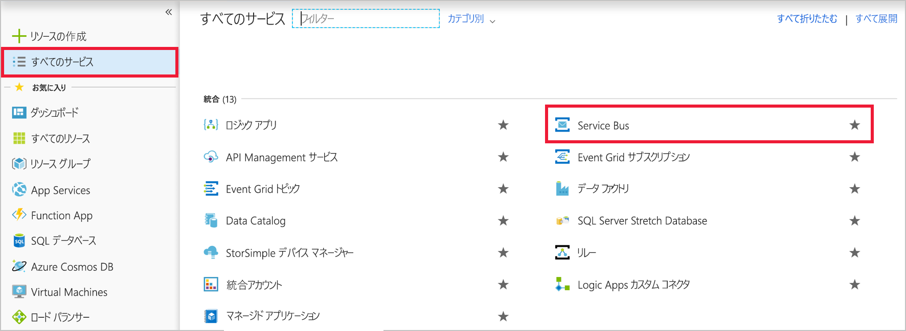
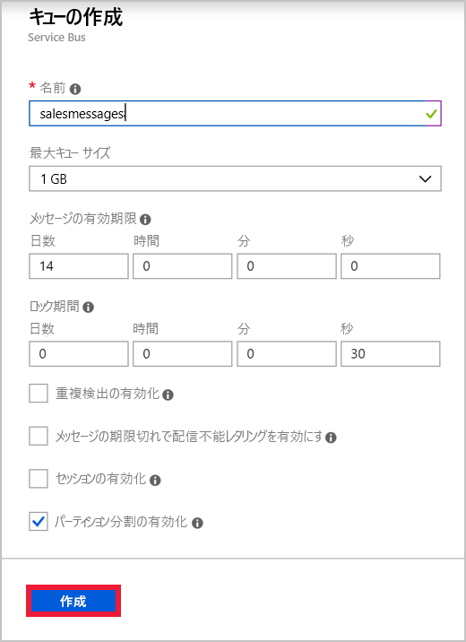
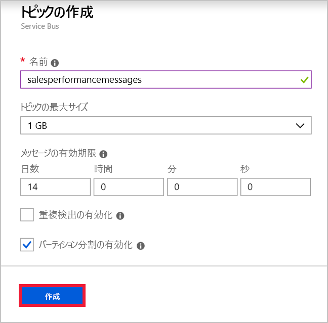

グローバル企業の営業チーム向けアプリケーションがあるとします。 各チーム メンバーは、アプリをインストールする携帯電話を持っています。 Azure でホストされている Web サービスには、アプリケーションのビジネス ロジックが実装され、情報は Azure SQL Database に格納されます。 地理的リージョンごとに 1 インスタンスの Web サービスがあります。 次のように、モバイル アプリと Web サービスの間でメッセージを送信する目的を特定しました。

- 個々の販売に関連するメッセージは、ユーザーのリージョンの Web サービス インスタンスにのみ送信される必要があります。
- 販売実績に関連するメッセージは、Web サービスのすべてのインスタンスに送信される必要があります。

1 つ目のユース ケースのために Service Bus キュー、2 つ目のユース ケースのために Service Bus トピックを実装することに決めました。

この演習では、サブスクリプションに関するキューとトピックの両方を含む Service Bus 名前空間を作成します。

## Service Bus 名前空間を作成する

Azure Service Bus における名前空間とは、キュー、トピック、およびリレー用の一意の完全修飾ドメイン名を持つコンテナーです。 まず名前空間の作成から始める必要があります。

各名前空間には、プライマリおよびセカンダリの Shared Access Signature 暗号化キーもあります。 送信側または受信側のコンポーネントは、名前空間内のオブジェクトに対するアクセス権を得るために、接続時にこれらのキーを提供する必要があります。

Azure portal を使用して Service Bus 名前空間を作成するには、次の手順を実行します。

1. ブラウザーで [Azure portal](https://portal.azure.com/) に移動し、通常の Azure アカウントの資格情報を使用してログインします。

1. 左側のナビゲーションで、**[すべてのサービス]** をクリックします。

1. **[すべてのサービス]** ブレードで、**[統合]** セクションまで下へスクロールし、**[Service Bus]** をクリックします。

    

1. **[Service Bus]** ブレードの左上にある **[追加]** をクリックします。

1. **[名前]** ボックスに、名前空間の一意の名前を入力します。 たとえば、「salesteamapp」 + "*自分のイニシャル*" + "*現在の日付*" を入力します。

1. **[価格レベル]** ドロップダウン リストで **[Standard]** を選択します。

1. **[サブスクリプション]** ドロップダウン リストでサブスクリプションを選択します。

1. **[リソース グループ]** で **[新規作成]** を選択し、「**SalesTeamAppRG**」と入力します。

1. **[場所]** ドロップダウン リストで、近くの場所を選択し、**[作成]** をクリックします。 新しい Service Bus 名前空間が作成されます。

    

## Service Bus キューを作成する

名前空間を用意できたので、次は個々の販売に関するメッセージのキューを作成します。 その手順は次のとおりです。

1. **[Service Bus]** ブレードで **[更新]** をクリックします。 作成した名前空間が表示されます。

1. 先ほど作成した名前空間をクリックします。

1. 名前空間ブレードの左上にある **[+ キュー]** をクリックします。

1. **[キューの作成]** ブレードで、**[名前]** ボックスに「**salesmessages**」と入力し、**[作成]** をクリックします。 名前空間にキューが作成されます。

    

## Service Bus トピックとサブスクリプションを作成する

販売実績に関連するメッセージに使用されるトピックを作成することもできます。 ビジネス ロジック Web サービスの複数のインスタンスが、さまざまな国からこのトピックをサブスクライブします。 各メッセージは複数のインスタンスに配信されます。

次の手順を実行します。

1. **[Service Bus 名前空間]** ブレードで **[+ トピック]** をクリックします。

1. **[トピックの作成]** ブレードで、**[名前]** ボックスに「**salesperformancemessages**」と入力し、**[作成]** をクリックします。 名前空間にトピックが作成されます。

    

1. トピックが作成されたら、**[Service Bus 名前空間]** ブレードの **[エンティティ]** で **[トピック]** をクリックします。

1. トピックのリストから **[salesperformancemessages]** をクリックし、**[+ サブスクリプション]** をクリックします。

1. **[名前]** ボックスに「**Americas**」と入力し、**[作成]** をクリックします。

1. **[+ サブスクリプション]** をクリックします。

1. **[名前]** ボックスに「**EuropeAndAfrica**」と入力し、**[作成]** をクリックします。

営業部門の分散アプリケーションの回復力を高めるために、Service Bus の使用に必要なインフラストラクチャを構築しました。 個々の販売に関するメッセージのキューと、販売実績に関するメッセージのトピックを作成しました。 トピックには複数のサブスクリプションが含まれています。これは、そのトピックに送信されたメッセージが、世界各地の複数の受信側 Web サービスに配信される可能性があるためです。
