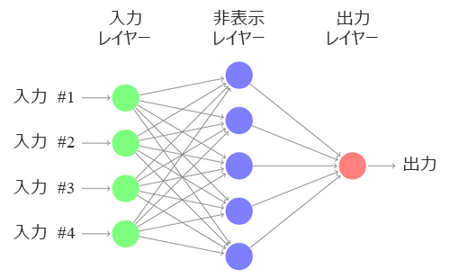
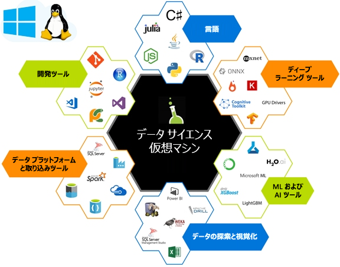

Machine Learning (ML) の目的は、入力データ (画像、タイム シリーズ、オーディオなど) を指定された出力 (たとえばキャプション、価格値、トランスクリプション) に変換するモデルをトレーニングする機能を見つけることです。 従来のデータ サイエンスでは、機能は多くの場合、手作りされます。 手作りされたそれらの機能が、次の図に示すネットワークのような浅い学習アルゴリズムに取り込まれます。 

ディープ ラーニング (DL) では、入力をベクトルとして表し、これを一連の適切な線形代数操作によって所与の出力に変換することで機能抽出のプロセスを学習します。  モデル出力が、損失関数と呼ばれる式を使用して、想定される出力と比較されます。 各トレーニング入力の損失関数によって返される値は、次のパス上で下位の損失となる機能を抽出するようにモデルをガイドするために使用されます。 このプロセスを*トレーニング*といいます。 

トレーニングにより、これらのアルゴリズムは、指定されたデータセットに対して最もパフォーマンスが高く最適な機能を学習します。 ネットワーク内の層の数を理由に、これらはディープと呼ばれます。  

線形代数コンポーネントの一部として計算する一連の行列演算は、計算コストが高くなります。 これらの演算は、多くの場合に並列で処理されることから、効率的に計算することを目的としてグラフィックス処理装置 (GPU) などの特殊な計算を行う候補として適しています。

ディープ ラーニングを実行するための環境のセットアップは容易ではありません。 ハードウェアのセットアップをどのようにするか、モデルのトレーニングに CPU を使用するのか、または GPU を使用するのか、また、これらのマシンのメモリの量をどれだけにするのかを決める必要があります。 ディープ ラーニング ネットワークの作成とトレーニングを行うには、適切なソフトウェアをインストールすることが必要です。 多数のディープ ラーニング フレームワークの中から選択できますが、各コンポーネント間の依存関係に注意する必要があります。 このセットアップがすべて終わった後、別のフレームワーク上に作成された優れたモデルが見つかり、それを試してみたいと思うことがあるかもしれません。使用しているマシン上にすべての依存関係をセットアップして新しいディープ ラーニング フレームワークを手に入れる手間をなくしたいと考えるでしょう。 このような問題の解決にデータ サイエンス仮想マシンが役立ちます。 

## データ サイエンス仮想マシン (DSVM) とは

データ サイエンス仮想マシンは、Azure 上の仮想マシン (VM) イメージです。 多くの一般的なデータ サイエンスおよびディープ ラーニングのツールが既にインストールされ、構成されています。 これらのイメージには、一般的なデータ サイエンスおよび機械学習のツールである Microsoft R Server Developer Edition、Microsoft R Open、Anaconda Python、Julia、Jupyter notebook、Visual Studio Code、RStudio、xgboost、およびその他多くのツールが付属しています。  同等のワークスペースを独自にロールアウトする代わりに DSVM をプロビジョニングすることによって、インストール、構成、パッケージ管理プロセスにかかる多くの時間を節約できます。 DSVM がデプロイされたら、直ちにデータ サイエンス プロジェクトに関する作業を開始できます。

DSVM は、グラフィック処理装置 (GPU) ハードウェアで、ディープ ラーニング アルゴリズムを使用したトレーニング モデルに使用できます。 DSVM では、Azure クラウドの VM スケーリング機能を利用すると、必要に応じてクラウド上で GPU ベースのハードウェアを使用できます。 同じ OS ディスクを保持しつつ、大規模モデルをトレーニングするとき、または高速計算が必要なときに GPU ベースの VM に切り替えることができます。 Windows Server 2016 エディションの DSVM には、GPU ドライバー、フレームワーク、および GPU バージョンのディープ ラーニング フレームワークが事前インストールされています。 Linux では、GPU のディープ ラーニングは、CentOS と Ubuntu DSVM の両方で可能です。 データ サイエンス VM の Ubuntu、CentOS、または Windows 2016 エディションは CPU ベースの Azure 仮想マシンにもデプロイできます。その場合、すべてのディープ ラーニング フレームワークは CPU モードにフォールバックします。 

DSVM で実行できることの詳細については、「[Azure での Linux データ サイエンス仮想マシンを使用したデータ サイエンス](https://docs.microsoft.com/azure/machine-learning/data-science-virtual-machine/linux-dsvm-walkthrough)」を参照してください。

