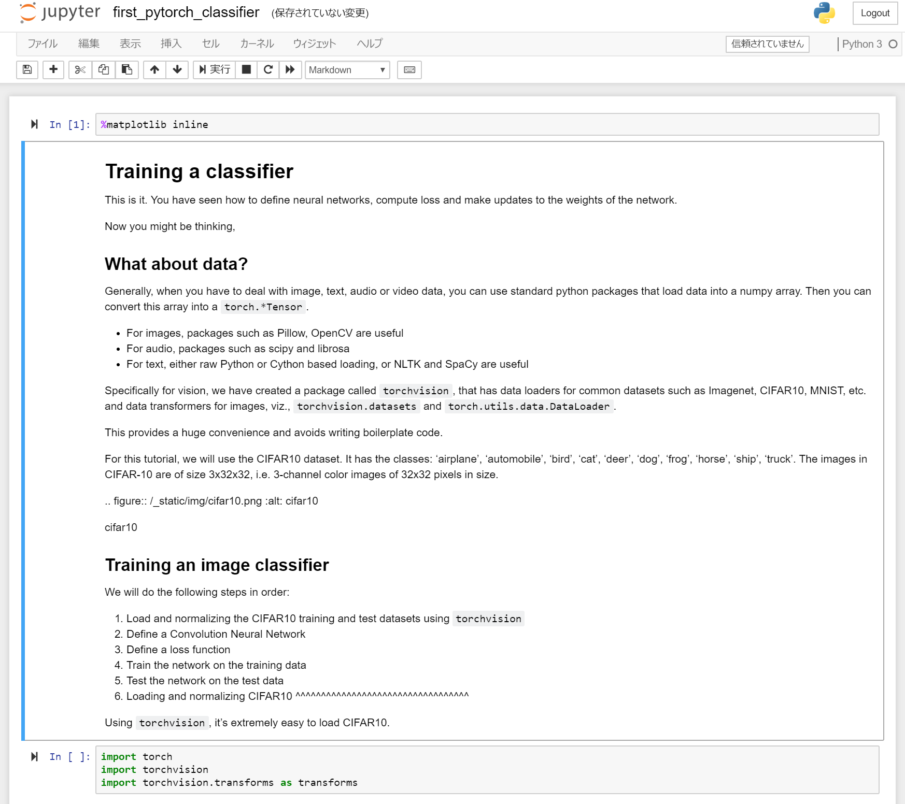

## PyTorch と Jupyter を使用して、最初のディープ ラーニング モデルをトレーニングします

 

通常ディープ ラーニングのエンジニアはマトリックス代数をすべて手動でハード コード化することはありません。 PyTorch や TensorFlow などのフレームワークを代用します。  

PyTorch は、ディープ ラーニングの開発プラットフォームとしての柔軟性を提供する python ベースのフレームワークです。 PyTorch のワークフローは、python の科学技術コンピューティング ライブラリ NumPy 上に構築されます。 

PyTorch をディープ ラーニング モデルの構築に使用するのはなぜでしょうか。  

- API が簡単に使えます – python と同じほど簡単です。
- Python のサポート – PyTorch が科学技術コンピューティング スタックとスムーズに統合されます。
- 動的計算グラフ – 特定機能付きで、事前に定義されたグラフではなく、PyTorch が実行時間内に変更可能な計算グラフを動的に作成します。 動的計算グラフは、入れ子になったバッチ処理に有効で、特定のネットワークに必要とされるメモリの量が不明の場合に役立ちます。

## 最初の PyTorch モデルを実行します

最後の章でセットアップした、Jupyter Notebook に移動します。

- [[HOSTNAME OF DSVM]].westus2.cloudapp.azure.com:8888/?token={sometoken}

First_pytorch_classifier.ipynb ノートブックを選択します

ノートブックの指示に従って、最初の PyTorch クラシッファーをトレーニングします。

