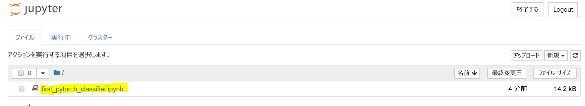
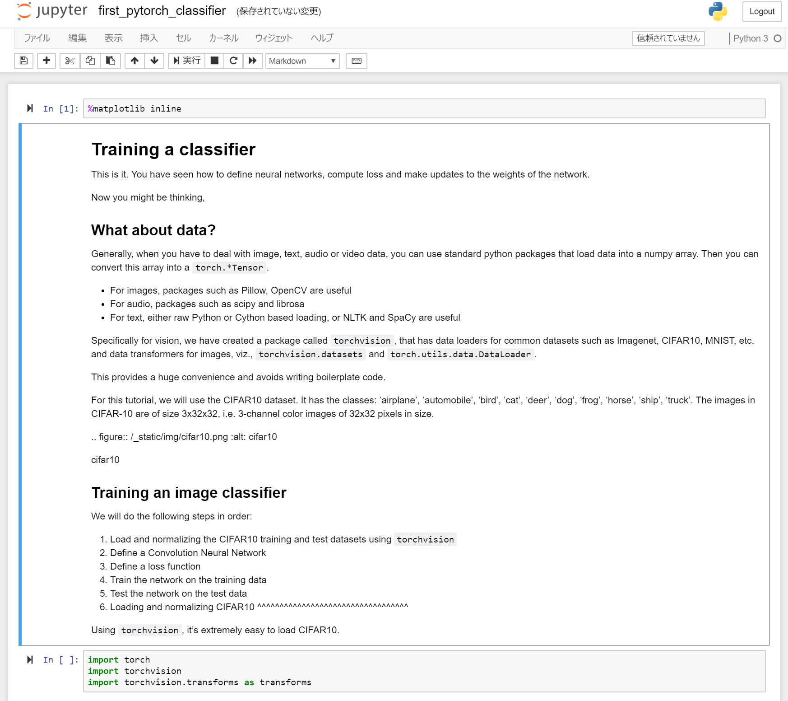

 

通常、ディープ ラーニングのエンジニアはマトリックス代数をすべて手動で実装することはありません。Typically deep learning engineers don't implement the matrix algebra operations all by hand. 代わりに、PyTorch や TensorFlow などのフレームワークを使用します。Instead, they use frameworks such as PyTorch or TensorFlow.  

PyTorch は、ディープ ラーニングの開発プラットフォームとしての柔軟性を提供する Python ベースのフレームワークです。PyTorch is a python-based framework that provides flexibility as a deep learning development platform. それは、Python の科学技術コンピューティング ライブラリである NumPy 上に構築されています。It's built on the Python scientific computing library, NumPy. 

PyTorch をディープ ラーニング モデルの構築に使用するのはなぜでしょうか。Now you might ask, why would we use PyTorch to build deep learning models?  

- 使いやすい API - Python の知識があれば、短時間で成果を得ることができます。Easy to use API – If you know Python, you can ramp up quickly.
- Python のサポート - PyTorch は、科学技術コンピューティング スタックとスムーズに統合されています。Python support – PyTorch smoothly integrates with the scientific computing stack.
- 動的計算グラフ - 特定機能付きの事前に定義されたグラフではなく、PyTorch が実行時間内に変更可能な計算グラフを動的に作成します。Dynamic computation graphs – Instead of predefined graphs with specific functionality, PyTorch builds computational graphs dynamically that can be modified during runtime. 動的計算グラフは、入れ子になったバッチ処理に有効で、特定のネットワークに必要とされるメモリの量が不明の場合に役立ちます。Dynamic computation graphs are valuable for nested batching and when we do not know how much memory will be needed for creating a given network.

PyTorch の詳細については、[PyTorch.org の公式ドキュメント](https://pytorch.org/about/)を参照してください。For more information about PyTorch, see [PyTorch.org official documentation](https://pytorch.org/about/).

## 最初の PyTorch モデルを実行するRun your first PyTorch model

PyTorch イメージからプロビジョニングされた Docker コンテナーが用意できたので、実験を開始しましょう。Now that you have a Docker container provisioned from a PyTorch image, it's time to experiment. [python.org](https://python.org) から Notebook をダウンロードしたことを思い出してください。そのサンプル Notebook を使用して、イメージをさまざまなカテゴリに分類するネットワークのトレーニングについて説明します。If you recall, we downloaded a notebook from [python.org](https://python.org). That sample notebook walks you through training a network to classify images  into different categories. それは、ディープな畳み込みニューラル ネットワーク (CNN) を定義します。It defines a deep Convolutional Neural Network (CNN).

1. ローカル ブラウザーで、前回の演習で設定した Jupyter Notebook サーバーに移動します。Navigate in your local browser to the Jupyter Notebook server that you set up in the last exercise. URL は次の形式になります。The URL will be of the form:

    `<HOSTNAME>.<REGION>.cloudapp.azure.com:8888/?token={sometoken}`

1. ダッシュボードで、`first_pytorch_classifier.ipynb` Notebook を選択します。Select the `first_pytorch_classifier.ipynb` notebook in the dashboard.

    

    Notebook の指示に従って、最初の PyTorch 分類子をトレーニングします。Follow the instructions in the notebook to train your first PyTorch classifier.

    

2. Notebook の先頭から開始し、各セルを順に実行します。Start from the top of the notebook and run each cell in order. 以下の点に注意してください。Note the following:

    - 一部のセルは、実行に時間がかかります。Some of the cells take a long time to run. Notebook の右上の "Python 3" という単語の横にある小さな点を観察します。Observe the small dot in the top right of the notebook beside the words "Python 3". カーネルが操作でビジー状態の場合、点は塗りつぶされた暗い円になります。When the kernel is busy with an operation, the dot becomes a filled, darker, circle. 操作が完了するまで、その状態のままになります。It remains that way until the operation is complete. 
    - イメージを分類するように CNN をトレーニングしています。You're training a CNN to classify images. ネットワークのトレーニングが終わると、Notebook は、ラベル付けされた画像をモデルに対してテストします。Once the network is trained, the notebook will test labeled images against the model. イメージごとに行われた予測を記録し、モデルの精度を計算します。It records the prediction made for each image and calculates the accuracy of the model. 次の形式で結果が表示されます。You'll see results in the following format.

    
    
    - [PyTorch チュートリアル ドキュメント](https://pytorch.org/tutorials/beginner/blitz/cifar10_tutorial.html) オンラインで、この Notebook の詳細を確認できます。You can learn more about the notebook in the [PyTorch Tutorials documentation](https://pytorch.org/tutorials/beginner/blitz/cifar10_tutorial.html) online.
    
    - Notebook の終わり近くに、GPU でのトレーニングに関する注意事項があります。Towards the end of the notebook, the notes talk about training on a GPU. このモジュールの演習をそのまま実行した場合は、CPU ベースの VM が設定されています。If you followed the exercises in this module, you have set up a CPU-based VM. それは、このサイズのモデルでは問題はありませんが、GPU を使用したトレーニング時間の大幅な改善は観察されない可能性があります。This is fine for a model this size and you may not see any significant improvements in training time with a GPU. GPU 付きの仮想マシンを使用してモジュールを試す場合は、2 つの変更を行う必要があります。If you do want to try the module using a  virtual machine with GPUs, then there are two changes you need to make:
    - GPU 対応 N シリーズ VM のサイズで DSVM をプロビジョニングします。Provision DSVM on a GPU enabled, N-series VM size.
    - 前の演習で `docker` の代わりに `nvidia-docker` を使用してコンテナーを作成します。Create a container using `nvidia-docker` instead of `docker` in the previous exercise.