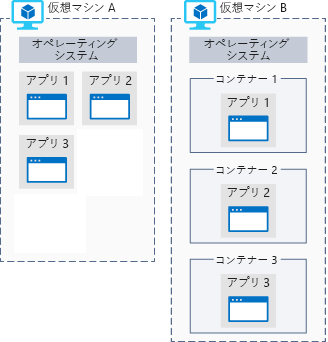

研究チームは、Mars の検出につながる可能性のあるイメージ データの膨大な量を収集しました。 ただし計算量のデータ処理を実行する必要がある作業を実行する機器があります。 Azure のデータ分析を行うための適切な選択がある理由を見てみましょう。

## Azure コンピューティングとは
Azure コンピューティングでは、クラウド ベースのアプリケーションを実行するためのオンデマンドのコンピューティング サービスです。 仮想マシンとコンテナーを使用して、マルチコア プロセッサやスーパーコンピューターなどのコンピューティング リソースを提供します。 また、インフラストラクチャのセットアップや構成を必要とせずにアプリを実行するサーバーレス コンピューティングを提供します。 オンデマンドでリソースを利用でき、通常は分単位で、場合によっては秒単位でさえ作成することができます。 使用したリソースに対してのみ、それらを使用している期間についてだけ、課金されます。

Azure でコンピューティングを実行するには、3 つの一般的な手法があります。

- 仮想マシン
- コンテナー
- サーバーレス コンピューティング

## 仮想マシンとは

**仮想マシン**、または Vm、物理コンピューターのソフトウェア エミュレーション。 仮想プロセッサ、メモリ、ストレージ、およびネットワーク リソースが含まれます。 オペレーティング システムをホストし、物理コンピューターと同じようにソフトウェアをインストールして実行できます。 リモート デスクトップ クライアントを使用すると、使用、座って前にあるかのように、仮想マシンを制御します。

### Azure での仮想マシン

仮想マシンを Azure で作成したり、ホストしたりすることができます。 通常、新しいバーチャル マシンを作成および事前構成済みの仮想マシン イメージを選択して数分でプロビジョニングします。

イメージを選択すると、VM を作成するときにすることになりますの最も重要な決定事項の 1 つです。 イメージとは、仮想マシンの作成に使用するテンプレートです。 これらのテンプレートには、オペレーティング システム (OS) と、多くの場合は開発ツールや Web ホスティング環境などの他のソフトウェアが、既に含まれています。

## コンテナーとは

> [!VIDEO https://www.microsoft.com/videoplayer/embed/RE2yMhY]

コンテナーは仮想化環境ですが、仮想マシンとは異なりオペレーティング システムを含みません。 代わりに、コンテナーを実行しているホスト環境のオペレーティング システムを参照します。 たとえば、特定の Linux カーネルを使用するサーバーで 5 つのコンテナーを実行すると、5 つのコンテナーすべてがその同じカーネルで実行されます。

次の図は、VM 上で直接実行されているアプリケーションとコンテナー内の VM で実行されるアプリケーション間の比較を示します。

コンテナーには、アプリケーションを作成し、通常は含まれている&mdash;と共に、アプリケーション ホスト環境のカーネルで実行するために必要なすべてのライブラリです。

コンテナーは軽量になるように意図され、動的に作成、スケールアウト、停止されるように設計されています。 これにより、オンデマンドでの変更に応答して、クラッシュやハードウェアの中断が発生した場合すぐに再起動することができます。

コンテナーを使用して別のメリットは、仮想マシンで複数の独立したアプリケーションを実行する機能です。 コンテナー自体がセキュリティで保護されて分離されているので、異なるワークロードごとに VM を分ける必要は必ずしもありません。

Azure では、Docker コンテナーと、それらのコンテナーを管理するための複数の方法がサポートされています。 手動で、または Azure Kubernetes Service などの Azure サービスで、コンテナーを管理できます。

### サーバーレス コンピューティングとは

サーバーレス コンピューティングとは、ユーザーのコードを実行するクラウドでホストされた実行環境ですが、基になるホスティング環境が完全に抽象化されています。 サービスのインスタンスを作成して、コードを追加します。インフラストラクチャの構成やメンテナンスは必要はありませんが、許可されていることもあります。

> [!VIDEO https://www.microsoft.com/videoplayer/embed/RE2yzjL]

_イベント_ に応答するようにサーバーレス アプリを構成します。 REST エンドポイント、定期的なタイマー、別の Azure サービスから受信したメッセージなどのイベントがあります。 イベントでトリガーされた場合にのみ、サーバーレス アプリが実行されます。

基本的には、インフラストラクチャでは、お客様の責任はありません。 スケーリングとパフォーマンスは自動的に処理され、使用した正確なリソースに対してのみ課金されます。 容量を予約する必要すらありません。

Azure には、サーバーレス コンピューティングの 2 つの実装があります。

- **Azure Functions**ほぼあらゆる最新の言語でコードを実行することができます。
- **Azure Logic Apps**: Web ベースのデザイナーで設計されており、コードを記述せずに Azure サービスによってトリガーされるロジックを実行できます。
