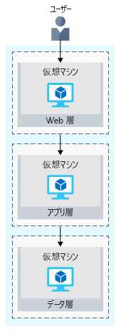
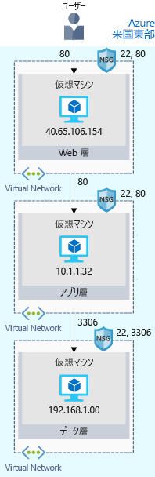

最初の手順は、おそらく、オンプレミスの構成をクラウドに再作成することです。Your first step will likely be to re-create your on-premises configuration in the cloud.

この基本的な構成により、ネットワークがどのように構成され、ネットワーク トラフィックがどのように Azure を出入りしているかについての感覚をつかむことができます。This basic configuration will give you a sense of how networks are configured, and how network traffic moves in and out of Azure.

## e コマース サイトの概要Your e-commerce site at a glance

大規模なエンタープライズ システムは、多くの場合、連動する相互接続された複数のアプリケーションとサービスで構成されます。Larger enterprise systems are often composed of multiple inter-connected applications and services that work together. 在庫を表示し、顧客が注文できるフロントエンド Web システムを用意することがあります。You might have a front-end web system that displays inventory and allows customers to create an order. そのようなシステムは、在庫データを提供したり、ユーザー プロファイルを管理したり、クレジット カードを処理したり、処理された注文の受注処理を要求したりするために、さまざまな Web サービスと通信します。That might talk to a variety of web services to provide the inventory data, manage user profiles, process credit cards, and request fulfillment of processed orders.

これらの複雑なシステムの設計、構築、管理、保守を簡単にするために、ソフトウェア アーキテクトとデザイナーはいくつかの戦略とパターンを採用します。There are several strategies and patterns employed by software architects and designers to make these complex systems easier to design, build, manage, and maintain. そのうちのいくつかを見てみましょう。まずは_疎結合アーキテクチャ_です。Let's look at a few of them, starting with _loosely coupled architectures_.

#### 疎結合アーキテクチャの利点Benefits of Loosely Coupled Architectures

> [!VIDEO https://www.microsoft.com/videoplayer/embed/RE2yHrc]

### n 層アーキテクチャの使用Using an N-tier architecture

疎結合システムの構築に使用できるアーキテクチャ パターンは、_n 層_です。An architectural pattern that can be used to build loosely coupled systems is _N-tier_.

[n 層アーキテクチャ](https://docs.microsoft.com/azure/architecture/guide/architecture-styles/n-tier)では、アプリケーションが 2 つ以上の論理層に分割されます。An [N-tier architecture](https://docs.microsoft.com/azure/architecture/guide/architecture-styles/n-tier) divides an application into two or more logical tiers. アーキテクチャ上、上の階層は下の階層からのサービスにアクセスすることができますが、下の階層が上の階層にアクセスすることはできません。Architecturally, a higher tier can access services from a lower tier, but a lower tier should never access a higher tier.

階層は問題を分割するのに役立ち、再利用できるように設計するのが理想的です。Tiers help separate concerns, and are ideally designed to be reusable. 階層型アーキテクチャを使用することで、メンテナンスも簡略化されます。Using a tiered architecture also simplifies maintenance. 階層は個別に更新したり置き換えたりできます。また、必要に応じて新しい階層を挿入することもできます。Tiers can be updated or replaced independently, and new tiers can be inserted if needed.

_3 層_とは、3 つの階層がある n 層アプリケーションを指します。_Three-tier_ refers to an n-tier application that has three tiers. あなたの e コマース Web アプリケーションは、この 3 層アーキテクチャに従っています。Your e-commerce web application follows this three-tier architecture:

* **Web 層**は、ブラウザーを介して、ユーザーに Web インターフェイスを提供します。The **web tier** provides the web interface to your users through a browser.
* **アプリケーション層**は、ビジネス ロジックを実行します。The **application tier** runs business logic.
* **データ層**には、製品情報と顧客の注文を保持するデータベースとその他のストレージが含まれます。The **data tier** includes databases and other storage that hold product information and customer orders.

ユーザーからデータ層への要求のフローを、次の図に示します。The following illustration shows the flow of request from the user to the data tier.

ユーザーが発注ボタンをクリックすると、その要求が Web 層に、ユーザーの住所と支払い情報と共に送信されます。When the user clicks the button to place the order, the request is sent to the web tier, along with the user's address and payment information. Web 層はこの情報をアプリケーション層に渡します。そこでは支払い情報の検証とインベントリのチェックが行われます。The web tier passes this information to the application tier, which would validate payment information and check inventory. アプリケーション層では、後で受注処理に使用するために、注文をデータ層に格納する場合があります。The application tier might then store the order in the data tier, to be picked up later for fulfillment.

## Azure で実行されている e コマース サイトYour e-commerce site running on Azure

Azure には、コードをホストする完全に事前構成された環境から、自分で構成、カスタマイズ、管理を行う仮想マシンまで、Web アプリケーションをホストするためのさまざまな方法が用意されています。Azure provides many different ways to host your web applications, from fully pre-configured environments that host your code, to virtual machines that you configure, customize, and manage.

たとえば、e コマース サイトを仮想マシンで実行することを選択したとします。Let's say you choose to run your e-commerce site on virtual machines. Azure で実行されるテスト環境は、次のようになります。Here's what that might look like in your test environment running on Azure. 受信要求を制限するセキュリティ機能を有効にした仮想マシン上で実行される 3 層アーキテクチャを、次の図に示します。The following illustration shows a three-tier architecture running on virtual machines with security features enabled to restrict inbound requests. 

これを 1 つずつ見ていきましょう。Let's break this down.

:::row:::
  :::column:::
    
  :::column-end:::
    :::column span="3"::: **Azure リージョンとは?**:::column span="3"::: **What's an Azure region?**

_リージョン_とは、特定の地理的な場所内にある Azure データ センターのことです。A _region_ is an Azure data center within a specific geographic location. 米国東部、米国西部、北ヨーロッパなどがリージョンの例です。East US, West US, and North Europe are examples of regions. このインスタンスでは、アプリケーションが米国東部リージョンで実行されていることがわかります。In this instance, you see that the application is running in the East US region.

  :::column-end:::
:::row-end:::
:::row:::
  :::column:::
    
  :::column-end:::
    :::column span="3"::: **仮想ネットワークとは?**:::column span="3"::: **What's a virtual network?**

_仮想ネットワーク_とは、Azure 上で論理的に分離されたネットワークのことです。A _virtual network_ is a logically isolated network on Azure. Hyper-V、VMware、または他のパブリック クラウドでネットワークを設定したことがあれば、Azure 仮想ネットワークにすぐに慣れることができます。Azure virtual networks will be familiar to you if you've set up networks on Hyper-V, VMware, or even on other public clouds.

Web 層、アプリケーション層、およびデータ層にはそれぞれ単一の VM があります。The web, application, and data tiers each have a single VM. 各 VM は仮想ネットワークに属しています。Each VM belongs to a virtual network.

ユーザーは Web 層と直接やり取りするため、Web 層の VM にはパブリック IP アドレスがあります。Users interact with the web tier directly, so that VM has a public IP address. ユーザーがアプリケーション層とデータ層とやり取りすることはありません。Users don't interact with the application or data tiers. そのため、これらの VM にはそれぞれプライベート IP アドレスがあります。So these VMs each have a private IP address.

物理ハードウェアは、Azure データ センターで管理されます。Azure data centers manage the physical hardware for you. 仮想ネットワークは、ソフトウェアを通じて構成します。これにより、仮想ネットワークを独自のネットワークと同じように扱うことができます。You configure virtual networks through software, which enables you to treat a virtual network just like your own network. たとえば、ネットワークでの IP アドレスの割り当てをより細かく制御するため、仮想ネットワークをサブネットに分割することができます。For example, you can divide a virtual network into subnets to better control how the network assigns IP addresses. また、仮想ネットワークが到達できる他のネットワークを選択することもできます。それがパブリック インターネットであっても、プライベート IP アドレス空間内の他のネットワークであってもかまいません。You also choose which other networks your virtual network can reach, whether that's the public internet or other networks in the private IP address space.

  :::column-end:::
:::row-end:::
:::row:::
  :::column:::
    
  :::column-end:::
    :::column span="3"::: **ネットワーク セキュリティ グループとは?**:::column span="3"::: **What's a network security group?**

_ネットワーク セキュリティ グループ_ (NSG) は、Azure リソースへの着信ネットワーク トラフィックを許可または拒否します。A _network security group_, or NSG, allows or denies inbound network traffic to your Azure resources. ネットワーク セキュリティ グループを、自分のネットワークのクラウド レベルのファイアウォールとして考えてみましょう。Think of a network security group as a cloud-level firewall for your network.

たとえば、Web 層の VM で、ポート 22 (SSH) とポート 80 (HTTP) での着信トラフィックが許可されていることに注目してください。For example, notice that the VM in the web tier allows inbound traffic on ports 22 (SSH) and 80 (HTTP). この VM のネットワーク セキュリティ グループでは、すべてのソースからのこれらのポート経由の着信トラフィックが許可されます。This VM's network security group allows inbound traffic over these ports from all sources. 信頼できる IP アドレスなど、既知のソースからのみトラフィックを受け入れるようにネットワーク セキュリティ グループを構成することができます。You can configure a network security group to accept traffic only from known sources, such as IP addresses that you trust.

> [!NOTE]
> ポート 22 では、SSH 経由で Linux システムに直接接続することができます。Port 22 enables you to connect directly to Linux systems over SSH. ここでは、学習目的のために、ポート 22 を開いています。Here we show port 22 open for learning purposes. 実際には、セキュリティを強化するために、仮想ネットワークに VPN アクセスを構成します。In practice, you might configure VPN access to your virtual network to increase security.

  :::column-end:::
:::row-end:::

## まとめSummary

あなたの 3 層アプリケーションは現在、米国東部リージョンの Azure で実行されています。Your three-tier application is now running on Azure in the East US region. _リージョン_とは、特定の地理的な場所内にある Azure データ センターのことです。A _region_ is an Azure data center within a specific geographic location.

各階層は、下の階層からのサービスにのみアクセスできます。Each tier can access services only from a lower tier. Web 層で実行されている VM は、インターネットからトラフィックを受信するため、パブリック IP アドレスを持っています。The VM running in the web tier has a public IP address because it receives traffic from the internet. それより下の階層 (アプリケーション層とデータ層) の VM は、インターネット経由で直接通信することはないため、それぞれプライベート IP アドレスを持っています。The VMs in the lower tiers, the application and data tiers, each have private IP addresses because they don't communicate directly over the internet.

_仮想ネットワーク_を使用すると、関連するシステムをグループ化したり分離したりすることができます。_Virtual networks_ enable you to group and isolate related systems. _ネットワーク セキュリティ グループ_を定義して、仮想ネットワーク内を通過できるトラフィックを制御します。You define _network security groups_ to control what traffic can flow through a virtual network.

ここで説明した構成は、すぐれた出発点となります。The configuration you saw here is a good start. しかし、自身の e コマース サイトをクラウドの運用環境にデプロイするときに、オンプレミスのデプロイで経験したのと同じ問題が発生する可能性があります。But when you deploy your e-commerce site to production in the cloud, you'll likely run into the same problems as you did in your on-premises deployment.
