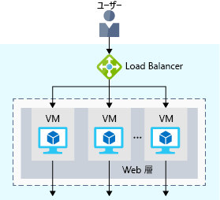
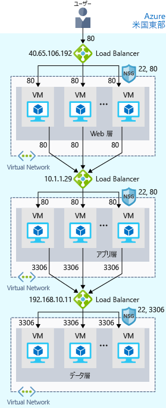
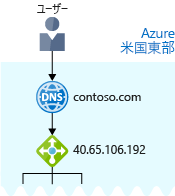

現在あなたのサイトは、Azure で実行されています。You now have your site up and running on Azure. しかし、毎日 24 時間、サイトが確実に稼働するようにするにはどうすればよいですか?But how can you help ensure your site is running 24/7?

たとえば、毎週のメンテナンスを行う必要がある場合は、どうなりますか?For instance, what happens when you need to do weekly maintenance? メンテナンス期間中、サービスは使用できなくなります。Your service will still be unavailable during your maintenance window. また、あなたのサイトのユーザーは世界中にいるため、メンテナンスのためにシステムを停止するのに都合のよい時間帯はありません。And because your site reaches users all over the world, there's no good time to take down your systems for maintenance. 同時に接続するユーザーが多すぎると、パフォーマンスの問題も発生します。You may also run into performance issues if too many users connect at the same time.

## 耐久性と高可用性とは何ですか?What are availability and high availability?

:::row:::
  :::column:::
    
  :::column-end:::
    :::column span="3":::
_可用性_とは、サービスが中断なく稼働する長さを指します。_Availability_ refers to how long your service is up and running without interruption. "_高可用性_" または "_可用性が高い_" とは、長期間稼働するサービスを指します。_High availability_, or _highly available_, refers to a service that's up and running for a long period of time.

必要な情報にアクセスできないことがどれほどいら立たしいことかはおわかりでしょう。You know how frustrating it is when you can't access the information you need. あなたが毎日アクセスしているソーシャル メディアやニュース サイトを考えてみてください。Think of a social media or news site that you visit daily. そのサイトには常にアクセスできますか、それとも "503 サービス利用不可" などのエラー メッセージが頻繁に表示されますか?Can you always access the site, or do you often see error messages like "503 Service Unavailable"?
  :::column-end:::
 :::row-end:::

"ファイブ ナインの可用性" などの言葉を聞いたことがあるかもしれません。You may have heard terms like "five nines availability." ファイブ ナインの可用性とは、サービスが 99.999% の時間実行されることを保証することを意味しています。Five nines availability means that the service is guaranteed to be running 99.999 percent of the time. 100% の可用性を実現するのは困難ですが、多くのチームが少なくともファイブ ナインの実現に努めています。Although it's difficult to achieve 100 percent availability, many teams strive for at least five nines.

## 回復性とは何ですか?What is resiliency?

:::row:::
  :::column:::
    
  :::column-end:::
    :::column span="3":::
_回復性_は、異常な状態でシステムが機能を維持できる能力を指します。_Resiliency_ refers to a system's ability to stay operational during abnormal conditions.

異常な状態には次のようなものがあります。These conditions include:

- 自然災害。Natural disasters.
- ソフトウェアの更新やセキュリティ パッチの適用を含む、計画的および計画外のシステム メンテナンス。System maintenance, both planned and unplanned, including software updates and security patches.
- サイトへのトラフィックの急増。Spikes in traffic to your site.
- 分散型サービス拒否 (DDoS) 攻撃など、悪意のある第三者による脅威。Threats made by malicious parties, such as distributed denial of service, or DDoS, attacks.
  :::column-end:::
:::row-end:::

あなたが所属するマーケティング チームでは、ビタミン サプリメントの新製品の販売促進のためのフラッシュ セールを計画しているとします。Imagine your marketing team wants to have a flash sale to promote a new line of vitamin supplements. あなたはこの期間にトラフィックが急増することを予想しています。You might expect a huge spike in traffic during this time. この急増がシステムの処理能力を上回ると、システムが遅くなったり停止したりして、ユーザーを失望させる恐れがあります。This spike could overwhelm your processing system, causing it to slow down or halt, disappointing your users. あなた自身、こうした失望を味わった経験があるでしょう。You may have experienced this disappointment for yourself. オンライン ショップにアクセスしようとしたのに Web サイトが応答しなかったことはありませんか。Have you ever tried to access an online sale only to find the website wasn't responding?

## ロード バランサーとはWhat is a load balancer?

:::row:::
  :::column:::
    
  :::column-end:::
    :::column span="3":::
_ロード バランサー_は、プール内の各システムにトラフィックを均等に分散させます。A _load balancer_ distributes traffic evenly among each system in a pool. ロード バランサーは、高可用性と回復性の両方を実現するのに役立ちます。A load balancer can help you achieve both high availability and resiliency.

たとえば、それぞれ同じように構成された VM を各階層に追加することから始めるとします。Say you start by adding additional VMs, each configured identically, to each tier. この考えは、1 つがダウンした場合、または同時にサービスを提供するユーザーの数が多すぎる場合に、追加のシステムを準備することです。The idea is to have additional systems ready, in case one goes down or is serving too many users at the same time.
  :::column-end:::
:::row-end:::

ここでの問題は、VM ごとに独自の IP アドレスがあることです。The problem here is that each VM would have its own IP address. さらに、1 つのシステムがダウンまたはビジー状態になったときに、トラフィックを分散させる方法がないことです。Plus, you don't have a way to distribute traffic in case one system goes down or is busy. ユーザーからは 1 つのシステムと見えるように VM を接続するにはどうすればよいですか?How do you connect your VMs so that they appear to the user as one system?

答えは、ロード バランサーを使用してトラフィックを分散させることです。The answer is to use a load balancer to distribute traffic. ロード バランサーは、ユーザーへのエントリ ポイントになります。The load balancer becomes the entry point to the user. ロード バランサーが要求を受信するのにどのシステムを選ぶかは、ユーザーにはわかりません (知る必要はありません)。The user doesn't know (or need to know) which system the load balancer chooses to receive the request.

次の図は、ロード バランサーの役割を示したものです。The following illustration shows the role of a load balancer.

ロード バランサーが、ユーザーの要求を受信しているのがわかります。You see that the load balancer receives the user's request. ロード バランサーは、要求を Web 層内のいずれかの VM に要求を送信します。The load balancer directs the request to one of the VMs in the web tier. VM が使用できない、または応答を停止している場合は、ロード バランサーはその VM へのトラフィックの送信を停止します。If a VM is unavailable or stops responding, the load balancer stops sending traffic to it. 次にロード バランサーは、応答しているサーバーのいずれかにトラフィックを送信します。The load balancer then directs traffic to one of the responsive servers.

負荷分散することで、サービスを中断せずにメンテナンス タスクを実行することができます。Load balancing enables you to run maintenance tasks without interrupting service. たとえば、メンテナンス期間が重ならないように VM ごとに調整することができます。For example, you can stagger the maintenance window for each VM. メンテナンス期間中は、ロード バランサーが VM が応答していないことを検出して、プール内の他の VM にトラフィックを送信します。During the maintenance window, the load balancer detects that the VM is unresponsive, and directs traffic to other VMs in the pool.

この eコマース サイトの場合、アプリ層とデータ層にもロード バランサーを配置することができます。For your e-commerce site, the app and data tiers can also have a load balancer. これは提供するサービスの必要性に応じて決まります。It all depends on what your service requires.

## Azure Load Balancer とはWhat is Azure Load Balancer?

Azure Load Balancer は Microsoft が提供するロード バランサー サービスで、ユーザーのためにメンテナンスの面倒を見ます。Azure Load Balancer is a load balancer service that Microsoft provides that helps take care of the maintenance for you.

ユーザーが仮想マシンに一般的なロード バランサー ソフトウェアを手動で構成すると、メンテナンスの必要なシステムが増えるという欠点があります。When you manually configure typical load balancer software on a virtual machine, there's a downside: you now have an additional system that you need to maintain. ロード バランサーがダウンしたり定期的なメンテナンスが必要になったりすると、元の問題に戻ります。If your load balancer goes down or needs routine maintenance, you're back to your original problem.

しかし、代わりに Azure Load Balancer を使用すると、自分でメンテナンスする必要のあるインフラストラクチャやソフトウェアはありません。If instead, however, you use Azure Load Balancer, there's no infrastructure or software for you to maintain.

次の図は、多層アーキテクチャでの Azure ロード バランサーの役割です。The following illustration shows  the role of Azure load balancers in a multi-tier architecture.

## DNS とはWhat about DNS?

:::row:::
  :::column:::
    
  :::column-end:::
    :::column span="3":::
ドメイン ネーム システム (DNS) は、わかりやすい名前をその IP アドレスにマップする方法です。DNS, or Domain Name System, is a way to map user-friendly names to their IP addresses. DNS は、インターネットの電話帳として考えることができます。You can think of DNS as the phonebook of the internet.

たとえば、ドメイン名 contoso.com を Web 層のロード バランサーの IP アドレス 40.65.106.192 にマップできます。For example, your domain name, contoso.com, might map to the IP address of the load balancer at the web tier, 40.65.106.192.

独自の DNS サーバーを導入することも、Azure DNS (Azure インフラストラクチャで実行される DNS ドメインのホスティング サービス) を使用することもできます。You can bring your own DNS server or use Azure DNS, a hosting service for DNS domains that runs on Azure infrastructure.
  :::column-end:::
:::row-end:::

Azure DNS の図を次に示します。The following illustration shows Azure DNS. ユーザーが contoso.com に移動すると、Azure DNS によってトラフィックがロード バランサーにルーティングされます。When the user navigates to contoso.com, Azure DNS routes traffic to the load balancer.

## まとめSummary

負荷分散を配置することで、あなたの e コマース サイトの可用性と回復力がさらに向上しました。With load balancing in place, your e-commerce site is now more highly available and resilient. メンテナンスを実行したり、トラフィックが増加すると、ロード バランサーによってトラフィックを別の使用可能なシステムに分散させることができます。When you perform maintenance or receive an uptick in traffic, your load balancer can distribute traffic to another available system.

VM に独自のロード バランサーを構成することもできますが、Azure Load Balancer を使用すると、メンテナンスするインフラストラクチャやソフトウェアがないため、維持費を削減できます。Although you can configure your own load balancer on a VM, Azure Load Balancer reduces upkeep because there's no infrastructure or software to maintain.

DNS は、わかりやすい名前をその IP アドレスにマップします。これは、電話帳で人名または企業名を電話番号にマップする方法とよく似ています。DNS maps user-friendly names to their IP addresses, much like how a phonebook maps names of people or businesses to phone numbers. 独自の DNS サーバーを導入することも、Azure DNS を使用することもできます。You can bring your own DNS server, or use Azure DNS.
