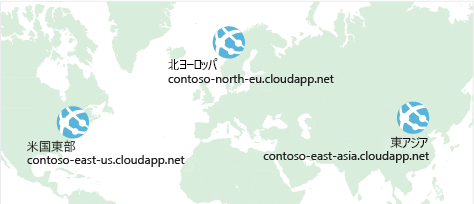

以前に、高可用性を実現し、ダウンタイムを最小限に抑えるのに **Azure Load Balancer** がどのように役立つかについて説明しました。Previously, you saw how **Azure Load Balancer** helps you achieve high availability and minimize downtime.

あなたの e コマース サイトの可用性はさらに向上しましたが、それによって待機時間の問題が解決したり、地理的リージョン全体での回復性が高くなったりするわけではありません。Although your e-commerce site is more highly available, it doesn't solve the issue of latency or create resiliency across geographic regions.

ヨーロッパやアジアのユーザーのために、米国にあるサイトの読み込みを高速化するにはどうすればよいですか?How can you make your site, which is located in the United States, load faster for users located in Europe or Asia?

## ネットワーク待ち時間とは何ですか?What is network latency?

:::row:::
  :::column:::
     :::column-end:::: :::column span="3"::: _待ち時間_は、ネットワーク経由でデータが送信されるのにかかる時間を指します。 :::column-end:::: :::column span="3"::: _Latency_ refers to the time it takes for data to travel over the network. 通常、待ち時間はミリ秒単位で測定されます。Latency is typically measured in milliseconds.

待ち時間を帯域幅と比較します。Compare latency to bandwidth. 帯域幅は、その接続に収めることができるデータ量を指します。Bandwidth refers to the amount of data that can fit on the connection. 待ち時間は、データが送信先に到達するまでにかかる時間を指します。Latency refers to the time it takes for that data to reach its destination.
  :::column-end:::
:::row-end:::

使用する接続の種類やアプリケーションの設計方法などの要因が、待ち時間に影響する場合もありますが、Factors such as the type of connection you use and how your application is designed can affect latency. 最も大きな要因は距離です。But perhaps the biggest factor is distance.

米国東部リージョンに配置されている Azure にあるあなたの e コマース サイトについて考えてみましょう。Think about your e-commerce site on Azure, which is in the East US region. 通常、アトランタ (約 640 キロメートルの距離) にデータを転送する時間は、ロンドン (約 6,400 キロメートル) にデータを転送する時間よりも短くて済みます。It would typically take less time to transfer data to Atlanta (a distance of around 400 miles) than to transfer data to London (a distance of around 4,000 miles).

あなたの e コマース サイトでは、標準的な HTML、CSS、JavaScript、およびイメージを配信しています。Your e-commerce site delivers standard HTML, CSS, JavaScript, and images. ファイルが増えるほどネットワーク待ち時間は長くなる可能性があります。The network latency for many files can add up. 地理的に遠く離れた場所にいるユーザーへの待ち時間を短くするには、どうすればよいですか?How can you reduce latency for users located far away geographically?

## 異なるリージョンへのスケール アウトScale out to different regions

Azure では、世界中のさまざまなリージョンでデータ センターを提供していることを思い出してください。Recall that Azure provides data centers in regions across the globe.

:::row:::
  :::column:::
     :::column-end:::: :::column span="3"::: データ センターを建設する場合の費用を考えてください。 :::column-end:::: :::column span="3"::: Think about the cost of building a data center. 機器のコストだけではありません。Equipment costs aren't the only factor. 電源、冷却装置、および各場所でシステムを常に稼働させるための人員を提供する必要があります。You need to provide the power, cooling, and personnel to keep your systems running at each location. データ センター全体をレプリケートするには、多額のコストがかかる場合があります。It might be prohibitively expensive to replicate your entire data center. しかし、Azure には既に機器と人員が用意されているため、Azure を使用すれば、ずっと少ないコストでこれを行うことができます。But doing so with Azure can cost much less, because Azure already has the equipment and personnel in place.
  :::column-end:::
:::row-end:::

待ち時間を短縮する 1 つの方法は、サービスの正確なコピーを複数のリージョンに提供することです。One way to reduce latency is to provide exact copies of your service in more than one region. グローバルなデプロイの例を次の図に示します。The following illustration shows an example of global deployment.

図では、Azure の 3 つのリージョン (米国東部、北ヨーロッパ、および東アジア) で実行されている eコマース サイトが示されています。The diagram shows your e-commerce site running in three Azure regions: East US, North Europe, and East Asia. それぞれの DNS 名に注目してください。Notice the DNS name for each. contoso.com ドメインの下で、地理的に最も近いサービスにユーザーを接続させるにはどうすればよいですか?How can you connect users to the service that's closest geographically, but under the contoso.com domain?

## Traffic Manager を使用して最も近いエンドポイントにユーザーをルーティングするUse Traffic Manager to route users to the closest endpoint

:::row:::
  :::column:::
     :::column-end:::: :::column span="3"::: 答えの 1 つが **Azure Traffic Manager** です。 :::column-end:::: :::column span="3"::: One answer is **Azure Traffic Manager**. Traffic Manager は、ユーザーに最も近い DNS サーバーを使用して、ユーザー トラフィックを世界中に分散されたエンドポイントに送信します。Traffic Manager uses the DNS server that's closest to the user to direct user traffic to a globally distributed endpoint.
  :::column-end:::
:::row-end:::

次の図は、Traffic Manager のロールを示しています。The following illustration shows the role of the Traffic Manager.

Traffic Manager では、クライアントとサーバー間を通過するトラフィックを認識することはありません。Traffic Manager doesn't see the traffic that's passed between the client and server. 代わりに、クライアントの Web ブラウザーを優先エンドポイントに送信します。Rather, it directs the client web browser to a preferred endpoint. Traffic Manager は、待ち時間が最も短いエンドポイントなどに、いくつかの異なる方法でトラフィックをルーティングすることができます。Traffic Manager can route traffic in a few different ways, such as to the endpoint with the lowest latency.

ここには示されていませんが、このセットアップには、カリフォルニアで実行されているオンプレミスのデプロイも含めることができます。Although not shown here, this setup could also include your on-premises deployment running in California. Traffic Manager を自分のオンプレミスのネットワークに接続して、既存のデータ センターへの投資を維持することができます。You can connect Traffic Manager to your own on-premises networks, enabling you to maintain your existing data center investments. または、アプリケーションを完全にクラウドに移行することもできます。Or you can move your application entirely to the cloud. 選ぶのはあなた自身です。The choice is yours.

## Load Balancer と Traffic Manager を比較するCompare Load Balancer to Traffic Manager

:::row:::
  :::column:::
     :::column-end:::: :::column span="3"::: Azure Load Balancer は、サービスの可用性と回復性をより高めるため、同じリージョン内でトラフィックを分散させます。 :::column-end:::: :::column span="3"::: Azure Load Balancer distributes traffic within the same region to make your services more highly available and resilient. Traffic Manager は、DNS レベルで動作し、優先エンドポイントにクライアントを送信します。Traffic Manager works at the DNS level, and directs the client to a preferred endpoint. このエンドポイントは、ユーザーに最も近いリージョンにすることができます。This endpoint can be to the region that's closest to your user.

Load Balancer と Traffic Manager はどちらもサービスの回復性を高めるのに役立ちますが、その方法は若干異なります。Load Balancer and Traffic Manager both help make your services more resilient, but in slightly different ways. Load Balancer では、応答していない VM を検出すると、プール内の別の VM にトラフィックを送信します。When Load Balancer detects an unresponsive VM, it directs traffic to other VMs in the pool. Traffic Manager では、エンドポイントの正常性を監視します。Traffic Manager monitors the health of your endpoints. これに対し、Traffic Manager が応答していないエンドポイントを検出すると、次に最も近い応答しているエンドポイントにトラフィックを送信します。In contrast, when Traffic Manager finds an unresponsive endpoint, it directs traffic to the next closest endpoint that is responsive.
  :::column-end:::
:::row-end:::

## まとめSummary

地理的な距離は、待ち時間に影響する最も大きな要因の 1 つです。Geographic distance is one of the biggest factors that contributes to latency. Traffic Manager を配置すると、サービスの正確なコピーを複数の地理的リージョンでホストすることができます。With Traffic Manager in place, you can host exact copies of your service in multiple geographic regions. これにより、米国、ヨーロッパ、およびアジアのユーザーすべてが、あなたの e コマース サイトの使用に対して良好なエクスペリエンスを持つことができます。That way, users in the United States, Europe, and Asia will all have a good experience using your e-commerce site.
