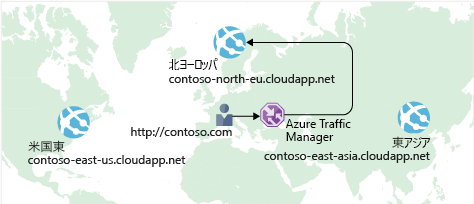

以前に、高可用性を実現し、ダウンタイムを最小限に抑えるのに **Azure Load Balancer** がどのように役立つかについて説明しました。

あなたの e コマース サイトの可用性はさらに向上しましたが、それによって待機時間の問題が解決したり、地理的リージョン全体での回復性が高くなったりするわけではありません。

ヨーロッパやアジアのユーザーのために、米国にあるサイトの読み込みを高速化するにはどうすればよいですか?

## ネットワーク待ち時間とは何ですか?

_待ち時間_は、ネットワーク経由でデータが送信されるのにかかる時間を指します。 通常、待ち時間はミリ秒単位で測定されます。

待ち時間を帯域幅と比較します。 帯域幅は、その接続に収めることができるデータ量を指します。 待ち時間は、データが送信先に到達するまでにかかる時間を指します。

使用する接続の種類やアプリケーションの設計方法などの要因が、待ち時間に影響する場合もありますが、 最も大きな要因は距離です。

米国東部リージョンに配置されている Azure にあるあなたの e コマース サイトについて考えてみましょう。 通常、アトランタ (約 640 キロメートルの距離) にデータを転送する時間は、ロンドン (約 6,400 キロメートル) にデータを転送する時間よりも短くて済みます。

あなたの e コマース サイトでは、標準的な HTML、CSS、JavaScript、およびイメージを配信しています。 ファイルが増えるほどネットワーク待ち時間は長くなる可能性があります。 地理的に遠く離れた場所にいるユーザーへの待ち時間を短くするには、どうすればよいですか?

## 異なるリージョンへのスケール アウト

Azure では、世界中のさまざまなリージョンでデータ センターを提供していることを思い出してください。

データ センターを構築するコストについて考えてみましょう。 機器のコストは、唯一の要素はありません。 電源、冷却装置、および担当者の各場所で実行されている、システムを提供する必要があります。 データ センター全体をレプリケートするには、多額のコストがかかる場合があります。 ただし、既にされているため Azure 担当者の装置とインプレースほど、コスト Azure を使ってこれを行います。

待ち時間を短縮する 1 つの方法は、サービスの正確なコピーを複数のリージョンに提供することです。 「この次図は、グローバル展開例を示します。

図では、Azure の 3 つのリージョン (米国東部、北ヨーロッパ、および東アジア) で実行されている e コマース サイトが示されています。 それぞれの DNS 名に注目してください。 contoso.com ドメインの下で、地理的に最も近いサービスにユーザーを接続させるにはどうすればよいですか?

## Traffic Manager を使用して最も近いエンドポイントにユーザーをルーティングする

1 つの解答**Azure Traffic Manager**します。 Traffic Manager は、ユーザーに最も近い DNS サーバーを使用して、ユーザー トラフィックを世界中に分散されたエンドポイントに送信します。 次の図は、Traffic Manager の役割を示します。

Traffic Manager では、クライアントとサーバー間を通過するトラフィックを認識することはありません。 代わりに、優先エンドポイントにクライアントの web ブラウザーを指示します。 Traffic Manager できますでトラフィックをルーティング、いくつかの異なる方法でなどをエンドポイントに最も低い待機時間。

ここで表示されませんが、このセットアップがカリフォルニア州で実行されている、オンプレミスのデプロイを含めることもできます。 Traffic Manager は、データ センターの既存投資を維持することを有効にすると、オンプレミス ネットワークに接続できます。 または、アプリケーションを完全にクラウドに移行することもできます。 選ぶのはあなた自身です。

## ロード バランサーを Traffic Manager を比較します。

Azure Load Balancer は、サービスの可用性と回復性をより高めるため、同じリージョン内でトラフィックを分散させます。 Traffic Manager は、DNS レベルで動作し、優先エンドポイントにクライアントに指示します。 このエンドポイントは、ユーザーに最も近いリージョンにすることができます。

ロード バランサーと、サービスの回復性が向上するため両方 Traffic Manager が若干異なります。 ロード バランサーは、応答していない VM を検出すると、プール内の他の Vm へのトラフィックを送信します。 Traffic Manager は、エンドポイントの正常性を監視します。 これに対し、Traffic Manager が応答していないエンドポイントを検出すると、次に最も近い応答しているエンドポイントにトラフィックを送信します。

## まとめ

地理的な距離は、待ち時間に影響する最も大きな要因の 1 つです。 Traffic Manager を配置すると、サービスの正確なコピーを複数の地理的リージョンでホストすることができます。 これにより、米国、ヨーロッパ、およびアジアのユーザーすべてが、あなたの e コマース サイトの使用に対して良好なエクスペリエンスを持つことができます。
