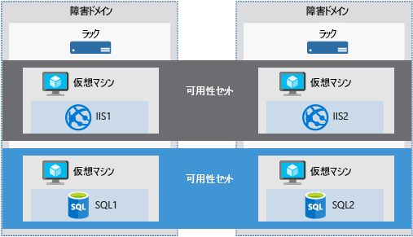

多くの場合、サービス企業の成功は、企業がその顧客と締結するサービス レベル アグリーメント (SLA) に直接関連します。 顧客は企業が提供するサービスが常に利用できること、自分のデータが安全に守られることを期待します。 Microsoft はこのことを非常に重視しています。 顧客が会社のサービスをいつでも利用できるように、Azure では、可用性、データ セキュリティ、監視を管理するためのツールが提供されます。

Azure VM の管理は、VM で実行されるオペレーティング システムまたはソフトウェアの管理に限定されません。 サービスの可用性を確保し、自動化を支援する Azure サービスを把握する上で役立ちます。 このようなサービスは、事業継続とディザスター リカバリーの方針を計画するときに便利です。

ここでは、VM 可用性の改善、VM 管理作業の合理化、VM データのバックアップとセキュリティを支援する Azure サービスを紹介します。 それでは可用性の定義から始めましょう。

## 可用性とは何でしょうか。

可用性とは、あるサービスを利用できる時間の割合です。

ある Web サイトを所有しているあなたはその情報に顧客がいつでもアクセスできるようにすることを望んでいるとします。 あなたは Web サイトのアクセス可用性に 100% を望みます。

### Azure を使用するとき、なぜ可用性について考慮する必要があるのでしょうか?

Azure VM は Azure データ センター内でホストされている物理サーバー上で実行されます。 多くの物理デバイスと同様に、故障が発生する可能性があります。 物理サーバーが故障した場合、そのサーバーでホストされている仮想マシンも停止します。 その場合、Azure では、VM が正常なホスト サーバーに自動的に移動されます。 しかしながら、この自己修復移行には数分かかることがあり、その間、その VM でホストされているアプリケーションが利用できなくなります。

VM はまた、Azure 自体により開始される定期的な更新の影響を受ける場合があります。 このような保守管理イベントはソフトウェア更新からハードウェア アップグレードまでわたりますが、プラットフォームの信頼性とパフォーマンスを改善することが要求されます。 そうしたイベントは通常、ゲスト VM に影響を与えることなく実行されますが、更新またはアップグレードを完了するために仮想マシンが再起動されることがあります。

> [!NOTE]
> Microsoft がユーザーの VM OS またはソフトウェアを自動更新することはありません。 更新はユーザーがすべてコントロールし、その責任を負います。 ただし、信頼性と高いパフォーマンスを常に確保するために、基礎となるソフトウェア ホストとハードウェアには定期的にパッチが適用されます。

サービスが中断されないようにするため、また、単一障害点を回避するために、VM ごとに 2 つのインスタンスをデプロイすることをお勧めします。 この機能は_可用性セット_と呼ばれています。

### 可用性セットとは。

**可用性セット**とは、全部が単一障害点の制限下に含まれないように、また、データ センターでホスト オペレーティング システムがアップグレードされるとき、全部が同時にアップグレードされないように、関連 VM のグループを確実にデプロイするための論理機能です。 可用性セットに配置された VM では、同じ機能セットを実行する必要があり、同じソフトウェアをインストールする必要があります。

> [!TIP]
> Microsoft は、ある可用性セットにデプロイされたマルチインスタンス VM に対して、99.95% の外部接続性サービス レベル アグリーメント (SLA) を提供します。 そのため、適用する SLA に対して、ある可用性セット内に少なくとも 2 つの VM インスタンスをデプロイする必要があります。 

可用性セットは Azure Portal のディザスター リカバリー セクションから作成できます。 また、Resource Manager テンプレート、任意のスクリプト ツール、任意の API ツールを利用して作成できます。 可用性セットに VM を配置するとき、Azure では、必ず**障害ドメイン**と**更新ドメイン**に分散されます。

#### 障害ドメインとは何でしょうか。

障害ドメインとは Azure のハードウェア論理グループであり、共通の電源とネットワーク スイッチを共有します。 オンプレミス データセンター内のラックのようなものであるとお考えください。 1 つのラックでネットワークまたは電源に障害が発生しても、影響を受ける VM が 1 つだけになるように、可用性セットの最初の 2 つの VM が 2 つの異なるラックにプロビジョニングされます。 障害ドメインも、VM に接続されているマネージド ディスクに対して定義されます。

#### 更新ドメインとは何しょうか。

更新ドメインとは、メンテナンスや再起動が同時に行われる可能性のあるハードウェアの論理グループです。 Azure では、Azure プラットフォームでホスト オペレーティング システムが変更されるときの影響を最小限に抑える目的で、可用性セットが更新ドメインに自動的に配置されます。 Azure ではその後、一度に 1 つずつ各更新ドメインが処理されます。

可用性セットは、VM で実行されているサービスを顧客が常に利用できるようにする高度な機能です。 ただし、絶対確実ではありません。 VM 自体で実行されているデータやソフトウェアに何か発生した場合、どうなりますか。 それに関しては、ディザスター リカバリーとバックアップに関する他の手法を考察する必要があります。

## 場所間でのフェールオーバー

サイト間でインフラストラクチャを複製し、リージョン内でフェールオーバーすることもできます。 **Azure Site Recovery** では、プライマリ サイトからセカンダリの場所にワークロードが複製されます。 プライマリ サイトで停電が発生した場合、セカンダリの場所にフェールオーバーできます。 このフェールオーバーにより、中断なく、引き続きアプリケーションにアクセスできます。 その後、プライマリの場所が再び動いたらそこにフェールバックできます。 Azure Site Recovery の目標は仮想マシンまたは物理マシンの複製にあります。停電時、ワークロードの可用性を維持します。

Site Recovery には優れた技術的特徴がいろいろありますが、ビジネスにおいては利点が少なくとも 2 つあります。

1. Site Recovery を利用すれば、Azure を復元先として利用できます。そのため、第二の物理データセンターを保守するためのコストと煩雑さから解放されます。

2. Site Recovery では、運用環境に影響を与えることなく、復旧演習でフェールオーバーを極めてシンプルにテストできます。 そのため、計画フェールオーバーや計画外フェールオーバーを簡単にテストできます。 結局のところ、フェールオーバーを試したことがなければ、良いディザスター リカバリーを計画できません。

Site Recovery で作成した復元計画は、シナリオで求められるなら、シンプルにも複雑にもすることができます。 計画にはカスタム PowerShell スクリプト、Azure Automation Runbook、手動介入手順を含めることができます。 復元計画を活用してワークロードを Azure に複製できるため、新たな移行、急増時の一時的なバースト、新しいアプリケーションの開発やテストが簡単になります。

Azure Site Recovery は Azure リソース、Hyper-V、VMware、オンプレミス インフラストラクチャの物理サーバーと連動します。また、複製、フェールオーバー、プライマリの場所に障害が発生した場合のワークロードとアプリケーションの復元を調整することで、組織の BCDR (事業継続とディザスター リカバリー) 方針の重要な部分となります。
