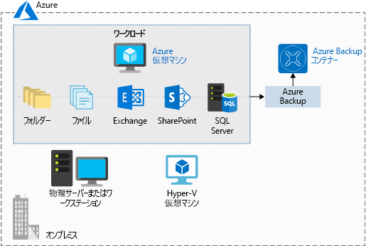

優れたインフラストラクチャを計画するにあたり、データのバックアップと復元が不可欠な要素となります。 バグによりデータの一部が消えることもあれば、アーカイブ済みのデータを監査目的で引き出さなければならないこともあります。 バックアップ方針が優れていれば、データやソフトウェアを復元しなければならなくなっても慌てることはありません。

**Azure Backup** は、オンプレミスとクラウドを問わず、物理コンピューターと仮想コンピューターを保護する_サービスとしてのバックアップ_ サービスです。

Azure Backup は、次のような、さまざまなデータ バックアップ シナリオで利用できます。

- Windows OS コンピューター上のファイルとフォルダー (物理または仮想、ローカルまたはクラウド)
- アプリケーション対応スナップショット (ボリューム シャドウ コピー サービス)
- Microsoft SQL Server、Microsoft SharePoint、Microsoft Exchange など、Microsoft の人気サーバー ワークロード
- Azure Virtual Machines のネイティブ サポート、Windows と Linux の両方
- Linux と Windows 10 のクライアント コンピューター

## Azure Backup を使用する利点

従来のバックアップ ソリューションでは、基になる Azure プラットフォームを最大限まで常に活用できるとは限りません。 結果として、ソリューションは高額になったり、非効率的になったりします。 ソリューションが提供するストレージが大きすぎるか、小さすぎるかであり、ストレージの種類が適切でなく、面倒な管理タスクが長時間続きます。 Azure Backup は他の Azure サービスと連携して動作するように設計されており、非常に大きな特典がいくつかあります。

- **ストレージ管理の自動化**。 Azure Backup は、従量制課金モデルを使用して、バックアップ ストレージを自動的に割り当てて管理します。 料金は使用した分だけになります。

- **無制限のスケーリング**。 Azure Backup では、Azure のパワーと拡張性が利用され、可用性が高くなります。

- **複数のストレージ オプション**。 Azure Backup はローカル冗長ストレージを提供します。データのコピーはすべて同じリージョン内に存在し、geo 冗長ストレージでは、複製されたデータがセカンダリ リージョンに置かれます。

- **無制限のデータ転送**。 転送する受信データまたは送信データ量に制限がありません。 転送データに対して料金は発生しません。

- **データの暗号化**。 データの暗号化により、Azure において、セキュリティで保護された転送と保存が実現します。

- **アプリケーションの整合性のバックアップ**。 アプリケーション整合性バックアップは、復旧ポイントがバックアップ コピーを復元するために必要なすべてのデータを持っていることを意味します。 Azure Backup では、アプリケーション間で一貫性のあるバックアップが行われます。

- **長期保存**。 Azure では、バックアップ データを維持する時間に制限がありません。

## Azure Backup の使用

Azure Backup では、ダウンロードし、バックアップするコンピューターにデプロイするコンポーネントがいくつか活用されます。 デプロイするコンポーネントは、何を保護するかによって決まります。

- Azure Backup エージェント
- System Center Data Protection Manager
- Azure Backup Server
- Azure Backup VM 拡張機能

Azure Backup では、バックアップ データの格納に Recovery Services コンテナーが使用されます。 コンテナーは Azure Storage Blob によりバックアップされ、非常に効率的で経済的な長期間ストレージ手段となります。 コンテナーを配置したら、バックアップするコンピューターを選択し、バックアップ ポリシーを定義できます (スナップショットを作成するタイミングや保存期間)。