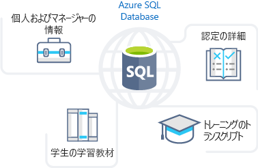
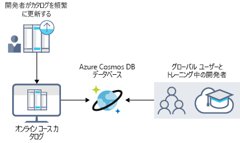
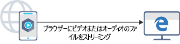
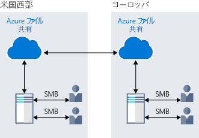
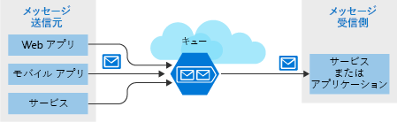
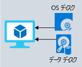

ラーニング ポータルは、格納するための最適な方法を提供を理解する Azure データ ストレージの利点を調べるします。Looking at the benefits of Azure data storage, you understand that it offers the best options for storing your learning portal. 今すぐ利点とオプションをビジネス ニーズを組み込む方法を詳しく見ていきましょう。Now let's explore the benefits and options in detail to see how it fits your business needs.

## Azure データ ストレージはビジネス ストレージ ニーズを満たす方法How Azure data storage can meet your business storage needs

Azure では、特定の種類のデータ ストレージのニーズに合わせていくつかのストレージ オプションを提供します。Azure provides several storage options that accommodate specific types of data storage needs. その一部について簡単に説明を見てみましょう。Let's take a brief look at some of them.

### Azure SQL DatabaseAzure SQL Database

**Azure SQL Database**は堅牢な完全管理型リレーショナル クラウド データベースです。**Azure SQL Database** is a robust, fully managed, relational cloud database. この機能を使用すると、スタッフの個人情報やトレーニングに関する情報など、頻繁にアクセスおよび更新するデータを格納できます。You can use this feature to store data that you frequently access and update, such as personal and training-related information for your staff. また、アプリケーションを変更することなく、既存の SQL Server データベースを移行することもできます。You can also migrate your existing SQL Server databases without changing your applications. Azure SQL データベースに格納されるオンライン ラーニング ポータル シナリオからのデータの種類を、次の図に示します。The following illustration shows the types of data from the online learning portal scenario that would be stored in an Azure SQL database.

### Azure Cosmos DBAzure Cosmos DB

Azure Cosmos DB は、グローバル分散データベース サービスです。Azure Cosmos DB is a globally distributed database service. 応答性の高いビルドできるスキーマのないデータをサポートし、 **Always On**絶えず変化するデータをサポートするアプリケーション。It supports schema-less data that lets you build highly responsive and **Always On** applications to support constantly changing data. この機能を使用すると、データが更新され、世界各地のユーザーによって管理されるデータを格納します。You can use this feature to store data that is updated and maintained by users around the world. 次の図は、世界各地にあるユーザーによってアクセスされるデータの格納に使用されるサンプルの Azure Cosmos DB データベースを示します。The following illustration shows a sample Azure Cosmos DB database that's used to store data that's accessed by people located across the globe.

### Azure BLOB ストレージAzure Blob storage

Azure Blob storage では、大規模なビデオをストリーミングまたは任意の場所からユーザーのブラウザーに直接オーディオ ファイル、世界中にします。Azure Blob storage lets you stream large video or audio files directly to the user's browser from anywhere in the world. Blob Storage は、バックアップと復元、ディザスター リカバリー、アーカイブのためのデータの格納にも使用されます。Blob storage is also used to store data for backup and restore, disaster recovery, and archiving. 最大 8 TB の仮想マシンのデータを格納することがあります。It has the ability to store up to 8 TB of data for virtual machines. Azure BLOB ストレージの使用例を次の図に示します。The following illustration shows an example usage of Azure blob storage.

### Azure Data Lake Storage Gen2Azure Data Lake Storage Gen2

Data Lake の機能を使用すると、データの使用状況の分析を実行して、レポートの準備ができます。The Data Lake feature allows you to perform analytics on your data usage and prepare reports. Data Lake は、構造化データと非構造化データの両方を格納する大規模なリポジトリです。Data Lake is a large repository that stores both structured and unstructured data.

**Azure Data Lake Storage Gen2** では、オブジェクト ストレージのスケーラビリティおよびコスト メリットと、ビッグ データ ファイル システム機能の信頼性とパフォーマンスが結合されています。**Azure Data Lake Storage Gen2** combines the scalability and cost benefits of object storage with the reliability and performance of the Big Data file system capabilities. 次の図は、Azure Data Lake のすべてのビジネス データの格納し、分析のために使用できるようにします。The following illustration shows how Azure Data Lake stores all your business data and makes it available for analysis.

### Azure FilesAzure Files

Azure Files では、クラウドでのフル マネージド ファイル共有が提供されます。Azure Files offers fully managed file shares in the cloud. Azure で実行されているアプリケーションでは、VM 間でファイルを簡単に共有できます。Applications running in Azure can easily share files between VMs. Windows、Linux、macOS のクラウドまたはオンプレミスの展開に対して同時に Azure ファイル共有を使用できます。You can use Azure file shares at the same time for cloud or on-premises deployments of Windows, Linux, and macOS. 2 つの地理的な場所間でデータを共有するために使用されている Azure Files を、次の図に示します。The following illustration shows Azure Files being used to share data between two geographical locations. Azure Files では、保存時と転送中のデータの暗号化が保証されるサーバー メッセージ ブロック (SMB) プロトコルが使用されます。Azure Files uses the Server Message Block (SMB) protocol which ensures the data is encrypted at rest and in transit.

### Azure QueueAzure Queue

Azure Queue Storage は、世界中のどこからでもアクセスできる大量のメッセージを格納するためのサービスです。Azure Queue storage is a service for storing large numbers of messages that can be accessed from anywhere in the world. パースペクティブに言うと、1 つのキュー メッセージには最大 64 KB のサイズ、およびキューは、数百万のメッセージを含めることができます。To put it in perspective, a single queue message is up to 64 KB in size, and a queue can contain millions of messages.

通常、1 つ以上の送信側コンポーネントと 1 つ以上の受信側コンポーネントがあります。Typically, there are one or more sender components and one or more receiver components. 送信側のコンポーネントは、受信側コンポーネントは、処理のためのキューの先頭からメッセージを取得中に、キューにメッセージを追加します。Sender components add message to the queue, while receiver components retrieve messages from the front of the queue for processing. 次の図は、メッセージを Azure Queue に追加する複数の送信側アプリケーションと、メッセージを取得する 1 つの受信側アプリケーションを示しています。The following illustration shows multiple sender applications adding messages to the Azure Queue and one receiver application retrieving the messages.

Queue storage を使用することができます。You can use queue storage to:

- 別の Azure の web サーバー間でメッセージを渡すと作業のバックログを作成します。Create a backlog of work and to pass messages between different Azure web servers.
- トラフィックの急激な増加を管理して別の web サーバーのインフラストラクチャの間での負荷を分散します。Distribute load among different web servers/infrastructure and to manage bursts of traffic.
- 複数のユーザーが同時にデータをアクセス時に、コンポーネントの障害に対して回復力を構築します。Build resilience against component failure when multiple users access your data at the same time.

### Azure Standard StorageAzure Standard Storage

Azure の仮想マシンでは、オペレーティング システム、アプリケーション、およびデータを格納するためにディスクが使用されます。Virtual machines in Azure use disks to store operating systems, applications, and data. Azure Standard Storage では、ミッション クリティカルではないワークロードを実行する VM 向けに、信頼性の高い低コストのディスク サポートが提供されます。Azure Standard Storage delivers reliable, low-cost disk support for VMs running workloads that are not mission critical. Standard Storage では、データはハード ディスク ドライブ (HDD) に格納されます。With Standard Storage, the data is stored on hard disk drives (HDDs).

VM を使用するとき、重要度の低いワークロードには Standard SSD および HDD ディスクを使用し、ミッション クリティカルな運用アプリケーションには Premium SSD ディスクを使用できます。When working with VMs, you can use standard SSD and HDD disks for less critical workloads, and premium SSD disks for mission-critical production applications. Azure ディスクは、0% の年間のエラー率、業界トップ レベルのエンタープライズ レベルの持続性を一貫して提供しました。Azure Disks have consistently delivered enterprise-grade durability, with an industry-leading ZERO% annualized failure rate. 個別のディスクを使用してさまざまなデータを格納する Azure 仮想マシンを次の図に示します。The following illustration shows an Azure virtual machine using separate disks to store different data.

### ストレージ層Storage tiers

Azure では、blob オブジェクト ストレージ用の 3 つの記憶域階層を提供します。Azure offers three storage tiers for blob object storage:

1. **ホット ストレージ層**: 頻繁にアクセスされるデータの格納に適しています。**Hot storage tier**: optimized for storing data that is accessed frequently.

1. **クール ストレージ層**: 頻度の低いアクセスされ、少なくとも 30 日間格納されるデータに適しています。**Cool storage tier**: optimized for data that is infrequently accessed and stored for at least 30 days.

1. **アーカイブ ストレージ層**: データがほとんどアクセスされず、柔軟な待ち時間の要件が、少なくとも 180 日間保存します。**Archive storage tier**: for data that is rarely accessed and stored for at least 180 days with flexible latency requirements.

### 暗号化とレプリケーションEncryption and replication

Azure では、セキュリティと暗号化およびレプリケーション機能を介してデータに高可用性を提供します。Azure provides security and high availability to your data through encryption and replication features.

#### ストレージ サービスの暗号化Encryption for storage services

ご利用のリソースには次の種類の暗号化を使用できます。The following encryption types are available for your resources:

1. 保存データ用の **Azure Storage Service Encryption (SSE)** は、データをセキュリティで保護して組織のセキュリティと規制コンプライアンスを満たすのに役立ちます。**Azure Storage Service Encryption (SSE)** for data at rest helps you secure your data to meet the organization's security and regulatory compliance. 格納する前にデータを暗号化し、それを取得する前に、データを復号化します。It encrypts the data before storing it and decrypts the data before retrieving it. 暗号化と復号化をユーザーが認識することはありません。The encryption and decryption are transparent to the user.

1. **クライアント側暗号化**では、データはクライアント ライブラリによって既に暗号化されています。**Client-side encryption** is where the data is already encrypted by the client libraries. 保存時には暗号化された状態でデータが格納され、取得の間に復号化されます。Azure stores the data in the encrypted state at rest, which is then decrypted during retrieval.

#### ストレージの可用性のためのレプリケーションReplication for storage availability

ストレージ アカウントを作成するときに、レプリケーションの種類を設定します。A replication type is set up when you create a storage account. レプリケーション機能により、データが永続的で常に使用できることが保証されます。The replication feature ensures that your data is durable and always available. Azure では、自然災害、火災、洪水などのようなその他の地域の災害からデータを保護するリージョンと地理的レプリケーションを提供します。Azure provides regional and geographic replications to protect your data against natural disasters and other local disasters like fire or flooding.