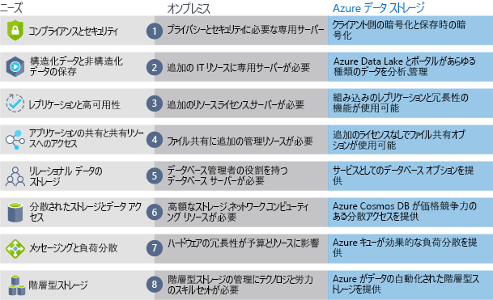

Azure Storage の利点と機能を学習したので、次は Azure Storage とオンプレミス ストレージの違いを見てみましょう。

## Azure Storage とオンプレミス ストレージの比較

"オンプレミス" という用語は、ローカルのハードウェアやサーバー上でのデータの保存と管理を指します。 オンプレミス ストレージと Azure Storage を比較する際に考慮する必要がある複数の要素があります。

### コスト効率
オンプレミス ストレージ ソリューションには、購入、導入、構成、保守が必要な専用ハードウェアが必要です。 これは、多大な初期投資 (資本コスト) になる可能性があります。 今後の要件の変更により、新しいハードウェアへの投資が必要になることも少なくありません。 また、需要が急増した場合、ピーク需要に対応できるハードウェアに投資する必要がありますが、ピーク時以外はアイドル状態であったり、使用率が低かったりする可能性があります。

Azure Storage では、初期資本コストではなく、運用コストとして企業にとって魅力的であることが多い従量課金制価格モデルが提供されます。 さらに、Azure Storage はスケーラブルであるため、需要の増加に応じてスケールアップまたはスケールアウトし、需要が少ないときにはスケールバックすることができます。 必要なデータ サービスにのみ課金されます。

### 信頼性 
オンプレミス ストレージには、データ バックアップ、負荷分散、ディザスター リカバリーの各戦略が必要です。 多くの場合、これらは、ハードウェアと IT リソースの両方に多大な投資を必要とする専用サーバーが必要であるため、困難でコストがかかる可能性があります。

Azure Storage では、データ バックアップ、負荷分散、ディザスター リカバリー、データ レプリケーションがサービスとして提供され、データの安全性と高可用性が確保されます。

### ストレージの種類
ソリューションには、ファイル ストレージやデータベース ストレージなど、複数の異なるストレージの種類が必要な場合があります。 多くの場合、オンプレミスのアプローチでは、ストレージの種類ごとに多数のサーバーと管理ツールが必要になります。

Azure Storage には、分散アクセスや階層型ストレージなどのさまざまなストレージ オプションが用意されています。 これにより、ソリューションの各部分に最適なストレージの選択肢を提供するストレージ テクノロジの組み合わせを統合することが可能になります。

### 俊敏性
要件とテクノロジは変化します。 オンプレミス展開の場合、これは新しいサーバーやインフラストラクチャ要素のプロビジョニングと展開を意味することがありますが、このアクティビティには時間とコストがかかります。

Azure Storage では、新しいサービスを数分で作成できる柔軟性がもたらされます。 この柔軟性により、多大なハードウェア投資を必要とせずにストレージ バックエンドを迅速に変更できます。

次の図では、オンプレミス ストレージと Azure データ ストレージの違いを示します。

