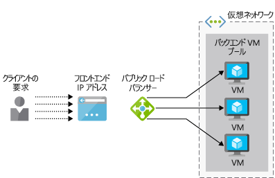
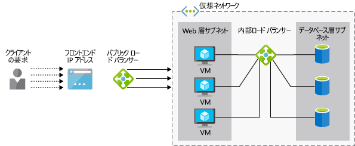

会社が Azure Load Balancer は、エンタープライズ リソース プランニング (ERP) アプリケーションをサポートを確認したいとします。 アプリケーションは、ユーザー用の web インターフェイスを備え、複数のサーバーで実行されます。 各サーバーでは、すべてのサーバー間で同期は、ERP のデータベースのローカル コピーを保持します。

ここでは、方法、サービスの高可用性を提供するロード バランサーがヘルプになります。 Basic と standard の load balancer のオプションの違いを識別し、Azure Virtual Machines のロード バランサーを作成する方法を説明します。

## 負荷分散とでしょうか。

_負荷分散_ワークロードを分散コンピューティング、ストレージなどの複数のデバイスとデバイスのネットワークのためのさまざまな手法について説明します。 負荷分散の目的は、インフラストラクチャのスケール アウトと一部のコンポーネントが使用できない場合ことを確認するサービスが保持されるよう、これらのリソースの最も効率的な使用を複数のリソースの使用を最適化します。

ここでは、Azure の負荷が分散仮想マシン (Vm) のサポートについて説明します。

### 高可用性とは

高可用性 (HA) では、システム コンポーネントのエラーに関係なくアクセス可能なアプリケーションまたはサービスの機能を測定します。 理想的には、あるされませんあります顕著なサービスが。

負荷分散は、サーバーのプールとして機能する複数の Vm を許容するために HA の配信に不可欠です。 プールは、いくつかの Vm のクラッシュ サービス要求の場合でもし続けるか、メンテナンスがオフラインです。

## Azure Load Balancer とは何ですか?

**Azure Load Balancer**はプール内の複数の Vm 間で着信要求を分散する Azure サービスです。 正常な Vm のセットの受信ネットワーク トラフィックを分散し、応答するようになっているすべての VM を回避できます。

 Azure Load Balancer は、レイヤー 4 (TCP、UDP) の OSI 7 層のモデルで動作します。 これは、サポート TCP および UDP アプリケーションのシナリオ、トラフィックが Azure Vm にバインドされると、他の Azure サービスは通過 TCP および UDP トラフィック Azure Vm の外部エンドポイントに送信シナリオを構成できます。

> [!VIDEO https://www.microsoft.com/videoplayer/embed/RE2yBWo]

## 内部ロード バランサーとパブリック

Azure Load Balancer には、いずれかを指定できる_パブリック_または_内部_受信要求のソースに応じて。

A**パブリック ロード バランサー** Azure インフラストラクチャの外部からのクライアント要求を処理します。 ロード バランサーのパブリック IP アドレスは、パブリック IP とロード バランサーのリソースを作成するときに自動的にロード バランサーのフロント エンドとして構成されます。 次の図は、パブリック ロード バランサーを示します。

**内部ロード バランサー**仮想ネットワーク内 (または VPN 経由で) からの要求を処理します。 その仮想ネットワーク内のリソースへの要求を配信します。 ロード バランサー、IP アドレス フロント エンド、および仮想ネットワークでは、インターネットから直接アクセスできません。 次の図は、パブリックおよび内部のロード バランサーの両方を格納しているアーキテクチャを示します。 パブリック ロード バランサーは、内部ロード バランサーは、内部の Vm とデータベースを処理するために、要求を転送する一方、外部からの要求を処理します。

## Azure Load Balancer のしくみ

Azure Load Balancer で構成されている情報を使用して**ルール**と**正常性プローブ**でロード バランサーの受信は、受信トラフィックを新しい方法を決定する**フロント エンド**は内の VM インスタンスに配布する**バック エンド プール**します。

### フロント エンド

ロード バランサーのフロント エンドは、IP 構成で 1 つまたは複数パブリック IP アドレスを格納している、インターネット経由でのロード バランサーとそのアプリケーションへのアクセスをできるようにします。

### バックエンド アドレス プール

仮想マシンは、その仮想ネットワーク インターフェイス カード (vNIC) を使用してロード バランサーに接続します。 バックエンド アドレス プールには、ロード バランサーに接続されている Vnic の IP アドレスが含まれています。 可用性セット内のすべての Vm を配置する場合は、ロード バランサーを構成するときは、バック エンド プールに Vm を簡単に追加してこれを使用できます。

### 正常性プローブ

ロード バランサーの使用_正常性プローブ_を決定する仮想マシンは、要求を処理できます。 ロード バランサーが使用可能で、運用 Vm へのトラフィックだけが配布されます。 

正常性プローブは、各 VM の特定のポートを監視します。 「ヘルス」; に対応する応答の種類を定義することができます。たとえば、必要な`HTTP 200 Available`web アプリケーションからの応答。 既定では、VM が後に設定する「利用不可」と 15 秒間隔で 2 つの連続する障害。

### 負荷分散規則

ロード バランサー_ルール_バックエンド Vm にトラフィックを分散する方法を定義します。 目標は、バック エンド プールで正常な Vm 間で非常に要求を分散します。

Azure Load Balancer では、ハッシュ ベースのアルゴリズムを使用して、受信パケットのヘッダーを書き直してください。 既定では、ロード バランサーからハッシュを作成します。

- 発信元 IP アドレス
- ソース ポート
- 宛先 IP アドレス
- ターゲット ポート
- IP プロトコル番号

このメカニズムによりパケット クライアント フロー内のすべてのパケットが、同じバックエンド VM インスタンスに送信されるようになります。 クライアントから新しいフローは、ソース ポートがランダムに割り当てられる、異なるで使用されます。 つまり、ハッシュが変更、およびロード バランサーは、別のバックエンド エンドポイントにこのフローを送信できます。

## 基本とStandard Load Balancer の Sku

Azure Load Balancer の 2 つのバージョン:**基本的な**と**標準**します。 スケール、機能、および料金が異なります。 例:

- Standard は、Basic ではありません、HTTPS をサポートしています
- プールのサイズが非常に大きい Standard できます。
- Basic は無料、標準の規則とスループットに基づいて課金されます。

Basic は、標準上でも動作する標準は Basic では、適切なため、シナリオのスーパー セットです。 Basic SKU は、標準が運用環境の推奨に一般にプロトタイプやテストに対するものです。

## パブリック basic load balancer の展開を開始します。

負荷分散された VM のシステムを作成するには、必要があります自体には、ロード バランサーを作成する、仮想マシンを格納する仮想ネットワークを作成して、仮想ネットワークに Vm を追加します。

Azure portal を使用してロード バランサーを作成するには、次が定義します。

- ロード バランサー名
- 種類: パブリックまたは内部
- SKU: Basic または Standard
- パブリック IP アドレス: 動的または静的
- リソース グループと場所

バックエンド Vm はこのリソースを次に構成する必要があるために、すべて、同じ仮想ネットワークに接続します。

- 仮想ネットワーク名
- 172.20.0.0/16 など、使用するアドレス空間
- リソース グループ
- 使用するサブネットの名前
- サブネット (主な領域内である必要があります)、172.20.0.0/24 などのアドレス空間

作成して、バックエンド Vm をデプロイし、仮想ネットワークを使用するように構成する必要があります。 同じ可用性セットに Vm を配置することも必要があります。 可用性セットの Vm のグループ全体に対してフォールト トレランスのレベルを定義するが、負荷分散にも役立ちますバック エンド プールに Vm を割り当てます。

高可用性ソリューションの一部として、Azure Load Balancer を使用する方法を確認できました。 次に、ロード バランサーをデプロイするのに手順を使用します。