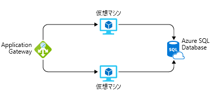

Azure でのシステムの構築を依頼され、今後 12 か月間のコストを見積もるよう求められたものとします。Imagine that you've been asked to build a system on Azure, and you've been asked for an estimate of what it might cost to run over the next 12 months. Azure の料金計算は完全に透過的であり、毎月使用したサービスについてのみ請求されることは、既に知っています。You already know that Azure pricing is fully transparent and that you're billed monthly for only the services that you use. それらのサービスをデプロイして実行することなく、または Azure サービスの価格ページを基にして各サービスの料金を手作業で計算することなく、その見積もりを得るにはどうすればよいでしょうか?How would you get that estimate without deploying and running those services or without manually pricing out each service from the Azure service pricing pages?

## Azure 料金計算ツールの概要Introducing the Azure pricing calculator

お客様が見積もりを作成しやすいように、**Azure 料金計算ツール**が作成されています。To make estimates easy for customers to create, Microsoft developed the **Azure pricing calculator**. Azure 料金計算ツールは Web ベースの無料ツールであり、Azure サービスを入力し、サービスのプロパティとオプションを変更できるようになっています。The Azure pricing calculator is a free web-based tool that allows you to input Azure services and modify properties and options of the services. サービスあたりのコストと、完全な見積もりの総コストが出力されます。It outputs the costs per service and total cost for the full estimate.

別のブラウザー ウィンドウまたはタブで、[Azure 料金計算ツール](https://azure.microsoft.com/pricing/calculator/)に移動します。In another browser window or tab, go to the [Azure pricing calculator](https://azure.microsoft.com/pricing/calculator/). 料金計算ツールのページには 3 つのタブがあります。On the pricing calculator page, you'll see three tabs:

1. **[製品]**。**Products.** このタブでほとんどの作業を行います。This tab is where you'll do most of your activity. このタブには、すべての Azure サービスが一覧表示されます。このタブで見積もり式を作成するサービスを追加したり削除したりします。This tab has all the Azure services listed and is where you'll add or remove services to formulate your estimate.
2. **[見積もり]**。**Estimates.** このタブには、以前に保存した見積もりがすべて表示されます。This tab has all of your previously saved estimates. このプロセスについては後で説明します。We'll go through this process in a moment.
3. **[FAQ]**。**FAQ.** 名前のとおり、このタブにはよく寄せられる質問に対する回答があります。Just as it says, this tab has answers to some frequently asked questions.

**[製品]** タブから始めます。左側にすべてのサービス カテゴリが一覧表示されています。Let's start with the **Products** tab. You'll see the full listing of service categories down the left-hand side. いずれかのカテゴリをクリックすると、そのカテゴリのサービスが表示されます。Clicking on any of the categories will display the services in that category. 検索ボックスもあり、すべてのサービスから探しているサービスを検索できます。There's also a search box where you can search through all services for the service you're looking for. サービスをクリックすると、そのサービスが見積もりに追加されます。Clicking on the service will add that service to your estimate. 1 つでも複数でも、必要な数のサービスを追加できます。同じサービスを複数追加することもできます (たとえば、複数の仮想マシン)。You can add just one service, or you can add as many as you need, including multiples of the same service (for example, multiple virtual machines).

サービスを追加した後は、その料金を計算します。After you've added the services, you'll want to price them. ページを下にスクロールすると、そのサービスの料金に適用されるカスタマイズ可能な詳細が表示されます。Scrolling down on the page will show you customizable details for that service that apply to pricing. たとえば、仮想マシンについては、リージョン、オペレーティング システム、インスタンス サイズなどの詳細を選択でき、そのすべてが VM の料金に影響します。For example, on virtual machines, you can select details such as the region, operating system, and instance size, all of which will impact the pricing for the VM. サービスの小計が表示されます。You'll see a subtotal for the service. さらに下にスクロールすると、見積もりに含まれるすべてのサービスの総計が表示されます。And scrolling further down, you'll see a full total for all services included in the estimate. 合計と共に、見積もりをエクスポート、保存、共有するボタンが表示されます。Along with the total, you'll see buttons where you can export, save, and share the estimate.

## ソリューションを見積もるEstimate a solution

元のシナリオで、このシステムを 2 つの Azure VM 上で実行し、Azure SQL Database インスタンスに接続するものとします。From our original scenario, let's imagine that this system will run on two Azure VMs and will connect to an Azure SQL Database instance. また、レイヤー 7 ファイアウォールを設けて、次のような強化された負荷分散機能の実現を確実にします。We also want to have a layer 7 firewall in place to ensure we have the following enhanced load-balancing capabilities. 次の図では、1 つの Azure SQL Database インスタンスに接続されている 2 つの仮想マシンがアプリケーション ゲートウェイに接続されています。The following illustration shows an application gateway connected to two virtual machines that are connected to a single Azure SQL Database instance.

Azure 料金計算ツールを使用して、ソリューションのコストを計算し、チームと共有するために見積もりをエクスポートすることができます。We can use the Azure pricing calculator to figure out what the solution will cost and export our estimate to share with the team.

> [!TIP]
> 計算ツールを、見積もりに何も表示されていないクリーンな状態にします。Make sure you have a clean calculator with nothing listed in the estimate. 見積もりに何かある場合は、各項目のごみ箱アイコンをクリックして、見積もりをリセットします。If you have anything present in your estimate, click the trashcan icon on each item to reset the estimate.

Azure 料金計算ツールの **[製品]** タブで、次のサービスをクリックして見積もりに追加します。In the Azure pricing calculator, on the **Products** tab, add the following services to the estimate by clicking on them:

* [コンピューティング] カテゴリの仮想マシンVirtual Machines in the Compute category
* [データベース] カテゴリの Azure SQL DatabaseAzure SQL Database in the Database category
* [ネットワーク] カテゴリのアプリケーション ゲートウェイApplication Gateway in the Network category

**[見積もり]** タブで各サービスの詳細を構成し、コストの確実な見積もりを取得できます。We can configure the details of each, on the **Estimates** tab, to get a solid estimate of our costs. すべてのリソースに対し、**[米国西部]** リージョンを使用します。Use the **West US** region for all resources.

* **Virtual Machines**。**Virtual Machines.** これは ASP.NET アプリケーションなので、**Windows OS** VM を使用する必要があります。This is an ASP.NET application, so we'll need to use a **Windows OS** VM. このアプリケーションでは大量のコンピューティング パワーは必要ないので、**D2v3** インスタンス サイズを選択します。This application doesn't require a massive amount of computing power, so select the **D2v3** instance size. 2 つの仮想マシンを必要とし、それを常時 (730 時間/月) 実行します。We'll need two virtual machines, and they will run all the time (730 hours/month). これらの VM に対しては Premium SSD ストレージを使用し、VM ごとにサイズ **E10** のディスクが 1 つだけ必要です (全部で 2 つのディスク)。We're going to use premium SSD storage for these VMs and will require just one disk per VM of size **E10**, for a total of two disks.

* **SQL Database**。**SQL Database.** データベースについては、**仮想コア モデル**を使用して**単一データベース タイプ**をプロビジョニングします。For the database, we're going to provision a **single database type** using the **vCore model**. 4 仮想コアの汎用 Gen 4 データベースが必要です。We want a General Purpose, Gen 4 database with 4 vCores. 32 GB のストレージが必要であり、平均 16 GB のストレージを保持します。We'll need 32 GB of storage and will be retaining an average of 16 GB of storage. 保持ポリシーは、8 週間、12 か月間、5 年間になります。Our retention policy will be 8 weeks, 12 months, and 5 years.

* **Application Gateway**。**Application Gateway.** Application Gateway については、Web Application Firewall レベルを使用するので、環境がある程度保護されます。For Application Gateway, we're going to use the Web Application Firewall tier, so we have some protection for our environment. また、負荷が高くなることはないので、中サイズのインスタンスを 2 つだけ使用します。And we're going to go with just two instances and medium size, as our load isn't going to be high. 1 か月のデータ処理量は 1 TB と予想されます。We expect to process 1 TB of data per month.

見積もりに目を通すと、追加したサービスごとの小計コストと、見積もり全体の総計が表示されているはずです。Looking through your estimate, you should see a summary cost for each service you've added and a full total for the entire estimate. この場合、見積もりは **1 か月あたり 1,400.00 ドル**前後になるはずです。In this case, your estimate should be in the neighborhood of **$1,400.00 per month**. 一部のオプションを変更してみて、見積もりが増減することを確認できます。You can try playing with some of the options to see the estimate go up and down.

## 見積もりを共有および保存するShare and save your estimate

ソリューションの見積もりができました。We now have an estimate for our solution. この見積もりを保存しておき、後で必要に応じて戻って調整したり、さらに分析するために Excel にエクスポートしたり、URL を使用して見積もりを共有したりすることができます。We can save this estimate, so we can come back to it at a later time and make adjustments if necessary, export it to Excel for further analysis, and share the estimate via a URL.

見積もりをエクスポートするには、見積もりの下部にある [`Export`] をクリックします。To export the estimate, click `Export` at the bottom of the estimate. 見積もりが Excel (**.xlsx**) 形式でダウンロードされます。見積もりに追加したすべてのサービスが含まれます。This will download your estimate in Excel (**.xlsx**) format and will include all the services you added to your estimate.

Excel スプレッドシートを共有することも、計算ツールの [`Share`] ボタンをクリックして共有することもできます。We can either share the Excel spreadsheet, or we can click on the `Share` button in the calculator. ボタンをクリックすると、この見積もりを共有するために使用できる URL が示されます。This gives you a URL that you can use to share this estimate. このリンクを提供されたユーザーは誰でもこの見積もりにアクセスでき、簡単にチームと共有できます。Anyone with this link will be able to access it, making it easy to share with your team.

Azure アカウントでログインしている場合は、見積もりを保存できるので、後で再び見積もりを表示できます。If you are logged in with your Azure account, you can save the estimate, so you can come back to it later. ページの下部にある **[保存]** ボタンをクリックします。Go ahead and click the **Save** button. サインインしている場合は、見積もりが保存されたことを示す通知が表示されます。If you are signed in, you should see a notification that your estimate was saved. サインインしていない場合は、見積もりを保存するにはサインインする必要があることを示すメッセージが表示されます。If you aren't signed in, you'll see a message to sign in to save your estimate. 見積もりを保存した後、ページの先頭までスクロールして戻り、**[見積もり]** タブを選択します。見積もりが表示されます。After you've saved the estimate, scroll back up to the top of the page and select the **Estimates** tab. You will see your estimate there. 表示されている見積もりを選択して、再び詳細を見たり、不要になった場合は削除したりできます。You can then select it to pull it back up or delete it if you no longer need it.

## まとめSummary

まったくお金を使わずに、Azure サービスのセットに対する料金の見積もりを作成しました。We have arrived at a cost estimate for a set of Azure services without spending any money. 何も作成せずに、さらに分析したり後で変更したりできる完全に共有可能な見積もりが手に入りました。We didn't create anything, and we have a fully sharable estimate that we can do further analysis or modifications on in the future. このツールを使うと、使用する予定の特定のサービスがわかっているシステムの見積もりを作成するだけでなく、さまざまなサービスが全体的なコストに与える影響を比較することもできます。You can use this not only to create estimates for systems where you know the specific services you plan to use but also to compare how different services might impact your overall costs. たとえば、VM 上の Microsoft SQL Server とAzure SQL Database を比較できます。An example is Microsoft SQL Server on a VM vs. Azure SQL Database. 既にデプロイしてあるサービスについてコストの分析情報を入手する方法を見てみましょう。Now let's take a look at how we can get insight into costs for services we've already deployed.
