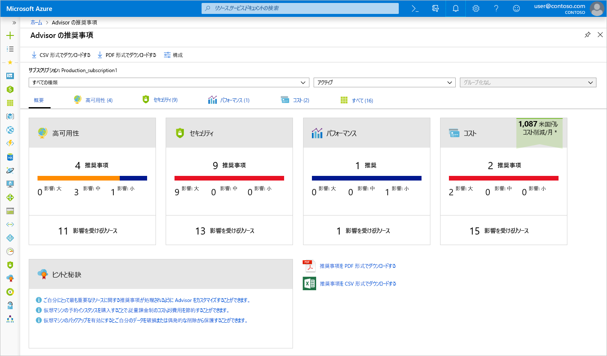
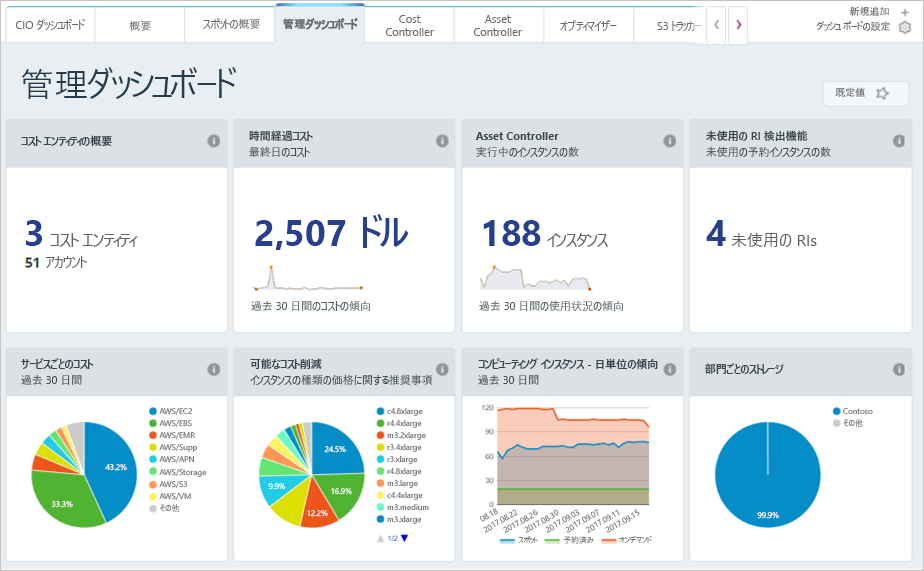

Azure でサービスをデプロイする前にコストを見積もる方法を学習しましたが、既にリソースをデプロイしている場合はどうなるのでしょうか?  既に発生しているコストはどのように確認しますか?  Azure に以前のソリューションをデプロイしており、仮想マシンのサイズを適切に設定したことを確認し、請求額を予測する場合、どうすればよいでしょうか?  この問題の解決を容易にするために使用できる Azure のいくつかのツールを見てみましょう。

## Azure Advisor とは

**Azure Advisor** は Azure に組み込まれている無料のサービスであり、高可用性、セキュリティ、パフォーマンス、およびコストについての推奨事項を示します。 Advisor ではデプロイされたサービスを分析し、4 つの領域全体の環境を改善する方法を見つけます。 ここではコストに関する推奨事項に重点を置きますが、ある程度の時間をかけて他の推奨事項も確認する必要があります。

Advisor では、次の領域でのコストに関する推奨事項を示します。

1. **プロビジョニングが解除された Azure ExpressRoute 回線を排除してコストを削減します。**
    プロバイダーの状態が 1 か月以上*未プロビジョニング*である ExpressRoute 回線を特定し、接続プロバイダーを使用してその回線をプロビジョニングする予定がない場合は回線を削除するよう勧めます。

1. **従量課金制よりコストを節約するために予約インスタンスを購入します。**
    過去 30 日間の仮想マシンの使用率を確認し、予約インスタンスを購入することで今後のコストを節約できるかどうかを判断します。 Advisor によって、最も節約できる可能性がある領域とサイズが示され、予約インスタンスを購入することで実現する可能性のある節約の見積もり額が示されます。

1. **使用率が低い仮想マシンのサイズを適切に設定するか、シャットダウンします。**
    仮想マシンの使用状況を 14 日間にわたって監視して、使用率が低い仮想マシンを識別します。 平均 CPU 使用率が 5% 以下で、ネットワーク使用量が 7 MB 以下である日が 4 日以上ある仮想マシンは、使用率が低い仮想マシンと見なされます。 平均 CPU 使用率のしきい値は最大 20% まで調整可能です。 これらの仮想マシンを識別することで、より小さいインスタンスの種類にサイズを変更することを決定でき、コストを削減できます。

[!include]

ポータルで Azure Advisor を見つけることができる場所を見てみましょう。 

1. Microsoft アカウントを使用して、 [Azure ポータル](https://portal.azure.com?azure-portal=true) にサインインします。 

1. **[すべてのサービス]** をクリックすると、**[管理ツール]** カテゴリに **[Advisor]** が表示されます。 フィルター ボックスに「`Advisor`」と入力して、そのサービスのみをフィルター処理することもできます。

1. Advisor をクリックすると、Advisor の推奨事項ダッシュボードが表示されます。そこで、ご利用のサブスクリプションに関する推奨事項をすべて確認できます。 推奨事項のカテゴリごとにボックスが表示されます。

> [!NOTE]
> Advisor でコストに関する推奨事項が示されない場合があります。 その理由としては、評価がまだ完了していないか、あるいは単に Advisor の推奨事項がないことが考えられます。

**[コスト]** ボックスをクリックすると、詳細な推奨事項が表示されます。そこで Advisor の推奨事項を確認できます。

任意の推奨事項をクリックすると、その特定の推奨事項の詳細が表示されます。 その後、支出を削減するための仮想マシンのサイズ変更など、特定のアクションを実行できます。

これらの推奨事項は、非効率的にコストをかけている可能性のあるすべての場所を示しています。 これらは開始点として、また、コストを削減する場所を見つけるときに継続的に見直す場所として最適です。 この例では、これらの推奨事項を実行する場合、1 か月あたり約 700 ドルを節約できる機会があります。 このように節約できるため、4 つの領域全体で推奨事項について必ず定期的に確認してください。

## Azure Cost Management

Azure Cost Management は Azure のもう 1 つの無料の組み込みツールです。これを使用することで、クラウドのコストが発生する場所についてより詳しい分析情報を得ることができます。 コストがかかるサービスや設定した予算の追跡方法などの履歴を詳しく確認することができます。 予算を設定し、レポートをスケジュールし、コスト領域を分析できます。

![[コストの管理と請求] ブレードの [コスト分析] セクションを示す Azure portal のスクリーン ショット。](../media/3-cost-management.png)

## Cloudyn

Microsoft の子会社である Cloudyn では、クラウドの使用状況と、ご利用の Azure リソース、および Amazon Web Service や Google などの他のクラウド プロバイダーに対する支出を追跡することができます。 わかりやすいダッシュボードのレポートは、コストの割り当てとチャージバックに役立ちます。 Cost Management を使うと、使用率が低いリソースを識別して管理、調整することにより、クラウドの支出を容易に最適化できます。 Azure は無料で利用でき、プレミアム サポートを受ける場合や他のクラウドからデータを表示するための有料のオプションがあります。

ご覧のとおり、Azure ではコストをかけずに使用できるツールがいくつかあります。これらを使用して、クラウドの支出を追跡し、予測して、コストの観点からご利用の環境では非効率である可能性のある場所を特定することができます。 クラウド フットプリント全体でコストを削減できるように、これらのツールで利用可能なレポートと推奨事項を定期的に確認する必要があります。