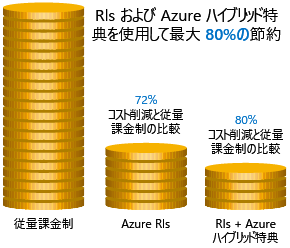
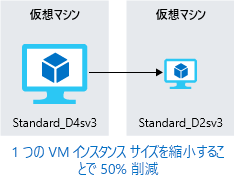
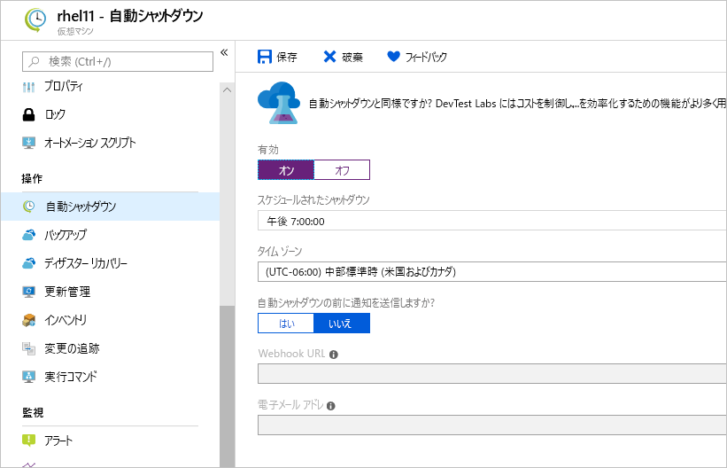

構築する環境用のコスト見積もりを作成する方法を確認し、いくつかのツールを使ってどの部分にコストがかかるかについて詳しく説明し、将来のコストを予想しました。We have seen how to create cost estimates for environments you'd like to build, walked through some tools to get details on where we're spending money, and projected future expenses. 次の課題は、そのインフラストラクチャ コストを削減する方法の確認です。Our next challenge is to look at how to reduce those infrastructure costs.

## 予約インスタンスを使用するUse reserved instances

本質的に静的で予測可能な VM ワークロード、特にそれが年中無休で実行されている場合、予約インスタンスを使用することが、VM のサイズによっては最大 70% から 80% の節約が見込める素晴らしい方法です。If you have VM workloads that are static and predictable in nature, particularly ones that run 24x7x365, using reserved instances is a fantastic way to potentially save up to 70-80%, depending on the VM size. 次の図では、Azure 予約インスタンスを使用することで最大 72% が節約され、予約インスタンスに加えて Azure ハイブリッド特典を使用することで最大 80% が節約されることを確認できます。The following illustration shows that using Azure reserved instances saves you up to 72% and using reserved instance plus Azure Hybrid Benefit saves up to 80% in costs.

予約インスタンスは 1 年または 3 年単位で購入でき、全額前払いとなります。Reserved instances are purchased in one-year or three-year terms, with payment required for the full term up front. 購入後、Microsoft ではその予約と実行中のインスタンスを突き合わせ、予約の時間を減らしていきます。After it's purchased, Microsoft matches up the reservation to running instances and decrements the hours from your reservation. Azure portal から予約を購入することができます。Reservations can be purchased through the Azure portal. また、予約インスタンスはコンピューティング割引であるため、Windows と Linux の両方の VM で利用可能です。And because reserved instances are a compute discount, they are available for both Windows and Linux VMs.

## 使用率が低い仮想マシンのサイズを適切に設定するRight-size underutilized virtual machines

Azure Cost Management と Azure Advisor によって VM の適切なサイズ設定またはシャットダウンが推奨される場合があるという、上記の説明を思い出してください。Recall from our previous discussion that Azure Cost Management and Azure Advisor might recommend right-sizing or shutting down VMs. 仮想マシンの適切なサイズ設定は、仮想マシンを適切なサイズに変更するプロセスです。Right-sizing a virtual machine is the process of resizing it to a proper size. たとえば、ドメイン コントローラーとして実行しているサーバーがあり、サイズは **Standard_D4sv3** として設定されていますが、多くの時間はご利用の VM が 90% アイドル状態にあるとします。Let's imagine you have a server running as a domain controller that is sized as a **Standard_D4sv3**, but your VM is sitting at 90% idle the vast majority of the time. この VM のサイズを **Standard_D2sv3** に変更することで、コンピューティング コストを 50% 減らすことができます。By resizing this VM to a **Standard_D2sv3**, you reduce your compute cost by 50%. 同じシリーズのより大きいサイズについては、コストはそれぞれ線形であり、2 倍になります。Costs are linear and double for each size larger in the same series. この場合、インスタンス シリーズを変更することで、VM シリーズのコストが低くなる可能性もあります。In this case, you might even benefit from changing the instance series to go to a less expensive VM series. 次の図では、同じシリーズ内で 1 つサイズを下げたことで 50% の節約を達成しています。The following illustration shows a 50% savings achieved by moving one size down within the same series.

サイズ超過の仮想マシンがあると、Azure に一般的な不要経費がかかりますが、簡単に修正できます。Over-sized virtual machines are a common unnecessary expense on Azure and one that can be easily fixed. Azure portal、Azure PowerShell、または Azure CLI を使用して、VM のサイズを変更することができます。You can change the size of a VM through the Azure portal, Azure PowerShell, or the Azure CLI.

> [!TIP]
> VM のサイズを変更するには、VM を停止し、サイズを変更してから再起動する必要があります。Resizing a VM requires it to be stopped, resized, and then restarted. サイズ変更の大きさによっては、数分かかる場合があります。This may take a few minutes depending on how significant the size change is. 停止を計画するか、このタスクの実行中に別のインスタンスにトラフィックをシフトします。Plan for an outage, or shift your traffic to another instance while you perform this task.

## 業務時間外に仮想マシンの割り当てを解除するDeallocate virtual machines in off hours

仮想マシンのワークロードが使用されるのは特定の期間のみであるにもかかわらず、毎日 1 時間ごとに実行している場合、コストの無駄になります。If you have virtual machine workloads that are only used during certain periods of time, but you're running them every hour of every day, you're wasting money. このような VM については、使用していないときにシャットダウンし、スケジュールに従ってバックアップを開始することをお勧めします。そうすれば、VM の割り当てが解除されている間、コンピューティング コストを節約できます。These VMs are great candidates to shut down when not in use and start back up on a schedule, saving you compute costs while the VM is deallocated.

この方法は開発環境用の優れた戦略です。This approach is a great strategy for development environments. 業務時間外にシステムの割り当てを柔軟に解除し、コンピューティング コストが発生しないようにして、業務時間にのみ開発を行うことがよくあります。It's often the case that development may happen only during business hours, giving you the flexibility to deallocate these systems in the off hours and stopping your compute costs from accruing. Azure では、環境内で[自動ソリューション](https://docs.microsoft.com/azure/automation/automation-solution-vm-management)を完全に利用できるようになりました。Azure now has an [automation solution](https://docs.microsoft.com/azure/automation/automation-solution-vm-management) fully available for you to leverage in your environment.

仮想マシンで自動シャットダウン機能を使用して、自動シャットダウンのスケジュールを設定することもできます。You can also use the auto-shutdown feature on a virtual machine to schedule automated shutdowns.

## 使用されていない仮想マシンを削除するDelete unused virtual machines

 このアドバイスは当たり前のことだと思われるかもしれませんが、サービスを使用しない場合は、シャットダウンする必要があります。This advice may sound obvious, but if you aren't using a service, you should shut it down. プロジェクトが不要になった後、非運用システムや概念実証システムがそのままになっていることに気付くのは珍しいことではありません。It's not uncommon to find non-production or proof-of-concept systems left around following a project that is no longer needed. 定期的にご利用の環境を確認し、これらのシステムを特定するようにしてください。Regularly review your environment and work to identify these systems. これらのシステムをシャットダウンすることは、インフラストラクチャ コストの削減だけでなく、ライセンスや運用に関する潜在的なコストの削減にもつながり、多くの面で利点が得られます。Shutting down these systems can have a multifaceted benefit by saving you not only on infrastructure costs but also potential savings on licensing and operations.

## PaaS または SaaS サービスに移行するMigrate to PaaS or SaaS services

最後に、ワークロードをクラウドに移動します。その場合、サービスとしてのインフラストラクチャ (IaaS) サービスから開始し、必要に応じて、反復的なプロセスでそれをサービスとしてのプラットフォーム (PaaS) に移動するのが自然です。Lastly, as you move workloads to the cloud, a natural evolution is to start with infrastructure-as-a-service (IaaS) services and then move them to platform-as-a-service (PaaS) as appropriate, in an iterative process.

PaaS サービスでは、通常、リソースと運用の両方のコストを大幅に削減できます。PaaS services typically provide substantial savings in both resource and operational costs. 課題は、サービスの種類によっては、時間とリソースの両方の観点から、これらのサービスの移動にはさまざまなレベルの労力が必要になることです。The challenge is that depending on the type of service, varying levels of effort will be required to move to these services from both a time and resource perspective. Azure SQL Database には SQL Server データベースを簡単に移動できる場合がありますが、ご利用の多層アプリケーションをコンテナーやサーバーレス ベースのアーキテクチャに移動するにはかなりの労力が必要になる可能性があります。You might be able to easily move a SQL Server database to Azure SQL Database, but it might take substantially more effort to move your multitier application to a container or serverless-based architecture. PaaS サービスから得られる効率性があるかどうかを確認するために、ご利用のアプリケーションのアーキテクチャを継続的に評価することをお勧めします。It's a good practice to continuously evaluate the architecture of your applications to determine if there are efficiencies to be gained through PaaS services.

Azure では少ないリスクでこれらのサービスを簡単にテストでき、新しいアーキテクチャ パターンを比較的簡単に試すことができます。Azure makes it easy to test these services with little risk, giving you the ability to try out new architecture patterns relatively easily. ただし、通常、これは長い道のりであり、コスト削減の観点から即効性のある成果を期待している場合、すぐには役立たないかもしれません。That said, it's typically a longer journey and might not be of immediate help if you're looking for quick wins from a cost-savings perspective. Azure アーキテクチャ センターは、さまざまなアーキテクチャや Azure サービスにおけるベスト プラクティスだけでなく、アプリケーションの変換の発想を得る優れた場所です。The Azure Architecture Center is a great place to get ideas for transforming your application, as well as best practices across a wide array of architectures and Azure services.