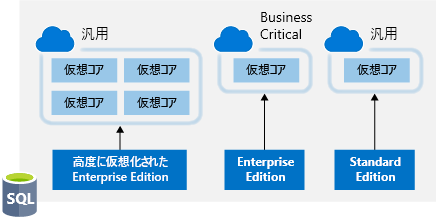
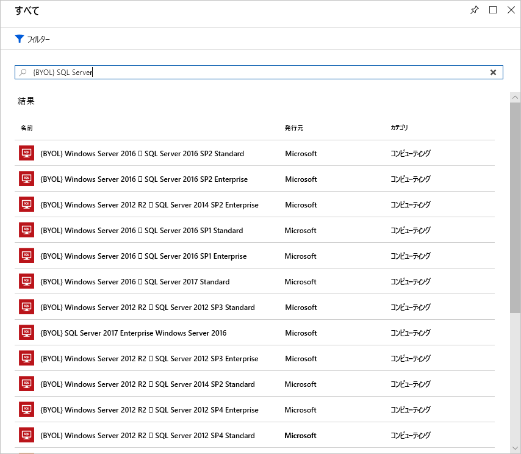

もう 1 つの領域であるライセンスは、クラウドの支出に大きく影響する可能性があります。 ライセンス コストを削減できる方法をいくつか見てみましょう。

## Windows Server 向け Azure Hybrid Benefit

多くのお客様が Windows Server ライセンスに投資しており、Azure ではこの投資を別の用途に使いたいと考えます。 Azure ハイブリッド特典では、Azure で仮想マシン用にこれらのライセンスを使用する権利がお客様に与えられます。 つまり、Windows Server ライセンスに対する料金は発生せず、代わりに Linux 料金で課金されます。

この特典を受けるには、Windows ライセンスがソフトウェア アシュアランスの対象である必要があります。 次のガイドラインも適用されます。

- 各 2 プロセッサ ライセンスまたは 16 コア ライセンスの各セットでは、最大 8 コアのインスタンスを 2 つ、または最大 16 コアのインスタンスを 1 つ利用できます。
- Standard Edition ライセンスは、オンプレミスまたは Azure 内のどちらかで一度のみ使用できます。 つまり、Azure VM とローカル コンピューターに対して同じライセンスを使用することはできません。
- Datacenter Edition の特典では、オンプレミスと Azure 内の両方で同時に使用することができるため、このライセンスでは実行中の 2 台の Windows コンピューターが対象になります。

> [!NOTE]
> ほとんどのお客様には通常、コアごとにライセンスが供与されるため、そのモデルを使用して計算します。 保有するライセンスについて質問がある場合は、ライセンス リセラーまたは Microsoft アカウント チームにお問い合わせください。

特典の適用は簡単です。 既存の VM でいつでもオンとオフを切り替えることができます。あるいは新しい VM のデプロイ時に適用できます。 ハイブリッド特典 (特に予約インスタンスと組み合わせた場合) ではライセンス コストを大幅に節約できます。

## SQL Server 向け Azure ハイブリッド特典

SQL Server 向け Azure ハイブリッド特典は、現在のライセンス投資価値を最大限に高め、クラウドへの移行を促進するうえで役立ちます。 SQL Server 向け Azure ハイブリッド特典は Azure ベースの特典であり、アクティブなソフトウェア アシュアランス付きの SQL Server ライセンスを使用して、割引料金を適用できます。

この特典は、Azure リソースがアクティブな場合でも適用できます。ただし、割引料金が適用されるのはポータルで選択した時点からとなります。 以前にさかのぼってクレジットが発行されることはありません。

### Azure SQL Database の仮想コア ベースのオプション

Azure SQL Database の場合、Azure ハイブリッド特典は次のようになります。

- アクティブなソフトウェア アシュアランス付きのコア ライセンスごとに Standard Edition がある場合は、オンプレミスで所有しているライセンス コアごとに General Purpose サービス レベルで仮想コアを 1 つ取得できます。
- アクティブなソフトウェア アシュアランス付きのコア ライセンスごとに Enterprise Edition がある場合は、オンプレミスで所有しているライセンス コアごとに Business Critical サービス レベルで仮想コアを 1 つ取得できます。 Business Critical サービス レベル用の SQL Server 向け Azure ハイブリッド特典を利用できるのは、Enterprise Edition ライセンスを持つお客様のみであることに注意してください。
- アクティブなソフトウェア アシュアランス付きのコア ライセンスごとに高度に仮想化された Enterprise Edition がある場合は、オンプレミスで所有しているライセンス コアごとに General Purpose サービス レベルで仮想コアを 4 つ取得できます。 これは、Azure SQL Database でのみ利用可能な独自の仮想化特典です。

次の図は、SQL Server ライセンスの Azure ハイブリッド特典が与えられている場合、各サービスで利用できる vCore ベースのオプションを示しています。

Azure Virtual Machines の SQL Server では、Azure ハイブリッド特典は次のようになります。

- アクティブなソフトウェア アシュアランス付きのコア ライセンスごとに Enterprise Edition がある場合は、オンプレミスで所有しているライセンス コアごとに Azure Virtual Machines の SQL Server Enterprise Edition のコアを 1 つ取得できます。
- アクティブなソフトウェア アシュアランス付きのコア ライセンスごとに Standard Edition がある場合は、オンプレミスで所有しているライセンス コアごとに Azure Virtual Machines の SQL Server Standard Edition のコアを 1 つ取得できます。

これが SQL Server ワークロードでの Azure の支出に大きな影響を与える場合があります。

## Dev/Test サブスクリプション オファーを使用する

[Enterprise Dev/Test](https://azure.microsoft.com/offers/ms-azr-0148p/) および[開発テスト用の従量課金制プラン](https://azure.microsoft.com/offers/ms-azr-0023p/) オファーは、非運用環境でコストを節約するために利用できる特典です。 この特典ではいくつかの割引が適用されます。特に Windows ワークロードの場合、ライセンス料金が不要となり、仮想マシン用の Linux 料金でのみ課金されます。 これは SQL Server や、Visual Studio サブスクリプション (旧 MSDN) の対象となるその他の Microsoft ソフトウェアにも適用されます。 

この特典に関する要件がいくつかあります。1 つは非運用ワークロード専用であること、もう 1 つはこれらの環境のすべてのユーザー (テスト担当者を除く) は Visual Studio サブスクリプションの対象でなければならないということです。 つまり、非運用ワークロードの場合、Windows、SQL Server、およびその他の Microsoft 仮想マシンのワークロードにかかるコストを節約できます。

以下に各オファーの詳細を示します。 Enterprise Agreement のお客様の場合、Enterprise Dev/Test オファーを活用します。Enterprise Agreement をご利用でないお客様で、代わりに PAYG アカウントを使用する場合は、開発テスト用の従量課金制プラン オファーを活用します。

## SQL Server ライセンスを持ち込む

Enterprise Agreement のお客様で、既に SQL Server ライセンスに投資しており、Azure へのリソースの移動時にライセンスが解放された場合、**ライセンス持ち込み** (BYOL) イメージを Azure Marketplace からプロビジョニングでき、未使用のライセンスを利用して Azure VM のコストを削減することができます。 これは Windows VM をプロビジョニングし、手動で SQL Server をインストールすることで常に行うことはできましたが、マイクロソフト認定イメージを活用することで作成プロセスが簡略化されます。 これらのイメージを見つけるには、Marketplace で **BYOL** を検索します。

> [!IMPORTANT]
> 認定されたこれらの BYOL イメージを使用するには、Enterprise Agreement サブスクリプションが必要です。

## SQL Server Developer Edition を使用する

多くの人は、SQL Server Developer Edition が**非運用環境用**の無料の製品であることに気付いていません。 Developer Edition には Enterprise Edition と同じ機能がすべてありますが、非運用ワークロードでは、ライセンス コストを大幅に節約できます。

このような場合、Azure Marketplace で Developer Edition 用の SQL Server イメージを見つけて、開発やテスト目的に使用することで、SQL Server にかかる追加コストを削減できます。

> [!TIP]
> ライセンスについて詳しくは、[料金ガイダンスに関するドキュメント](https://docs.microsoft.com/azure/virtual-machines/windows/sql/virtual-machines-windows-sql-server-pricing-guidance)を参照してください。

## データベース ワークロードで制約付きインスタンス サイズを使用する

多くのお客様はメモリ、ストレージ、および I/O 帯域幅に対する高い要求を持っていますが、CPU コアについては少ない数に抑えたいと考えます。 このようなよくある要求に基づき、Microsoft では新しいサイズで最もよく使われる VM サイズ (DS、ES、GS、MS) を利用できるようにしました。これにより、同じメモリ、ストレージ、および I/O 帯域幅を維持しながら、vCPU 数が元の VM サイズの半分または 4 分の 1 に制限されます。

| VM サイズ | vCPU 数 | メモリ | ディスクの最大数 | 最大 I/O スループット | SQL Server Enterprise の 1 年あたりのライセンス コスト | 1 年あたりの総コスト (コンピューティング + ライセンス) |
|---------|-------|--------|-----------|--------------------|-----------------------------------------------|---------------------------|
| Standard_DS14v2   | 16 | 112 GB | 32 | 51,200 IOPS または 768 MB/秒 |           |           |
| Standard_DS14-4v2 | **4**  | 112 GB | 32 | 51,200 IOPS または 768 MB/秒 | 75% 削減 | 57% 削減 |
| Standard_GS5      | 32 | 448    | 64 | 80,000 IOPS または 2 GB/秒   |           |           |
| Standard_GS5-8    | **8**  | 448    | 64 | 80,000 IOPS または 2 GB/秒   | 75% 削減 | 42% 削減 |

SQL Server や Oracle などのデータベース製品のライセンスは CPU ごとに供与されるため、お客様は最大で 75% ライセンス コストを削減でき、データベースで必要なハイ パフォーマンスを引き続き維持できます。