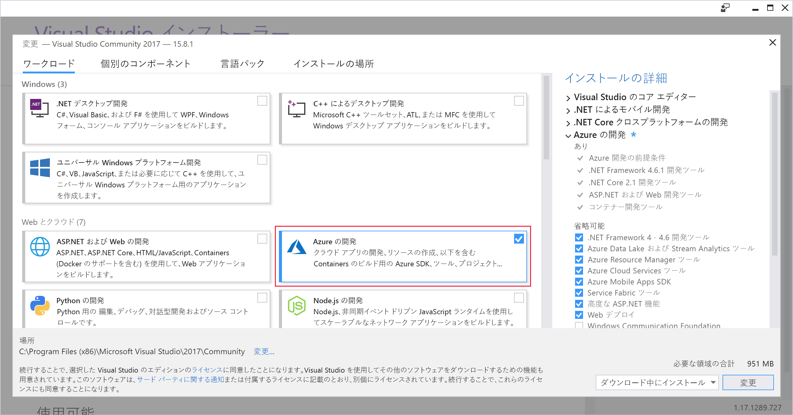

ここでは、Visual Studio をご利用の Windows または macOS 開発マシンにインストールします。Here, you'll install Visual Studio on either your Windows or your macOS development machine.

## 演習の手順Exercise steps

::: zone pivot="windows"::: zone pivot="windows"

### WindowsWindows

1. Visual Studio のインストーラーを、 https://visualstudio.microsoft.com/downloads/ からダウンロードします。Download the Visual Studio installer from https://visualstudio.microsoft.com/downloads/.

1. インストーラーを実行します。Run the installer.

1. **[ワークロード]** タブで **Azure 開発**ワークロードを選択します。On the **Workloads** tab, select the **Azure development** workload.

    次のスクリーンショットは、Visual Studio で Azure を開発するために Visual Studio インストーラーのワークロードが選択されているところを示しています。The following screenshot shows the Visual Studio Installer workload selected to allow Azure development within Visual Studio.

    

1. (省略可能) Azure で使用する Web アプリケーションを作成するために、ASP.NET および Web 開発ワークロードをインストールします。(Optional) Install the ASP.NET and web development workload to be ready to create web applications for Azure.

1. **[インストール]** をクリックし、Visual Studio がインストールされるのを待機します。Click **Install**, and wait for Visual Studio to install. Visual Studio が既にインストールされているシステムの場合、このボタンの表示が **[変更]** となることがあります。For systems with Visual Studio already installed, this button may say **Modify**.

1. インストールが完了したら、Visual Studio を開きます。When the installation is complete, open Visual Studio.

1. Visual Studio の [表示] メニューに移動し、**[Cloud Explorer]** オプションがあることを確認します。Go to the View menu in Visual Studio and make sure you have the **Cloud Explorer** option.

    次のスクリーン ショットでは、Azure 開発ワークロードがインストールされている場合に存在する Cloud Explorer のメニュー オプションを示します。The following screenshot shows the Cloud Explorer menu option that will be present if you have the Azure development workload installed.

    ![Cloud Explorer のメニュー オプションが強調表示された Visual Studio の [表示] メニューのスクリーンショット。](../media/5-verify-cloud-explorer.png)

::: zone-end::: zone-end

::: zone pivot="macos"::: zone pivot="macos"

### macOSmacOS

1. https://visualstudio.microsoft.com/ に移動し、Visual Studio for Mac インストーラーをダウンロードします。Go to https://visualstudio.microsoft.com/ and download the Visual Studio for Mac installer.

1. VisualStudioInstaller.dmg ファイルをクリックしてインストーラーをマウントし、ロゴをダブルクリックして実行します。Click the VisualStudioInstaller.dmg file to mount the installer, then run it by double-clicking the logo.

1. 表示されたプライバシーとライセンス条項に同意します。Acknowledge the Privacy and License terms when presented.

1. インストーラーにより、どのコンポーネントをインスト―ルするか尋ねられます。The installer will ask which components you wish to install. Azure のコンポーネントは既に Visual Studio for Mac の一部ですが、Azure 用の Web エクスペリエンスを開発するには、**.NET Core** プラットフォームをインストールすることが推奨されます。Azure components are already part of Visual Studio for Mac, but it is recommended to install the **.NET Core** platform to develop web experiences for Azure.

    次のスクリーン ショットは、Visual Studio for Mac で Azure を開発する機能を追加するために必要な .NET Core プラットフォームを示しています。The following screenshot shows the .NET Core platform required to add Azure development capabilities to Visual Studio for Mac.

    

1. 選択に問題がなければ、**[Install and Update]** \(インストールして更新\) をクリックし、インストーラーが完了するまで待機します。Click **Install and Update** once you are happy with the selections, and wait for the installer to complete.

1. 必要なアクセス許可を昇格するように求められた場合、それの実行に管理者の資格情報を使用します。If you are prompted to elevate the permissions needed, use your administrator credentials to do so.

1. インストーラーが完了したら、Visual Studio for Mac を開始します。Once the installer is complete, start Visual Studio for Mac.

::: zone-end::: zone-end