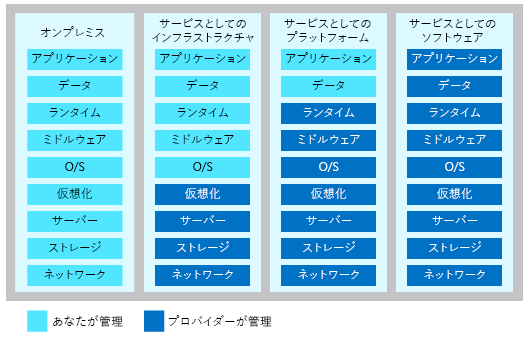

クラウド コンピューティングに関しては 3 つの主要なカテゴリがあります。When talking about cloud computing, there are three major categories. これらは会話、ドキュメント、トレーニングで使用されるため、理解しておくことが重要です。It's important to understand them because they are used in conversation, documentation, and training.

## クラウド コンピューティングの 3 つのカテゴリを確認するExplore the three categories of cloud computing

#### IaaS と Sass と PaaS の比較IaaS versus Sass versus PaaS

> [!VIDEO https://www.microsoft.com/videoplayer/embed/RE2yEbs]

:::row:::
  :::column:::
    
  :::column-end:::
  :::column span="3"::: **サービスとしてのインフラストラクチャ (IaaS)**:::column span="3"::: **Infrastructure as a service (IaaS)**

サービスとしてのインフラストラクチャは、クラウド サービスの最も柔軟なカテゴリです。Infrastructure as a Service is the most flexible category of cloud services. これは、アプリケーションを実行するハードウェアを完全に制御できるようにすることを目的としています。It aims to give you complete control over the hardware that runs your application. IaaS では、ハードウェアを購入するのではなくレンタルします。Instead of buying hardware, with IaaS, you rent it.
  :::column-end:::
:::row-end:::

:::row:::
  :::column:::
    
  :::column-end:::
  :::column span="3"::: **サービスとしてのプラットフォーム (PaaS)**:::column span="3"::: **Platform as a service (PaaS)**

PaaS では、ソフトウェア アプリケーションを構築、テスト、デプロイするための環境が提供されます。PaaS provides an environment for building, testing, and deploying software applications. PaaS の目的は、基になるインフラストラクチャの管理を気にせずに、できるだけ速やかにアプリケーションを作成できるよう支援することです。The goal of PaaS is to help you create an application as quickly as possible without having to worry about managing the underlying infrastructure. たとえば、PaaS を使用して Web アプリケーションをデプロイするときは、オペレーティング システムや Web サーバーだけでなく、システムの更新プログラムもインストールする必要はありません。For example, when deploying a web application using PaaS, you don't have to install an operating system, web server, or even system updates.
  :::column-end:::
:::row-end:::

:::row:::
  :::column:::
    
  :::column-end:::
  :::column span="3"::: **サービスとしてのソフトウェア (SaaS)**:::column span="3"::: **Software as a service (SaaS)**

SaaS は、エンド カスタマーのために一元的にホストされ、管理されるソフトウェアです。SaaS is software that is centrally hosted and managed for the end customer. 通常は、アプリケーションの 1 つのバージョンがすべての顧客に使用され、月単位のサブスクリプションまたは年間サブスクリプションによってライセンスされるアーキテクチャに基づいています。It is usually based on an architecture where one version of the application is used for all customers, and licensed through a monthly or annual subscription. Office 365 は SaaS ソフトウェアの好例です。Office 365 is a perfect example of SaaS software.
  :::column-end:::
:::row-end:::

## レイヤーとしてのサービス カテゴリについて考えるThink about service categories as layers

理解しておく必要があるのは、これらのカテゴリが相互に重なり合ったレイヤーであるという点です。One thing to understand is that these categories are layers on top of each other. たとえば、PaaS は抽象化のレベルを提供することによって IaaS の上にレイヤーを追加します。For example, PaaS adds a layer on top of IaaS by providing a level of abstraction. 抽象化には、細部が隠ぺいされるので開発者は気にする必要がなく迅速にコーディングできるというメリットがあります。The abstraction has the benefit of hiding the details that you may not care about so that you can get to coding quicker. ただし、その対価の 1 つとして、基になるハードウェアについて開発者が制御できる範囲は狭くなります。However, one cost of that is that you have less control over the underlying hardware. 次の図では、ご自分で、およびサービス プロバイダーが管理する、それぞれのクラウド サービスのカテゴリのリソース一覧を示しています。The following illustration shows a list of resources that you manage and that your service provider manages in each cloud service category.

## まとめSummary

IaaS、PaaS、SaaS には、それぞれ異なるレベルのマネージド サービスが含まれます。IaaS, PaaS, and SaaS each contain different levels of managed services. これらの種類のインフラストラクチャの組み合わせを簡単に使用できます。You may easily use a combination of these types of infrastructure. 会社のコンピューターで Office 365 を使用し (SaaS)、Azure で VM をホストし (IaaS)、Azure SQL Database を使用してデータを格納する (PaaS) ことができます。You could use Office 365 on your company’s computers (SaaS), and in Azure you could host your VMs (IaaS) and use Azure SQL Database (PaaS) to store your data. クラウドの柔軟性により、最大限の結果をもたらす組み合わせを使用できます。With the cloud’s flexibility, you can use any combination that provides you with the maximum result.
