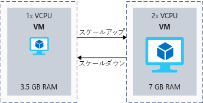

サーバーには、日単位の要求を処理するために十分なリソースが必要があります。 一般的な戦略では、一般的なワークロードのための十分なの作成時の VM サイズを選択し、需要の変化時にサイズを変更します。

Toy 企業シナリオでは、この方法は、中期的な成長のリソースを管理すると便利になります。 ビジネスの成長に応じて、追加の要求を処理するために、VM のサイズを大きくことができます。

## <a name="what-is-virtual-machine-size"></a>仮想マシンのサイズとは何ですか。

_サイズ_の仮想マシンは、CPU、メモリ、ディスク、および予期されるネットワーク帯域幅の測定単位です。 仮想マシン サイズのあらかじめ決められた数で利用できます。 たとえば、 **Standard_F32s_v2**サイズが 32 個の仮想 Cpu、64 GiB のメモリ、256 GiB ローカル SSD および想定されるネットワーク帯域幅の 14,000 Mbps。

Azure で新しい仮想マシンを作成すると、サイズを選択する必要があります。 サイズを大きくコストの詳細。 目標は、必要以上の電力を構成しなくても、ワークロードを処理できるサイズを選択します。

## <a name="what-is-virtual-machine-type"></a>仮想マシンの種類とは何ですか。

_型_の仮想マシンは、VM が最適化されているワークロード。 たとえば、web サーバーをホストしているように CPU を消費するタスクにいくつかの Vm が対象となります。 他のユーザーは、データベースを実行するようにジョブをストレージに重点を置いたを意図しています。

ある_型_最近のコンピューター内の各コアのハードウェア コンポーネントに対応する:**コンピューティング**、**メモリ**、**ストレージ**、および**GPU**します。 **汎用**リソースのバランスの取れた組み合わせが必要な場合に入力します。 次の表は、型とは、対象のワークロードの簡単な説明と共に、各型の一部である VM のサイズを示します。

|種類|サイズ|説明|
|---|---|---|
|汎用|B Ds_v3、D_v3、いくつか DS_v2、いくつか D_v2 A_v2|汎用のマシンでは、バランスのとれた CPU 対メモリ比があります。 汎用のマシンはテストまたは開発のサーバー、小規模中規模のデータベースからまたはトラフィックが中程度に不足している web サーバーに適しています。|
|コンピューティング最適化|Fs_v2、Fs、F|コンピューティングに最適化された仮想マシンがあるアプリケーション サーバー、ネットワーク アプライアンス、またはメディア トラフィックの web サーバーなどの追加の処理能力を必要とするタスクの汎用マシンよりもより高い CPU 対メモリ比。|
|メモリ最適化|Es_v3、E_v3、M、GS、G、DS_v2 によって、いくつか D_v2|仮想マシンのメモリ最適化では、高いメモリ対 CPU 比があります。 これらのマシンはリレーショナル データベース サーバー、サーバーが必要と、キャッシュの多くを実行またはメモリ内分析を実行するサーバーに適しています。|
|ストレージ最適化|Ls|これらの仮想マシンが高いディスク スループットと IO 操作に合わせて、SQL、ビッグ データ用に構成されたデータベースと NoSQL データベースです。|
|GPU|NV, NC, NC_v2, NC_v3, ND|GPU 仮想マシンは高負荷なグラフィックスのレンダリングやビデオ編集、モデルのトレーニングと推論 (ND シリーズ) でディープ ラーニングなどのタスクに特化されています。 これらのマシンの 1 つまたは複数の Gpu を選択できます。|
|ハイ パフォーマンス コンピューティング|H|高速で、最も強力な Cpu は、これらの仮想マシンで利用できます。 高スループットのネットワーク インターフェイス (RDMA) を追加することもできます。|

## <a name="clusters"></a>クラスター

Azure リージョン内の物理サーバー ハードウェアは、クラスターにグループ化されます。 各クラスターには、物理ハードウェアに基づくいくつかの別の仮想マシン サイズをサポートできます。

仮想マシンを作成、特定のサイズを選択すると、そのサイズを適切なハードウェア クラスターに仮想マシンがプロビジョニングされます。 仮想マシンのサイズを変更するには、作成後に、サイズ変更オプションを初期サイズの選択、ハードウェア クラスターによって制限される可能性が。

## <a name="what-is-vertical-scaling"></a>垂直方向のスケーリングとは

_垂直方向のスケーリング_を変更するプロセスは、_サイズ_の仮想マシン。 できます_スケール アップ_要求の増加を処理するより強力なサイズを選択してまたは_スケール ダウン_より少ないリソースを割り当てるし、コストを削減します。 次の図は、仮想マシンのサイズを変更する例を示します。



Azure portal、Azure PowerShell、または Azure CLI を使用して VM のサイズを変更することができます。

### <a name="resize-in-the-portal"></a>ポータルでのサイズを変更します。

Azure portal の仮想マシンをサイズをクリックすると、仮想マシンを選択して、**サイズ**エントリ、およびからエントリを選択すると、**サイズの選択**ブレード。 

仮想マシンが、時に実行している場合にお住まいの地域で利用可能なサイズから選択できる利用可能なサイズによって異なります。 のみが表示されます、仮想マシンは; で現在実行中の同じハードウェア クラスターと互換性のあるオプションのサイズを変更します。これと呼ぶことが、*サイズ ファミリ*します。 仮想マシンの実行中に、新しいサイズを選択した場合、VM が新しいサイズを適用する自動的に再起動されます。

仮想マシンが実行されているときに探しているサイズが、ポータルで表示されない場合より多くのオプションを表示する仮想マシンをシャットすることができます。 マシンの場合、**停止 (割り当て解除)** 状態では、同じリージョン内の他のハードウェアからサイズを選択することができます。

### <a name="resize-with-powershell"></a>PowerShell を使用したサイズを変更します。

PowerShell を使用して、対話形式またはスクリプトを使用した垂直方向のスケーリングを実行することができます。 スクリプトは複雑なシナリオに適してたとえば、次のように一度に複数の Vm のサイズを変更する必要がある場合です。 ユーザーの混乱を避けるために非稼働時間中にサイズ変更を実行する必要がある場合に便利ですもいます。

次のコマンドレットは、現在のハードウェアと同じサイズ ファミリの VM サイズを一覧表示します。

```PowerShell
Get-AzureRmVMSize -ResourceGroupName "myResourceGroup" -VMName "MyVM"
```

目的のサイズが表示されている場合は、仮想マシンのサイズを変更する次のコマンドレットを使用します。

```PowerShell
$vm = Get-AzureRmVM -ResourceGroupName "myResourceGroup" -VMName "MyVM"
$vm.HardwareProfile.VmSize = "<newVMsize>"
Update-AzureRmVM -VM $vm -ResourceGroupName "myResourceGroup"
```

実行しているマシンで目的のサイズが表示されない場合は、次のコマンドを使用して、仮想マシンの割り当て解除、マシンのサイズ変更、マシンをもう一度起動を。

```PowerShell
Stop-AzureRmVM -ResourceGroupName "myResourceGroup" -Name "MyVM" -Force
$vm = Get-AzureRmVM -ResourceGroupName "myResourceGroup" -VMName "MyVM"
$vm.HardwareProfile.VmSize = "<newVMSize>"
Update-AzureRmVM -VM $vm -ResourceGroupName "myResourceGroup"
Start-AzureRmVM -ResourceGroupName "myResourceGroup" -Name "MyVM"
```

パフォーマンスを向上させる、コストを削減したり、必要に応じて、Azure の仮想マシンのサイズを変更できます。 ポータルまたはスクリプトを手動で、サイズ変更を実行することは、ハンドルの段階的なビジネスの成長または事前に需要の変更についてわかっている場合に便利です。 Toy 会社では、休日を需要の急増を処理し、後でスケール ダウンする前に拡大、でした。
