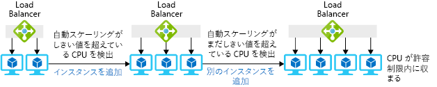

1 台の大きな仮想マシン､あるいは仮想マシン間でリクエストを分散するためのロード バランサーを装備した数台の小さな仮想マシンのどちらを利用しても必要とするリソースを取得することができます｡

VM プールには、需要が変化したときに仮想マシンを迅速に追加または削除したりできる素晴らしい利点があります｡ たとえば､おもちゃの会社の例では､この方式は､想定外の需要の急増に対処するのに役立ちます｡ 需要が増加したらプールに仮想マシンを追加し､需要が通常に戻ったら､仮想マシンを削除できます｡ プールによって冗長性が得られます。1 つの VM で問題が発生した場合は､残りの VM でサービスを中断することなく引き続きリクエストを処理することができます｡

このセクションでは、スケール セットを使用して複数の VM をプロビジョニングする方法､また需要の変化に応じてインスタンスを自動的に追加･削除する方法を説明します｡ 

## 水平スケーリングとは…

*水平スケーリング*とは､使用可能なリソース量を調整するためにプールから仮想マシンを追加･削除するプロセスです。 マシンの追加は_スケール アウト_､マシンの削除は_スケールイン_といいます｡ 水平スケーリングを利用するソリューションには、ロード バランサーまたはゲートウェイによるプール内の仮想マシンに対するリクエストの配信があります｡ 次の図は、仮想マシンのインスタンス数を変更している例です｡

この手法は、複数の同一のサーバーの間でアプリケーションを分散実行できる場合に最も有効です｡ たとえば、複数の仮想マシンで Web サーバーや Web ページの複製を作成することができます｡この場合､どのサーバーが要求を受信しても､すべてが同じ応答をすることができます｡ これに対し､バックエンドのデータベースを実行する仮想マシンは最適な候補にはなりません｡これは､データベースの複数のコピーを実行するには､それらコピーを同期させる必要があるためです。

## スケール セットとは…

*スケール セット*とは､同一の仮想マシン、リクエストを配信するロード バランサーまたはゲートウェイ､そしてプールの仮想マシンを追加または削除するタイミングを制御する任意規則セットからなるプールです。 ここで「同一」とは、セット内のすべての仮想マシンが同じイメージを使用して作成され、サイズが同じであることを意味します｡

新しい仮想マシンに対する必要とするソフトウェアの構成では､多少柔軟に対応することができます｡ 最初に基本 OS の定義済みイメージをインストールし、OS をセットアップしたら､スクリプトを使用してファイルを自動的にインストールまたはコピーすることができます｡ あるいは、オペレーティング システムと既にインストールされているアプリケーション ソフトウェアでカスタム仮想マシン イメージを作成することもできます。

## 要求の配信方法

スケール セット内のすべての VM インスタンスへのリクエスト配信には､ロード バランサーまたは Application Gateway のどちらでも利用できます｡

Azure ロード バランサーは OSI レイヤー 4 (TCP および UDP) で動作し、送信元の IP アドレスとポート､宛先の IP アドレスとポートの組み合わせに基づいてトラフィックをルーティングします。 Azure ロード バランサーにはアフィニティ機能があります｡この機能では､同じ送信元 IP アドレスを同じ宛先サーバーにルーティングすることによってクライアント セッション全体の一貫性を維持します｡ このロード バランサーには、サーバー インスタンスの可用性を判断する正常性プローブ メカニズムもあります。 仮想マシンが正常性プローブに応答しなくなった場合、ロード バランサーはそのマシンに新しい接続をルーティングしなくなります｡

Application Gateway は、OSI レイヤー 7 (アプリケーション層) で動作します。 たとえば VM で Web サーバーが稼働している場合、ゲートウェイは要求された URL を使用してルーティングを行うことができます｡ このことは、URL に `*/customers*` がある要求と URL に `*/partners*` があるリクエストとで送信先となるサーバー プールを変えることができることを意味します｡ Application Gateway はまた､ HTTP から HTTPS へのリダイレクト機能、仮想マシンに対する暗号化のための処理要件を軽減する SSL (Secure Sockets Layer) 終端機能､規則に基づいて既知の web 悪用を検出し､そうしたリクエストが Web サーバーに到達しないないようにする Web アプリケーション ファイアウォール (WAF) 機能も提供できます｡

## 自動スケールとは…

_自動スケール_は一連の規則に基づく自動的なスケール アウトまたはスケール イン プロセスです｡ 規則は、マシンの負荷またはスケジュールによって発動できます。 次の図は、負荷に対処する際に自動スケール機能がインスタンスを管理する方法を示しています｡

スケール セットに対して自動スケールを有効にするには、自動スケール プロファイルを作成する必要があります。 プロファイルでは、セットおよびスケール規則に対する 最小および最大 VM インスタンス数を定義します。 自動スケール規則には、次の要素があります｡

* メトリック - 自動スケール規則を発動する情報またはデータのソース。 4 つのオプションがあります。
  * *現在のスケール セット* - 追加のエージェントを必要としない、ホストベースのメトリックを提供します。
  * *ストレージ アカウント* - Azure 診断拡張機能が Azure ストレージにパフォーマンス メトリックを書き込み、それを使用して自動スケール規則が発動されます。
  * *Service Bus キュー* - 自動スケールを発動するアプリケーション ベースまたは他の Azure Service Bus メッセージを指定できます。
  * *App Insights* - インストルメンテーション パッケージを使用します。スケール セットで実行されるアプリケーションから直接メトリックデータをストリーミングするには､そのアプリケーションにパッケージをインストールする必要があります｡
* 規則の判定基準 - 自動スケール規則の発動に使用する具体的なメトリックです｡ ホスト ベースのメトリックを使用している場合は、CPU 使用率、ネットワーク トラフィック量、ディスクの操作回数､CPU クレジット数などの基準を含めることができます。 たとえば、1 秒あたりのディスク書き込み操がしきい値を超えた場合にスケール アウトする規則を設定できます。 Azure 診断拡張機能または App Insights を利用することで、用意されている基準を利用して規則を発動することができますが、適切なエージェントを構成する必要があります｡
* 集計の種類 - このメトリック データを測定する方法を指定します｡次のオプションのいずれかになります。
  * 平均
  * 最小値
  * 最大値
  * 合計
  * Last
  * Count (最後の回数)
* 演算子 - 演算子は、規則を発動する定義済みしきい値とメトリックとの関係を表します｡ これは、規則によってスケール アウトまたはスケール インのどちらを行うかを決定する上で特に重要です。 以下の演算子を使用できます｡
  * より大
  * 以上
  * より小
  * 以下
  * 等しい
  * 等しくない
* 操作 - 規則が発動されたときのインスタンス数の変更方法を指定します。 次のオプションがあります｡
  * *Increase count by* 一定の台数ずつ仮想マシンを増やします。
  * *Increase percent by* 既存のインスタンス数に対する割合で仮想マシンを増やします｡
  * *Increase count to* 指定された台数まで仮想マシンを増やします｡
  * *Decrease count by* 一定の台数ずつ仮想マシンを減らします｡
  * *Decrease percent by* 既存のインスタンス数に対する割合で仮想マシンを減らしします｡
  * *Decrease count to* 指定された台数まで仮想マシンを減らします｡

スケジュールに従って発動する自動スケール規則を作成することもできます。 たとえば、需要が大きくなる午前にスケール アウトして、一般に需要が減る昼食後にスケール インする規則を定義することができます｡

## スケール セットの作成方法

スケール セットは、Azure portal や Azure PowerShell、または Azure コマンド ライン インターフェイス (CLI) を使用して作成できます。

### ポータル

Azure portal を使用して、スケール セットを作成する場合は、仮想マシンに使用するオペレーティング システムイメージと､起動時に作成する VM インスタンス数を指定します｡ また、インスタンスごとに仮想マシンの大きさと､負荷分散用に Azure load balancer と Application Gateway のどちらを使用するのかも指定します｡ ロード バランサーを選択した場合、既定では､ポータルはそのための正常性プローブをポート 80 に作成します。

### PowerShell

**New-azurermvmss** PowerShell コマンドレットを使用して､仮想マシン スケール セットを作成することができます｡ このコマンドレットでは、新しいスケール セットとロード バランサーを作成し、IP アドレスと仮想ネットワークの割り当てを制御できます。 コマンドレットに指定のない限り､**New-azurermvmss** は既定で次の設定を利用します。

* 仮想マシン インスタンスを 2 つ作成
* Windows Server 2016 Datacenter イメージを使用
* Standard DS1_v2 の仮想マシン サイズを使用
* ロード バランサーを作成
* Windows の場合はポート 3389 と 5985､Linux の場合はポート 22 に対するロード バランサー規則を作成

**New-azurermvmss** は､ロード バランサーに対する正常性プローブを作成しません。 ベスト プラクティスは､スケール セットを作成した後で **Add-azurermloadbalancerprobeconfig** を使用してこのプローブを作成することです｡

スケール セットを使用した水平スケーリングですと、複数のサーバーにアプリケーションを実行させることができます｡ 複数のサーバーを利用することで､高負荷に対処し､サーバーがクラッシュした場合でも、確実にサービスを維持することができます｡ スケールセットに自動スケールを追加することで､想定外の需要の変化にも自動的に対応することができます｡