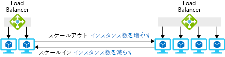

1 台の大きな仮想マシン､あるいは仮想マシン間でリクエストを分散するためのロード バランサーを装備した数台の小さな仮想マシンのどちらを利用しても必要とするリソースを取得することができます｡You can get the resources you need using either one large virtual machine or several small VMs with a load balancer to distribute requests among the VMs.

VM プールには、需要が変化したときに仮想マシンを迅速に追加または削除したりできる素晴らしい利点があります｡The VM pool has the nice advantage that you can add or remove VMs quickly when demand changes. たとえば､おもちゃの会社の例では､この方式は､想定外の需要の急増に対処するのに役立ちます｡In the toy company scenario, this strategy would be useful to handle unexpected spikes in demand. 需要が増加したらプールに仮想マシンを追加し､需要が通常に戻ったら､仮想マシンを削除できます｡You could add VMs to the pool when demand increased and remove them when demand returned to normal. プールによって冗長性が得られます。1 つの VM で問題が発生した場合は､残りの VM でサービスを中断することなく引き続きリクエストを処理することができます｡The pool also gives you redundancy; if one VM fails, the others can continue to handle requests with no interruption in service.

このセクションでは、スケール セットを使用して複数の VM をプロビジョニングする方法､また需要の変化に応じてインスタンスを自動的に追加･削除する方法を説明します｡In this section, you will see how to provision multiple VMs using scale sets and how to automatically add and remove instances in response to changing demand. 

## 水平スケーリングとは…What is horizontal scaling?

*水平スケーリング*とは、使用可能なリソース量を調整するためにプールから仮想マシンを追加･削除するプロセスです。*Horizontal scaling* is the process of adding or removing virtual machines from a pool to adjust the amount of available resources. マシンの追加は_スケール アウト_、マシンの削除は_スケールイン_といいます。Adding machines is called _scaling out_, and removing machines is called _scaling in_. 水平スケーリングを利用するソリューションには、ロード バランサーまたはゲートウェイによるプール内の仮想マシンに対する要求の配信があります。Solutions that use horizontal scaling include a load balancer or gateway to distribute requests among the VMs in the pool. 次の図は、仮想マシンのインスタンス数を変更している例です｡The following illustration shows an example of changing the number of virtual machine instances.

この手法は、複数の同一のサーバーの間でアプリケーションを分散実行できる場合に最も有効です。This technique works best for applications that can be run across multiple, identical servers. たとえば、複数の仮想マシンで Web サーバーや Web ページの複製を作成することができます。この場合、どのサーバーが要求を受信しても、すべてが同じ応答をすることができます。For example, you can duplicate your web server and web pages on multiple VMs, and they will all give the same response no matter which server receives the request. これに対し、バックエンドのデータベースを実行する VM は最適な候補にはなりません。これは、データベースの複数のコピーを実行するには、それらコピーを同期させる必要があるためです。On the other hand, a VM that runs your backend database is not an ideal candidate because running multiple copies of the database requires some effort to keep the copies in sync.

## スケール セットとは…What is a scale set?

*スケール セット*とは､同一の仮想マシン、リクエストを配信するロード バランサーまたはゲートウェイ､そしてプールの仮想マシンを追加または削除するタイミングを制御する任意規則セットからなるプールです。A *scale set* is a pool of identical virtual machines, a load balancer or gateway to distribute requests, and an optional set of rules that control when VMs are added or removed from the pool. ここで「同一」とは、セット内のすべての仮想マシンが同じイメージを使用して作成され、サイズが同じであることを意味します｡Here, "identical" means that each VM in the set is created using the same image and has the same size.

新しい仮想マシンに対する必要とするソフトウェアの構成では､多少柔軟に対応することができます｡You have some flexibility in how a new VM is configured with the software you need. 最初に基本 OS の定義済みイメージをインストールし、OS をセットアップしたら､スクリプトを使用してファイルを自動的にインストールまたはコピーすることができます｡You can start with a predefined image for the base OS and then use scripts to install or copy files automatically after the OS is set up. あるいは、オペレーティング システムと既にインストールされているアプリケーション ソフトウェアでカスタム仮想マシン イメージを作成することもできます。Alternately, you can create a custom virtual machine image with the operating system and your application software already installed.

## 要求の配信方法How to distribute requests

スケール セット内のすべての VM インスタンスへの要求配信には、ロード バランサーまたはアプリケーション ゲートウェイのどちらでも利用できます。You can use either a load balancer or an application gateway to distribute requests to the VM instances in a scale set.

Azure ロード バランサーは OSI レイヤー 4 (TCP および UDP) で動作し、発信元 IP アドレスとポート、宛先の IP アドレスとポートの組み合わせに基づいてトラフィックがルーティングされます。An Azure load balancer operates at OSI layer 4 (TCP and UDP) and routes traffic based on source IP address and port combined with the destination IP address and port. Azure ロード バランサーにはアフィニティ機能があります｡この機能では､同じ送信元 IP アドレスを同じ宛先サーバーにルーティングすることによってクライアント セッション全体の一貫性を維持します｡It can provide affinity, where traffic from the same source IP address is routed to the same destination server to provide consistency across a client session. このロード バランサーには、サーバー インスタンスの可用性を判断する正常性プローブ メカニズムもあります。The load balancer also has a health probe mechanism that determines the availability of server instances. 仮想マシンが正常性プローブに応答しなくなった場合、ロード バランサーではそのマシンに新しい接続がルーティングされなくなります。If a virtual machine becomes unresponsive to the health probe, the load balancer will avoid routing any new connections to that machine.

アプリケーション ゲートウェイは、OSI レイヤー 7 (アプリケーション層) で動作します。An application gateway operates at OSI layer 7 (the application layer). たとえば VM で Web サーバーが稼働している場合、ゲートウェイでは要求された URL を使用してルーティングを行うことができます。For example, if your VMs are running a web server, then the gateway can use the requested URL to perform routing. このことは、URL に `*/customers*` がある要求と URL に `*/partners*` がある要求とで、送信先となるサーバー プールを変えることができることを意味します。This means you could forward requests with `*/customers*` in the URL to one pool of servers and requests with `*/partners*` in the URL to a different pool. アプリケーション ゲートウェイでは、HTTP から HTTPS へのリダイレクト機能、仮想マシンに対する暗号化のための処理要件を軽減する SSL (Secure Sockets Layer) 終端機能、規則に基づいて既知の Web 悪用を検出し、そうした要求が Web サーバーに到達しないようにする Web アプリケーション ファイアウォール (WAF) 機能も提供できます。The application gateway can also provide HTTP to HTTPS redirection, Secure Sockets Layer (SSL) termination to reduce the processing requirement on the virtual machines for encryption, and a web application firewall (WAF) that uses rules to detect known web exploits and prevent these requests from reaching the web servers.

## 自動スケールとはWhat is autoscaling?

_自動スケール_は一連の規則に基づく自動的なスケール アウトまたはスケール イン プロセスです｡_Autoscaling_ is the process of automatically scaling out or in based on a set of rules. 規則は、マシンの負荷またはスケジュールによって発動できます。The rules can be triggered by machine load or a schedule. 次の図は、負荷に対処する際に自動スケール機能がインスタンスを管理する方法を示しています｡The following illustration shows how the autoscale feature manages instances to handle the load.

スケール セットに対して自動スケールを有効にするには、自動スケール プロファイルを作成する必要があります。To enable autoscaling for a scale set, you must create an autoscale profile. プロファイルでは、セットおよびスケール規則に対する 最小および最大 VM インスタンス数を定義します。The profile defines the minimum and maximum number of VM instances for the set and the scaling rules. 自動スケール規則には、次の要素があります。Autoscale rules have the following elements:

* メトリック - 自動スケール規則を発動する情報またはデータのソース。Metric source - The source of information or data that triggers the autoscale rule. 4 つのオプションがあります。There are four options:
  * *現在のスケール セット* - 追加のエージェントを必要としない、ホストベースのメトリックを提供します。*Current scale set* provides host-based metrics that do not require any additional agents.
  * *ストレージ アカウント*。*Storage account*. Azure 診断拡張機能により、Azure Sorage にパフォーマンス メトリックが書き込まれます。The Azure diagnostic extension writes performance metrics to Azure Storage. これらのメトリックを使用して、自動スケール規則がトリガーされます。These metrics are used to trigger autoscale rules.
  * *Azure Service Bus キュー* - 自動スケールを発動するアプリケーション ベースまたは他の Azure Service Bus メッセージを指定できます。*Azure Service Bus queue* can specify application-based or other Azure Service Bus messages to trigger autoscaling.
  * *Azure Application Insights* - インストルメンテーション パッケージを使用します。スケール セットで実行されるアプリケーションから直接メトリックデータをストリーミングするには、そのアプリケーションにパッケージをインストールする必要があります。*Azure Application Insights* uses an instrumentation package that needs to be installed in the application running on the scale set to stream metric data directly from the application.
* 規則の判定基準 - 自動スケール規則の発動に使用する具体的なメトリックです。Rule criteria - This is the specific metric you want to use to trigger an autoscale rule. ホスト ベースのメトリックを使用している場合は、CPU 使用率、ネットワーク トラフィック量、ディスクの操作回数､CPU クレジット数などの基準を含めることができます。If you are using host-based metrics, this can include aspects such as CPU usage, volume of network traffic, disk operations, or CPU credits. たとえば、1 秒あたりのディスク書き込み操がしきい値を超えた場合にスケール アウトする規則を設定できます。For example, you could configure a rule to scale out if disk write operations per second exceed a threshold. Azure 診断拡張機能または Application Insights を利用することで、用意されている基準を利用して規則を発動することができますが、適切なエージェントを構成する必要があります。Using the Azure diagnostic extension or Application Insights enables you to use any available measure to trigger the rule but requires configuration of the appropriate agent.
* 集計の種類 - このメトリック データを測定する方法を指定します。次のオプションのいずれかになります。Aggregation type - This specifies how you want to measure the metric data and will be one of the following options:
  * 平均Average
  * 最小値Minimum
  * 最大値Maximum
  * 合計Total
  * LastLast
  * Count (最後の回数)Count
* 演算子 - 演算子は、規則を発動する定義済みしきい値とメトリックとの関係を表します｡Operator - The operator denotes how a metric must be different to a defined threshold to trigger the rules action. これは、規則によってスケール アウトまたはスケール インのどちらを行うかを決定する上で特に重要です。This is particularly important when identifying whether the rule will scale out or in. 以下の演算子を使用できます｡Operators can be:
  * より大Greater than
  * 以上Greater than or equal to
  * より小Less than
  * 以下Less than or equal to
  * 等しいEqual to
  * 等しくないNot equal to
* 操作 - 規則が発動されたときのインスタンス数の変更方法を指定します。Action - This determines how the number of instances will change when the rule is triggered. 次のオプションがあります｡The following actions are available:
  * *Increase count by* 一定の台数ずつ仮想マシンを増やします。*Increase count by* a fixed number of virtual machines.
  * *Increase percent by* 既存のインスタンス数に対する割合で仮想マシンを増やします｡*Increase percent by* a percentage of existing instances.
  * *Increase count to* 指定された台数まで仮想マシンを増やします｡*Increase count to* a specific number of virtual machines.
  * *Decrease count by* 一定の台数ずつ仮想マシンを減らします｡*Decrease count by* a fixed number of virtual machines.
  * *Decrease percent by* 既存のインスタンス数に対する割合で仮想マシンを減らしします｡*Decrease percent by* a percentage of existing instances.
  * *Decrease count to* 指定された台数まで仮想マシンを減らします｡*Decrease count to* a specific number of virtual machines.

スケジュールに従って発動する自動スケール規則を作成することもできます。You can also create autoscale rules that trigger on a schedule. たとえば、需要が大きくなる午前にスケール アウトして、一般に需要が減る昼食後にスケール インする規則を定義することができます｡For example, you might define a rule that scales out in the morning when you know demand is high and then scales in after lunch when demand typically decreases.

## スケール セットの作成方法How to create a scale set

スケール セットは、Azure portal、Azure PowerShell、または Azure CLI を使用して作成できます。You can create a scale set using the Azure portal, Azure PowerShell, or the Azure CLI.

### Azure portalAzure portal

Azure portal を使用してスケール セットを作成する場合は、仮想マシンに使用するオペレーティング システムイメージと、起動時に作成する VM インスタンス数を指定します。If you use the Azure portal to create the scale set, you will specify the operating system image to use for the virtual machines and how many VM instances to create at startup. また、インスタンスごとに仮想マシンの大きさと、負荷分散用に Azure ロード バランサーとアプリケーション ゲートウェイのどちらを使用するのかも指定します。You will also specify the size of virtual machine for each instance and whether to use the Azure load balancer or the application gateway for load balancing. ロード バランサーを選択した場合、既定では、ポータルはそのための正常性プローブをポート 80 に作成します。If you choose a load balancer, the portal will create a default health probe on port 80 for it.

### Azure PowerShellAzure PowerShell

`New-AzureRmVmss` PowerShell コマンドレットを使用して、仮想マシン スケール セットを作成することができます。You can create a virtual machine scale set with the `New-AzureRmVmss` PowerShell cmdlet. このコマンドレットでは、新しいスケール セットとロード バランサーを作成し、IP アドレスと仮想ネットワークの割り当てを制御できます。This cmdlet can create a new scale set, a load balancer, and control IP address and virtual network assignments. コマンドレットに設定が指定されていない限り、`New-AzureRmVmss` では既定で次の設定が使用されます。Unless settings are specified in the cmdlet, `New-AzureRmVmss` will use the following default settings:

* 仮想マシン インスタンスを 2 つ作成Create two virtual machine instances
* Windows Server 2016 Datacenter イメージを使用Use the Windows Server 2016 Datacenter image
* Standard DS1_v2 の仮想マシン サイズを使用Use the Standard DS1_v2 virtual machine size
* ロード バランサーを作成Create a load balancer
* Windows の場合はポート 3389 と 5985、Linux の場合はポート 22 に対するロード バランサー規則を作成Create load balancer rules for ports 3389 and 5985 for Windows, port 22 for Linux

`New-AzureRmVmss` では、ロード バランサーの正常性プローブは作成されません。`New-AzureRmVmss` does not create a health probe for the load balancer. ベスト プラクティスは、スケール セットを作成した後で `Add-AzureRmLoadBalancerProbeConfig` を使用してこのプローブを作成することです。The best practice would be to create this using `Add-AzureRmLoadBalancerProbeConfig` after you have created the scale set.

スケール セットを使用した水平スケーリングでは、複数のサーバーでアプリケーションを実行することができます。Horizontal scaling with scale sets gives you multiple servers to run your application. 複数のサーバーを利用することで､高負荷に対処し､サーバーがクラッシュした場合でも、確実にサービスを維持することができます｡Using multiple servers lets you handle high loads and ensures your services remain available even if a server crashes. スケールセットに自動スケールを追加することで､想定外の需要の変化にも自動的に対応することができます｡You can add autoscale to your scale sets, so your system automatically adjusts to unexpected changes in demand.