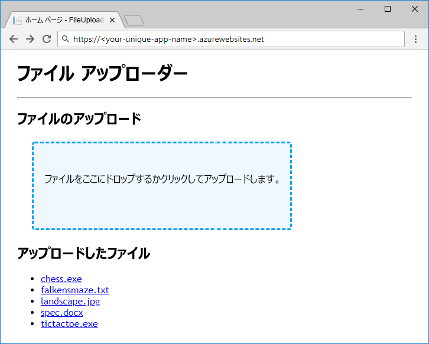

ストレージ アカウント、コンテナー、BLOB 間でデータをどのように保管するかについてアイデアが固まったら、アプリをサポートするために作成する必要がある Azure リソースについて検討することができます。

### <a name="storage-accounts"></a>ストレージ アカウント

ストレージ アカウントの作成は、アプリのデプロイと実行の前に、管理者またはマネージャーがあらかじめ行う作業です。 アカウントは通常、デプロイまたは環境セットアップ用のスクリプトや Azure Resource Manager テンプレートによって作成するか、管理者が手動で作成します。 通常、管理ツール以外のアプリケーションには、ストレージ アカウントを作成するアクセス許可を与えないようにします。

### <a name="containers"></a>Containers

ストレージ アカウントの作成とは異なり、コンテナーの作成は、アプリ内から実行するのに適した簡単な作業です。 アプリの作業の一部としてコンテナーの作成と削除を行うことは、珍しくありません。

ハードコードまたは事前に構成された名前を持つ既知のコンテナー セットに依存するアプリの場合、一般的な処理方法として、アプリを起動した時点または必要なコンテナーを初めて使用する時点でコンテナーがまだ存在していない場合は、アプリでコンテナーを作成します。 コンテナーをアプリのデプロイ過程で作成せず、アプリで作成できるようにすると、アプリケーションとデプロイ プロセスの両方について、アプリで使用するコンテナーの名前を知る必要がなくなります。

## <a name="exercise"></a>演習

Azure Blob Storage を使用するコードを追加して、未完成の ASP.NET Core アプリを完成させます。 この演習は、組織と名前付けスキームの設計についてよりも、Blob Storage API の活用方法について学習することを目的にしていますが、アプリおよびアプリでのデータ格納方法の簡単な概要を次に示します。



ここで使用するアプリは共有フォルダーのように機能し、ファイルのアップロードを受け入れて、ファイルをダウンロードできるようにします。 データベースを BLOB の整理に使用することはしません。そうではなく、アップロードされたファイルの名前をサニタイズしたうえで、BLOB 名として直接使用します。 アップロードされたすべてのファイルを単一のコンテナーに格納します。

最初のコードはコンパイルされて実行されますが、データの格納と読み込みに関する部分は空です。 コードが完了したら、アプリを Azure App Service にデプロイし、テストします。

[!include[](../../../includes/azure-sandbox-activate.md)]

アプリのストレージ インフラストラクチャを設定してみましょう。

### <a name="storage-account"></a>ストレージ アカウント

Azure Cloud Shell と Azure CLI を使用してストレージ アカウントを作成します。 ストレージ アカウントには一意の名前を付ける必要があります。後で必要になるため、名前をメモしておいてください。 次の例では、"米国東部" を使用していますが、一覧から利用可能な任意の場所に変更できます。

[!include[](../../../includes/azure-sandbox-regions-first-mention-note.md)]

次のコマンドを実行して、ストレージ アカウントを作成します。 

```azurecli
az storage account create --name <your-unique-storage-account-name> --resource-group <rgn>[sandbox resource group name]</rgn> --location eastus --kind StorageV2
```

> [!NOTE]
> なぜ `--kind StorageV2` なのか ストレージ アカウントにはいくつかの異なる種類があります。 ほとんどのシナリオでは、汎用 v2 アカウントを使用する必要があります。 `--kind StorageV2` を明示的に指定する必要がある唯一の理由は、汎用 v2 アカウントはかなり新しく、まだ Azure Portal または Azure CLI で既定となっていないためです。

### <a name="container"></a>コンテナー

このモジュールで操作するアプリでは、単一のコンテナーを使用しています。 ベスト プラクティスに従い、起動時にアプリでコンテナーを作成できるようにします。 ただし、コンテナーの作成は Azure CLI から行うこともできます。マニュアルを表示するには、Cloud Shell 端末で「`az storage container create -h`」を実行します。