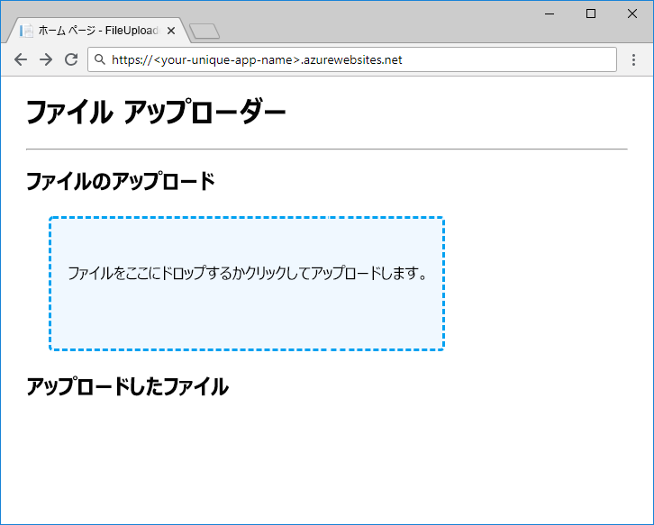

BLOB への参照を設定したら、データをアップロードおよびダウンロードすることができます。 `ICloudBlob` オブジェクトには、ソースおよびターゲットとしてバイト配列、ストリーム、およびファイルをサポートする `Upload` メソッドと `Download` メソッドが含まれています。 特定の種類には、便宜上、追加のメソッドが含まれています。たとえば、`CloudBlockBlob` では、`UploadTextAsync` および `DownloadTextAsync` を使用した文字列のアップロードとダウンロードがサポートされています。

## <a name="creating-new-blobs"></a>新しい BLOB を作成する

新しい BLOB を作成するには、ストレージ内に存在していない BLOB に対して、参照にある `Upload` メソッドのいずれかを呼び出します。 これにより、ストレージ内での BLOB の作成とデータのアップロードという 2 つのことが行われます。

## <a name="moving-data-to-and-from-blobs"></a>BLOB 間のデータ移動

BLOB 間のデータ移動は、時間がかかるネットワーク操作です。 Azure Storage SDK for .NET Core では、ネットワーク アクティビティを必要とするすべてのメソッドから `Task` が返されるため、コントローラー メソッドで `await` を正しく使用していることを確認します。

大規模なデータ オブジェクトを操作する場合の一般的な推奨事項は、バイト配列や文字列のようなメモリ内の構造ではなくストリームを使用することです。 これにより、ターゲットへの送信前に、すべての内容がメモリ内にバッファリングされるのを回避できます。 ASP.NET Core では、要求と応答でのストリームの読み取りおよび書き込みがサポートされています。

## <a name="concurrent-access"></a>同時アクセス

ご利用のアプリによって BLOB が使用されているときにその BLOB が他のプロセスによって追加、変更、または削除される可能性があります。 常に防衛的なコードを作成すると共に、ダウンロードを試みるとすぐに削除される BLOB や予期していないときに内容が変更される BLOB など同時実行により発生する問題について考えます。 AccessConditions および BLOB リースを使用して、BLOB への同時アクセスを管理する方法については、このモジュールの最後に記載されている「参考資料」セクションを参照してください。

## <a name="exercise"></a>演習

アップロードおよびダウンロードのコードを追加することによってアプリを完了してから、テストのためにそれを Azure App Service にデプロイしましょう。

### <a name="upload"></a>アップロード

BLOB をアップロードするには、コンテナーから `CloudBlockBlob` を取得する `GetBlockBlobReference` を使用して `BlobStorage.Save` メソッドを実装します。 `FilesController.Upload` からは `Save` にファイル ストリームが渡されるので、効率を最大限に高めるために `UploadFromStreamAsync` を使用してアップロードを実行することができます。

エディターで `BlobStorage.cs` の `Save` を次のコードで置き換えます。

```csharp
public Task Save(Stream fileStream, string name)
{
    CloudStorageAccount storageAccount = CloudStorageAccount.Parse(storageConfig.ConnectionString);
    CloudBlobClient blobClient = storageAccount.CreateCloudBlobClient();
    CloudBlobContainer container = blobClient.GetContainerReference(storageConfig.FileContainerName);
    CloudBlockBlob blockBlob = container.GetBlockBlobReference(name);
    return blockBlob.UploadFromStreamAsync(fileStream);
}
```

> [!NOTE]
> ここに示したストリーム ベースのアップロード コードは、バイト配列にファイルを読み込んでから Azure Blob Storage に送信するよりも効率的です。 ただし、クライアントからファイルを取得するのに使用する ASP.NET Core `IFormFile` 手法は、真のエンドツーエンド ストリーミング実装ではなく、小さいファイルのアップロードを処理する場合にのみ適しています。 完全にストリーム配信されたファイル アップロードについては、このモジュールの最後に記載されている「参考資料」セクションを参照してください。

### <a name="download"></a>ダウンロード

`BlobStorage.Load` からは `Stream` が返されます。すなわち、作成するコードでは BLOB ストレージからバイトを物理的に移動する必要は全くなく、BLOB ストリームへの参照を返す必要があるだけです。 それは、`OpenReadAsync` を使用して行うことができます。 ASP.NET Core では、クライアント応答がビルドされると、ストリームの読み取りおよび終了の処理が行われます。

`Load` をこのコードで置き換えて、作業内容を保存します。

```csharp
public Task<Stream> Load(string name)
{
    CloudStorageAccount storageAccount = CloudStorageAccount.Parse(storageConfig.ConnectionString);
    CloudBlobClient blobClient = storageAccount.CreateCloudBlobClient();
    CloudBlobContainer container = blobClient.GetContainerReference(storageConfig.FileContainerName);
    return container.GetBlobReference(name).OpenReadAsync();
}
```

### <a name="deploy-and-run-in-azure"></a>Azure 内でデプロイして実行する

アプリが完成したので、デプロイして動作を確認してみましょう。 App Service アプリを作成し、そのアプリをアプリケーション設定を使用して、自分のストレージ アカウント接続文字列とコンテナー名用に構成します。 `az storage account show-connection-string` を使用してストレージ アカウントの接続文字列を取得し、コンテナーの名前が `files` になるように設定します。

アプリ名はグローバルに一意である必要があるため、独自の名前を選んで `<your-unique-app-name>` に入力する必要があります。

```azurecli
az appservice plan create --name blob-exercise-plan --resource-group <rgn>[Sandbox resource group name]</rgn>
az webapp create --name <your-unique-app-name> --plan blob-exercise-plan --resource-group <rgn>[Sandbox resource group name]</rgn>
CONNECTIONSTRING=$(az storage account show-connection-string --name <your-unique-storage-account-name> --output tsv)
az webapp config appsettings set --name <your-unique-app-name> --resource-group <rgn>[Sandbox resource group name]</rgn> --settings AzureStorageConfig:ConnectionString=$CONNECTIONSTRING AzureStorageConfig:FileContainerName=files
```

ここでアプリをデプロイします。 以下のコマンドによってサイトを `pub` フォルダーに発行し、`site.zip` として圧縮した後、その zip を App Service にデプロイします。

> [!NOTE]
> シェルが `mslearn-store-data-in-azure/store-app-data-with-azure-blob-storage/src/start` ディレクトリにあることを確認してから、次のコマンドを実行してください。

```azurecli
dotnet publish -o pub
cd pub
zip -r ../site.zip *
az webapp deployment source config-zip --src ../site.zip --name <your-unique-app-name> --resource-group <rgn>[Sandbox resource group name]</rgn>
```

ブラウザーで `https://<your-unique-app-name>.azurewebsites.net` を開いて、実行中のアプリを表示します。 次の図のようになります。



アプリをテストするため、ファイルをいくつかアップロードしてダウンロードしてみましょう。 ファイルをいくつかアップロードしたら、シェル内で次を実行して、コンテナーにアップロードされた BLOB を確認します。

```console
az storage blob list --account-name <your-unique-storage-account-name> --container-name files --query [].{Name:name} --output table
```