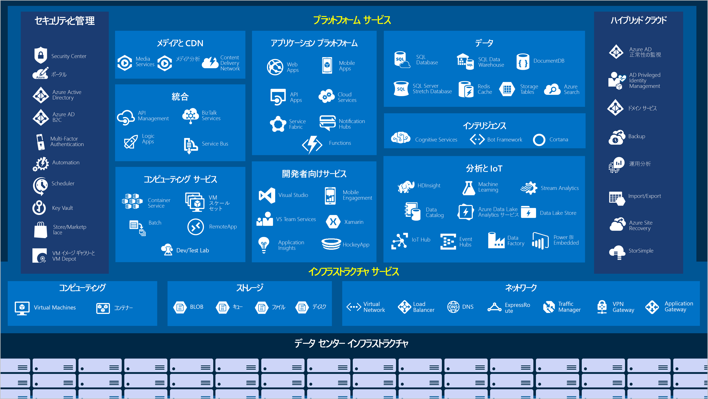
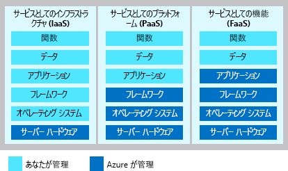

Microsoft Azure では、現在および将来のビジネスの課題に対応する組織に役立つクラウド サービスのセットが継続的に拡張されています。 Azure では、好みのツールとフレームワークを使用して、大規模なグローバル ネットワーク上でアプリケーションを自由にビルド、管理、デプロイできます。 Azure で提供されている高レベルのサービスをざっと見てみましょう。

## Azure サービス

Azure では非常に広範なクラウドベースのサービスが提供されており、機能の追加と強化が毎月行われています。 

よく使われる機能のいくつかを詳しく見てみましょう。 

- [Compute](#compute-services)
- [ネットワーク](#networking-services)
- [Storage](#storage-services)
- [Mobile](#mobil-services)
- [データベース](#database-services)
- [Web](#web-services)

### コンピューティング

コンピューティング サービスは、企業が Azure Platform に移行する主な理由の 1 つです。 Azure では、アプリケーションとサービスをホストするためのさまざまなオプションが提供されています。次はその一部です。

Azure での IaaS、PaaS、FaaS の例を次に示します。

|  種類  |  サービス名             | サービスの機能                                                         |
|--------|---------------------------|--------------------------------------------------------------------------|
| IaaS   | Azure Virtual Machines    | Azure でホストされている Windows または Linux の VM です                                     | 
| IaaS   | Azure Kubernetes Service  | コンテナー化されたサービスを実行する VM のクラスターを管理できます   |
| PaaS   | Azure Service Fabric      | 分散システム プラットフォームです。 Azure またはオンプレミスで実行されます。               |
| PaaS   | Azure Batch               | 並列および高パフォーマンスのコンピューティング アプリケーション用のマネージド サービスです |
| PaaS   | Azure Cloud Services      | クラウド アプリケーションを実行するためのマネージド サービスです                           |
| FaaS   | Azure Container Instances | VM のプロビジョニングやより高いサービスを必要としないコンテナーを提供します    |
| FaaS   | Azure Functions           | 管理された FaaS サービスです                                                     |

### ネットワーク

コンピューティング リソースをリンクし、アプリケーションへのアクセスを提供することが、Azure ネットワークの主要な機能です。 Azure のネットワーク機能には、外部の世界をグローバルな Microsoft Azure データ センター内のサービスと機能に接続するためのさまざまなオプションが含まれています。

Azure ネットワーク機能には次のようなものがあります

|  サービス名             | サービスの機能                                                                     |
| -------------             | -------------                                                                        |
| Azure Virtual Network     | 受信仮想プライベート ネットワーク (VPN) 接続に VM を接続します                   |
| Azure Load Balancer       | 受信および送信接続を複数のアプリケーションまたはサービス エンドポイントに分散させます       |
| Azure Application Gateway | アプリケーションのセキュリティを高めながら、アプリ サーバー ファームの配信を最適化します             |
| Azure VPN Gateway         | 高パフォーマンスの VPN ゲートウェイを介して Azure Virtual Network にアクセスします                |
| Azure DNS                 | 超高速の DNS 応答と非常に高いドメインの可用性を提供します                 |
| Azure Content Delivery Network  | 顧客に対して高帯域幅コンテンツをグローバルに提供します                          |
| Azure DDoS Protection     | Azure でホストされたアプリケーションを分散型サービス拒否 (DDoS) 攻撃から保護します |
| Azure Traffic Manager     | 世界中の Azure リージョンにネットワーク トラフィックを分散させます                           |
| Azure ExpressRoute        | セキュリティで保護された高帯域幅の専用接続を介して Azure に接続します                   |
| Azure Network Watcher     | シナリオ ベースの分析を使用してネットワークの問題を監視および診断します                  |
| Azure Firewall            | 無制限の拡張性を備えたセキュリティと可用性が高いファイアウォールを実装します      |
| Azure Virtual WAN         | ローカルとリモートのサイトを接続する統合されたワイド エリア ネットワーク (WAN) を作成します         |

### ストレージ

Azure では、主に 4 種類のストレージ サービスが提供されます。 これらのサービスを次に示します。

- **Azure Blob Storage** - ビデオ ファイルやビットマップなどの非常に大きなオブジェクト用のストレージを提供します
- **Azure File Storage** - ファイル サーバーのようにアクセスおよび管理できるファイル共有を作成します
- **Azure Queue Storage** - アプリケーション間のメッセージのキューイングおよび確実な配信のためのストアを実装します
- **Azure Table Storage** - どのようなスキーマからも独立した非構造化データをホストする NoSQL ストアで構成されます

これらの各サービスは、次のような共通の特性を備えています。

- 冗長性とレプリケーションによる永続性と高可用性。
- 自動的な暗号化とロールベースのアクセス制御による安全性。
- 実質的に無制限のストレージによる拡張性。
- メンテナンスや重大な問題の管理された自動的な処理。
- 世界中のどこからでも HTTP または HTTPS 経由でアクセス可能。

### モバイル

Azure では、開発者は自分が選択した開発環境を使用して、幅広い言語で iOS、Android、Windows の魅力的なアプリを短時間で簡単に作成できます。 企業のサインインを追加してから、SAP、Oracle、SQL Server、SharePoint などのオンプレミス リソースに接続するといった、これまでであれば時間がかかってプロジェクトのリスクが高くなるような機能を、シンプルに組み込めるようになりました。

このサービスには他に次のような機能があります。

- オフライン データ同期。
- オンプレミス データへの接続。
- プッシュ通知のブロードキャスト。
- ビジネス ニーズに合わせた自動スケーリング。

### データベース

Azure では、さまざまなデータの種類とボリュームを格納するために複数のデータベース サービスが提供されています。 また、グローバル接続により、ユーザーはこのデータをすぐに使用できます。

|  サービス名              | サービスの機能                                                                                |
| -------------              | -------------                                                                                   |
| Azure Cosmos DB            | NoSQL オプションをサポートするグローバル分散データベース                                       |
| Azure SQL Database         | 自動スケーリング、統合インテリジェンス、堅牢なセキュリティを備えた、フル マネージドのリレーショナル データベース    |
| Azure Database for MySQL   | 高可用性とセキュリティを備えた完全に管理されたスケーラブルな MySQL リレーショナル データベース        |
| Azure Database for PostgreSQL   | 高可用性とセキュリティを備えた完全に管理されたスケーラブルな PostgreSQL リレーショナル データベース   |
| VM 上の SQL Server          | エンタープライズ SQL Server アプリをクラウドでホストする                                                    |
| Azure SQL Data Warehouse   | すべてのスケール レベルで無料の統合セキュリティを備えた完全に管理されたデータ ウェアハウス    |
| Azure Database Migration Service    | アプリケーション コードの変更なしでクラウドにデータベースを移行します                  |
| Azure Redis Cache          | 頻繁に使用される静的データをキャッシュして、データとアプリケーションの待機時間を短縮します                   |
| Azure Database for MariaDB | 高可用性とセキュリティを備えた完全に管理されたスケーラブルな MySQL リレーショナル データベース        |

### Web

Azure の Web サービスには、次の機能が含まれます。

| サービス名 | 説明 |
|--------------|-------------|
| Azure App Service | Web およびモバイル向けのパワフルなクラウド アプリを短期間で作成します。 |
| Azure Notification Hubs |どのバック エンドからでもあらゆるプラットフォームへプッシュ通知を送信します。 |
| Azure API Management | API を開発者、パートナー、従業員に安全かつ大規模に発行します。 |
| Azure Search | フル マネージドの、サービスとしての検索です。 |
| Azure App Service の Web Apps の機能 | 大規模な基幹業務系 Web アプリを作成してデプロイします。 |
| Azure SignalR Service | リアルタイム Web 機能を簡単に追加します。 |

これで、Azure への移行を検討している企業が関心を持つ領域をいくつか特定できました。では、そのサービスと機能を利用するために必要なことを確認しましょう。
