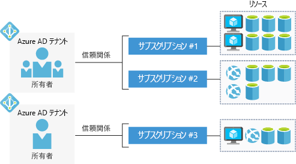

無料の Azure アカウントを使用して、エンタープライズ アプリケーションの構築、テスト、デプロイや、カスタムの Web およびモバイル エクスペリエンスの作成を行うことができます。また、機械学習や強力な分析によってデータから分析情報を得ることもできます。With a free Azure account, you can build, test, and deploy enterprise applications, create custom web and mobile experiences, and gain insights from your data through machine learning and powerful analytics.

## Azure アカウントとはWhat is an Azure account?

_Azure アカウント_は特定の ID に関連付けられており、次のような情報が保持されています。An _Azure account_ is tied to a specific identity and holds information like:

- 名前、電子メール、連絡先の設定Name, email, and contact preferences
- クレジット カードなどの課金情報Billing information such as a credit card

Azure アカウントは、Azure portal または Azure CLI にログインする際に使用するアカウントです。An Azure account is what you use to log in to the Azure portal or the Azure CLI. すべての Azure アカウントは、1 つまたは複数の_サブスクリプション_に関連付けられています。Every Azure account is associated with one or more  _subscriptions_.

## Azure サブスクリプションとはWhat is an Azure subscription?

_Azure サブスクリプション_は、Microsoft Azure にリソースをプロビジョニングするために使用される論理コンテナーです。An _Azure subscription_ is a logical container used to provision resources in Microsoft Azure. 仮想マシンやデータベースなどのすべてのリソースの詳細が保持されています。It holds the details of all your resources like virtual machines, databases, etc.

請求はサブスクリプション レベルで発生します。毎月、Azure サブスクリプションごとに 1 件の請求書が生成されます。Billing occurs at the subscription level &mdash; one bill is generated for every Azure subscription on a monthly basis. 月末に驚かないように、サブスクリプションごとに使用制限を設定できます。You can set spending limits on each subscription to ensure you aren't surprised at the end of the month.

## Azure AD テナントとはWhat is an Azure AD tenant?

Azure AD (Azure Active Directory) は、複数の認証プロトコルをサポートして、クラウドのアプリケーションとサービスをセキュリティで保護する最新の ID プロバイダーです。Azure AD (Azure Active Directory) is a modern identity provider that supports multiple authentication protocols to secure applications and services in the cloud. Windows デスクトップおよびサーバーのセキュリティ保護を重視した Windows Active Directory とは_異なります_。It's _not_ the same as Windows Active Directory, which is focused on securing Windows desktops and servers. Azure AD は、OpenID や OAuth などの Web ベースの認証標準に関するものです。Instead, Azure AD is all about web-based authentication standards such as OpenID and OAuth.

Azure AD に登録されているユーザー、アプリケーション、その他のエンティティが 1 つのグローバル サービスでひとまとめにされることはありません。Users, applications and other entities registered in Azure AD aren't all lumped into a single global service. そうではなく、Azure AD は個々の_テナント_に分割されます。Instead, Azure AD is partitioned into separate _tenants_. テナントは、他から離された、専用の Azure Active Directory サービス インスタンスであり、組織が所有し、管理します。A tenant is a dedicated, isolated instance of the Azure Active Directory service, owned and managed by an organization.

Azure AD テナントの場合、"組織" は具体的に定義されません。テナントは個人、チーム、会社、人のその他のグループが所有できます。When it comes to Azure AD tenants, there is no concrete definition of "organization" &mdash; tenants can be owned by individuals, teams, companies, or any other group of people. テナントは通常、企業に関連付けられます。Tenants are commonly associated with companies. 既存のテナントに関連付けられていない電子メール アドレスで Azure に新規登録する場合、新規登録プロセスでは、完全に自分で所有する自分のテナントを段階的に作成します。If you sign up for Azure with an email address that's not associated with an existing tenant, the sign-up process will walk you through creating your own tenant, owned entirely by you.

> [!NOTE]
> Azure のサインインに使用する電子メール アドレスは、複数のテナントに関連付けることができます。The email address you use to sign in to Azure can be associated with more than one tenant. 自分の Azure アカウントをお持ちのとき、Microsoft Learn の Azure サンドボックスで演習を完了すれば、そのことがわかります。You might see this if you have your own Azure account and you use Microsoft Learn's Azure sandbox to complete exercises. Azure portal では、1 つのテナントに属するリソースのみを一度に表示できます。In the Azure portal, you can only view resources belonging to one tenant at a time. リソースを見ているテナントを切り替えるには、ポータルの上部にある **[本とフィルター]** アイコンを選択し、**[ディレクトリの切り替え]** セクションで別のテナントを選択します。To switch the tenant you're viewing resources for select the **Book and filter** icon at the top of the portal and choose a different tenant in the **Switch directory** section.

Azure AD テナントとサブスクリプションには、多対一の信頼関係があります。テナントは複数の Azure サブスクリプションに関連付けることができますが、あるサブスクリプションを関連付けるテナントは 1 つに限られます。Azure AD tenants and subscriptions have a many-to-one trust relationship: A tenant can be associated with multiple Azure subscriptions, but every subscription is associated with only one tenant. この構造により、組織は複数のサブスクリプションを管理し、それらに含まれるすべてのリソースのセキュリティ規則を設定できます。This structure allows organizations to manage multiple subscriptions and set security rules across all the resources contained within them.

ここでは、アカウント、サブスクリプション、テナント、リソースを簡単に表しています。Here's a simple representation of accounts, subscriptions, tenants, and resources.

Azure AD テナントごとに "_アカウント オーナー_" がいることに注意してください。Notice that each Azure AD tenant has an _account owner_. これは、課金に対して責任を負う元の Azure アカウントです。This is the original Azure account that is responsible for billing. ユーザーをテナントに追加したり、サブスクリプション内のリソースにアクセスするために、他の Azure AD テナントからゲストを招待したりできます。You can add additional users to the tenant, and even invite guests from other Azure AD tenants to access resources in subscriptions.

## Azure アカウントの種類Azure account types

Azure には、さまざまな顧客タイプに対応する複数のアカウントの種類があります。Azure has several account types that cater to different customer types. 最もよく使用されるアカウントは次のとおりです。The most commonly used accounts are:

- 無料Free
- 従量課金制Pay-As-You-Go
- Enterprise AgreementEnterprise Agreement

### Azure 無料アカウントAzure free account

Azure 無料アカウントには、最初の 30 日間に使用できる **200 ドルのクレジット**、最も人気のある Azure 製品への 12 か月間の無料アクセス、常に無料の 25 以上の製品へのアクセスが含まれます。An Azure free account includes a **$200 credit** to spend for the first 30 days, free access to the most popular Azure products for 12 months, and access to more than 25 products that are always free. これは、新しいユーザーが使い始めるための優れた方法です。This is an excellent way for new users to get started. 無料アカウントを設定するには、電話番号、クレジット カード、および Microsoft アカウントが必要です。To set up a free account, you need a phone number, a credit card, and a Microsoft account.

> [!NOTE]
> クレジットカード情報は本人確認にのみ使用されます。Credit card information is used for identity verification only. アップグレードするまで、どのサービスにも課金されません。You won’t be charged for any services until you upgrade.

### Azure 従量課金制アカウントAzure Pay-As-You-Go account

従量課金制 (PAYG) アカウントでは、ユーザーが 1 か月間に使用したサービスに対して請求されます。A Pay-As-You-Go (PAYG) account bills you monthly for the services you used. このアカウントの種類は、個人から小規模企業や多くの大規模組織まで、広範なユーザーに適しています。This account type is appropriate for a wide range of users, from individuals to small businesses and many large organizations as well.

### Azure Enterprise AgreementAzure Enterprise Agreement

Enterprise Agreement では 1 つの契約でクラウド サービスやソフトウェア ライセンスを柔軟に購入でき、新しいライセンスとソフトウェア アシュアランスについては割引があります。An Enterprise Agreement provides flexibility to buy cloud services and software licenses under one agreement, with discounts for new licenses and Software Assurance. エンタープライズ規模の組織が対象になります。It is targeted at enterprise-scale organizations.

## まとめSummary

個人、スモール ビジネス、エンタープライズのいずれであっても、Azure サービスを使用するにはアカウントが必要です。Whether you are an individual, a small business, or an enterprise, you need an account to use Azure services. 一般的な順序としては、Azure サービスを評価できるように無料アカウントで開始します。The typical sequence is to start with a free account so that you can evaluate Azure services. 試用期間が経過した後、無料アカウントから従量課金制に変換します。When your trial period expires, you will convert from the free account to Pay-As-You-Go.